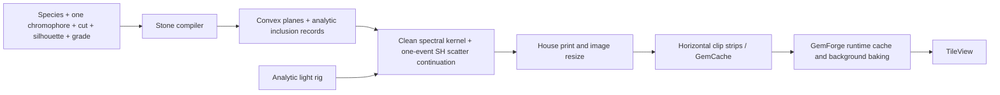
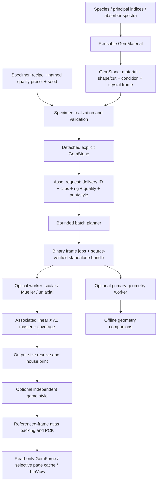

# Gemstone engine implementation report

**Snapshot:** 11 September 2026, commit **b3b1698**, branch **codex/physical-gem-engine**.  
**Comparison baseline:** **03e8850**, the audited prototype checkpoint.  
**Purpose:** account for the original request, the audit recommendations, the implementation constraints, the actual results, and the work that remains.

This report was prepared from the original prompt, the [initial audit](/C:/GIT/facets/docs/lapidary-audit-2026-09-10.md), the [implementation journal](/C:/GIT/facets/artifacts/ENGINE_PROGRESS.md), Git history, current source and contracts, and saved validation results. It is a retrospective source/evidence review; the renders and numerical experiments were not rerun merely to write it. Historical measurements are identified as such. The report is intentionally ignored by Git, following the instruction to keep working reports and temporary bakes out of source control.

**Navigation:** [Assessment](#1-overall-assessment) · [User requirements](#2-accounting-against-the-users-implementation-rules) · [Old/current architecture](#3-architecture-old-and-current) · [Contracts](#4-contract-changes-that-matter-to-future-development) · [Satisfied work](#5-implemented-to-satisfaction-within-a-defined-scope) · [Limited/disabled work](#6-implemented-but-limited-disabled-or-awaiting-tuning) · [Outstanding audit work](#7-still-to-do-from-the-original-audit-or-explicit-implementation-request) · [Optional extensions](#8-optional-new-directions-beyond-the-explicit-audit) · [Performance](#9-optimization-results-and-what-they-actually-establish) · [Validation](#10-validation-and-delivery-evidence-at-the-reviewed-checkpoint) · [Rejected approaches](#11-rejected-approaches-and-deliberate-non-activation) · [Chronology/source map](#12-implementation-chronology-and-navigation)

## 1. Overall assessment

The repository has moved from a specialized convex, mostly clean-stone renderer into a substantially broader procedural specimen and offline asset engine. The strongest completed work is the physical data separation, geometry and medium representation, transport validation, practical volume reconstruction, content-based reuse, and end-to-end asset factory. Physical condition is now expressed through geometry and optical properties instead of grade-dependent shader decorations.

**It is not accurate to say that every recommendation in the initial audit has been completed to its original acceptance criterion.** The final implementation checkpoint is a working, tested foundation and delivery milestone. It is not a universal gemstone simulator, a calibrated natural grading engine, or a finished game art pipeline. The previous acceptance note's statement that no further required work remained was too broad when read against the full audit. This report narrows that statement and explicitly preserves the outstanding items.

In particular:

- A usable physical-condition framework exists, with plausible examples of polish, rounding, cut tolerance, localized clouds and foreign crystals. That is a meaningful result. It does not establish natural grade calibration or reliable visual grade recognition across the catalog.
- Fracture geometry and transport were implemented and revisited, but the rendered morphology remained too lens-like/mottled. Automatic fracture grading was deliberately not accepted.
- The general geometry backend is much broader than before. The high-level faceted cut language is still constrained; it does not yet describe every named or arbitrary cut without extending the compiler.
- Higher-fidelity polarized and uniaxial transport exists, but it is optional and has strict capability limits. Default catalog rendering still makes anisotropy approximations.
- The storage, worker, batch-planning and game-loading path is implemented and verified locally. A commercial render-farm deployment, network-filesystem behavior and broad cross-platform performance remain unverified.
- The independent styling layer exists. The audit's fuller internal-contribution passes, tailored grade readability and perceptual acceptance study do not.

### How status is used in this report

| Status | Meaning |
|---|---|
| **Satisfied within stated scope** | Working code, relevant checks and an adequate operational result exist for the specified capability. This is not a claim of universal physical or perceptual validity. |
| **Implemented, limited / tuning required** | A real mechanism exists, but its supported domain, evidence, cost or appearance is narrower than the audit's eventual target. |
| **Experimental / disabled** | Code or an experiment exists, but it is not accepted for automatic production use. |
| **Outstanding audit work** | Explicitly requested or proposed by the original audit/user instructions, and not delivered to the corresponding acceptance criterion. |
| **Optional extension** | A new proposal beyond those requirements. It must not be used to hide or replace outstanding audit work. |

“Numerically tested,” “visually plausible,” “measured material data,” and “calibrated specimen appearance” are different claims. A furnace test can establish a conservation property without making an inclusion look natural; a pleasing image cannot establish an unbiased estimator.

## 2. Accounting against the user's implementation rules

| Instruction | What happened | Assessment |
|---|---|---|
| Nothing had to be preserved; rewrites and deletions were authorized | Removed the old fake inclusion transport and the runtime clip-baking/cache architecture; replaced material, condition, geometry, storage and delivery contracts. Retained Godot/GDScript/GLSL, spectral tracing and the convex fast path where useful. | Followed. Retaining these components was an engineering choice, not a compatibility obligation. No engine upgrade or complete native-backend replacement was necessary to deliver the tested capabilities. |
| Prioritize realism while minimizing stochastic noise and cost | Established actual repeated-scattering reference paths, rejected the inadequate source-iteration replacement, added sharp/residual reconstruction and optimized geometry, free flight and reuse. | Strong progress, but no universal “hundredfold faster with undetectable error” result. Some narrow highlights and small internal features remain noisy or biased by reconstruction. |
| Implement physical grading, scrutinize it, and leave inadequate mechanisms disabled | Added material interfaces, finish fields, workmanship, cleavage, rounding, fracture apertures, correlated crystal populations and named physical presets. Fracture grading and automatic catalog degradation remain off. | The fallback/deferral instruction was followed. The grading research is only partially complete; disabled status is not equivalent to successful appearance acceptance. |
| Support new gemstones beyond the current 16 through good templates and separation | Added reusable materials, absorber terms, independent index curves, shapes/cuts, conditions, crystal frames, microstructure recipes, quality presets and asset requests. | Foundation substantially satisfied. New material types within supported models are data work; new optical phenomena and unrestricted cut grammar can still require engine work. |
| Avoid unreasonable sprite volume, storage and loading; consider rotations, lighting and farms | Explicit requested clips and variants, master/frame deduplication, independent print/style caches, portable jobs, resume, claims, transfer, bounded pages, lossless compression and selective runtime loading. | Local end-to-end delivery satisfied. Farm/environment validation and predictive planning across hardware remain outstanding. No automatic cell-position × rotation × lighting lattice is generated. |
| No third-party models or textures needed to generate gems | Gem geometry and condition fields are procedural. Published numeric spectroscopy/observer data are build inputs. Independent renderer/reference tooling is test infrastructure, not required artistic assets. | Satisfied for the demonstrated generation path. Numerical reference data are not the same thing as imported gemstone models or textures. |
| Keep temporary bakes/docs out of Git, establish a baseline and commit progress | Baseline 03e8850; 51 subsequent commits covering the journal's 50 stages. Reports, experiments and generated delivery files are ignored. Reproducible source/tools/tests and runtime contracts are tracked. | Satisfied. Source tree was clean at the reviewed checkpoint. This does not mean ignored experiment folders consume no local disk space. |
| Verify claims and do not silently weaken contracts | Added independent numerical comparisons, capability admission, failure diagnostics, source identities and many explicit rejected experiments. | Substantially followed in implementation. Completion wording and some legacy comments were less disciplined; this report corrects the scope accounting. |

The board simulation's seeded integer randomness, topology/gravity accessors, event timeline and input contracts remain separate from the visual asset engine. The overhaul did not turn rendering into authoritative gameplay simulation.

## 3. Architecture: old and current

The “old version” here means the **audited GPU v3 prototype**, not the much earlier C++/Embree renderer mentioned in historical documents. Baseline 03e8850 captured the substantial working-tree changes that were present during the audit.

### Old flow

The layered resource idea was already good. The limiting contracts were a single convex host, narrow material/primitive records, grade formulas inside compilation, and an integrator that treated host exits as environment access. Cache keys did not fully represent actual content. The runtime still owned expensive missing-asset generation.

### Current flow

The important change is that **authoring recipes realize explicit specimens before rendering**, and **delivery names are separate from physical identities**. A quality preset, a material change, a pose, a print edit and a game-style edit are no longer interchangeable reasons to rebuild everything.

### Architectural differences

| Area | Audited prototype | Current implementation |
|---|---|---|
| Stone data | Species, chromophore, silhouette, cut and grade directly on GemStone | GemMaterial, GemShape, GemCondition, cut, grade metadata, physical scale and crystal frame |
| Absorption | Primarily one authored curve, optional second polarization curve, appearance-tuned scaling | Typed lists of absorber terms with explicit units, host compatibility, evidence and physical number-density conversion; homogeneous and local mixtures |
| Refractive indices | Ordinary Sellmeier plus signed constant birefringence approximation | Independent ordinary/extraordinary index curves and evidence; separate higher-fidelity transport capability |
| Grade meaning | Cut/crystal axes changed geometry/haze; clarity gated off; surface ignored | Labels alone do not alter transport. Named presets realize explicit physical condition/cut/material inputs |
| Defect authoring | Mostly independent primitives, heuristic color/reflectance and sprite-size floors | Explicit physical boundaries/materials plus correlated domain-based population recipes; no fake sparkle contribution |
| Shape representation | Convex half-space intersection | Convex planes, analytic round/oval cabochons, procedural loft meshes, mixed triangle/analytic boundary acceleration |
| Damage | Plane changes plus mostly disabled analytic marks | True cut-away/cleavage/chip geometry, continuous convex rounding, optional fracture voids, independent boundary finishes |
| Medium state | One principal host and special-case inclusion behavior | Closed region boundaries, region-to-material mapping, nested/overlapping priority state and external re-entry |
| Volume continuation | One scatter followed by a coarse SH field continuation | Repeated scattering with physical optical-depth integration; optional reconstruction of the stochastic residual |
| Polarization | Repeated local mixtures and approximate image doubling | Persistent absorption state; optional full isotropic Mueller interfaces; optional FP64 uniaxial Maxwell path |
| Lighting | Analytic angular rig with narrow Kelvin-based packing | Compiled light records plus explicit SPDs, standard observer/illuminant tables, background spectrum and independent white balance |
| Image formation | Coverage-weighted radiance incorrectly treated as straight RGB; encoded-image resizing | Associated linear XYZ resolve before nonlinear print, then conditional color with straight output alpha |
| Styling | House print was the main artistic transform | House print plus separately versioned optional GemStyle; current style consumes the mastered image |
| Identity | Short ID/rounded-value hashes and manual look-version dependence | Canonical resource-content hashes, explicit transport inputs, selected-pipeline source digests and separate worker provenance |
| Work unit | Clip bake tied to service state | Immutable binary frame job; explicit batch request; resumable master-level work |
| Geometry reuse | Repeated construction/upload | Content-keyed CPU admission/packing caches and retained GPU geometry buffers |
| Delivery | Whole clip strips; runtime missing-clip baking | Trimmed/deduplicated bounded pages; referenced assets only; read-only runtime consumption |
| Farm model | No complete independently packaged job path | Standalone source/data/shader bundles, sharding, checkpoints, cooperative claims and validated result transfer |
| Validation | Useful smoke tests, some self-confirming/broad tolerances | Numerical admission, independent analytic/rational/NumPy/Mitsuba comparisons, backend parity, resume/cache/pack/runtime tests |

### The implementation is still not completely backend-neutral

The data is much more explicit and reusable, but it remains Godot Resource/GDScript based. Compiled geometry/material dictionaries and RenderingDevice buffers still connect the compiler closely to this renderer. There is no demonstrated drop-in alternate renderer consuming a formal engine-independent interchange specification. Mitsuba is used for selected independent comparisons, not as a replacement production backend.

Authoring is also not one fully unified graphical application: Atelier supports progressive inspection and selected physical controls, while recipes, cut studies, batches and farm operations mainly use resources and command-line tools.

## 4. Contract changes that matter to future development

The current authorities are [factory/delivery CONTRACT.md](/C:/GIT/facets/core/lapidary/factory/CONTRACT.md), [kernel contract v21](/C:/GIT/facets/core/lapidary/tracer/KERNEL_CONTRACT.md), [AGENTS.md](/C:/GIT/facets/AGENTS.md) and [tools README](/C:/GIT/facets/tools/README.md). The older lapidary-architecture.md is explicitly marked historical. It should not be read as a description of current behavior.

| Contract | Current rule and practical consequence |
|---|---|
| Physical units | Stone-space unit radius is converted by size_mm to millimeters. Absorption/scattering coefficients are per mm. Cross-sections retain cm² source precision and are converted using explicit number density. Physical condition sizes do not silently grow to remain visible in sprites. |
| Resource isolation | Authoring variants use duplicate_deep(DEEP_DUPLICATE_ALL). Ordinary duplicate(true) was found to retain external resources and could mutate the source. |
| Grade identity | GemGrade is metadata. Transport uses GemStone.transport_inputs(); renaming a stone or relabeling a grade does not require new optical work. |
| Preset realization | GemSpecimenFactory replaces the base condition with an explicit preset, applies fixed-vocabulary bounded seed channels, optionally selects a cut/population, and validates before returning a stone. It does not simulate a wear history. |
| Stable variation | Named channels preserve existing draws when unrelated channels are inserted or lists reordered. Sharing a channel deliberately couples quantiles. Geometry/specimen randomness and optical sampling remain distinct concepts. |
| Evidence | Editing a measured scattering value through realization creates authored evidence retaining the parent evidence identity. Provenance metadata travels with binary specimens but is excluded from optical identity. |
| Geometry/medium state | Geometry must describe admitted closed boundaries with meaningful region/material membership. Adding a BVH is not permission to bypass actual air re-entry or nested transitions. |
| Coordinate frames | GemStone.crystal_to_stone supplies the host crystal frame for implemented consumers such as base optic axes, cleavage and population domains. Filling axes move with their defect-local geometry. Other authored fields can remain explicitly object-space; there is no automatic universal growth-frame transformation. |
| Numerical admission | Unsupported optical combinations, nonfinite inputs, invalid topology, unknown policies and bounded resource-graph violations fail explicitly. Passing admission is not a visual realism certificate. |
| GPU wire layout | Kernel v3's 128-byte Stone and primitive-inclusion contract became v21's 160-byte Stone, 32-byte planes with integer facet/finish bits, 64-byte mixed boundary primitives, 48-byte BVH nodes and separate region/material/finish/field buffers. Old binaries must not be treated as compatible. |
| Geometry companions | GAO1 stores 48-byte primary-boundary records: physical position/depth, normal/coverage and integer IDs. These are first-hit geometry, not refracted inclusion masks or an optical contribution decomposition. |
| Checkpoint | Version 2 retains raw estimator state (80 bytes/pixel) plus surface/crystal diagnostics, with sample count and identity checks. Failed or incompatible state is rejected. This is distinct from the reconstructed linear master. |
| Master/print/style | Optical master v3, unstyled display v2 and styled display v1 have separate identities. XYZ masters support reprinting/resizing; they cannot reconstruct arbitrary spectral relighting. |
| Source compatibility | Worker provenance and scalar/polarized/crystal/print/style/geometry result dependencies are distinct. Known authoring-only changes need not invalidate frozen physical results. Dependency grouping is explicit and conservative, not automatic call-graph analysis. |
| Serialization | Worker jobs use binary .res resources to preserve floating-point values and avoid text-rounding/global-script bundling failures. Source shaders, schemas and standard tables are bundled and checksummed. |
| Scheduling | Work claims cover masters and geometry. Busy work returns a status without duplicate GPU work. Crash recovery requires stopped workers and a matching coordination snapshot; slow workers are not evicted by an arbitrary timeout. |
| Atomicity | Individual blob/recipe publication is atomic. A complete multi-store transfer or bundle rewrite is not one global transaction. Active bundles must not be overwritten in place. |
| Delivery | Only clip-referenced frames ship. Retained unstyled prints, XYZ masters, checkpoints and geometry diagnostics remain offline unless explicitly given another delivery path. |
| Runtime | GemForge reads a prebuilt library, returns clip metadata/individual AtlasTextures and warms required idle pages. It no longer owns a tracer or background optical-baking queue. |
| Budgets | Examples include 127 resolved inclusion regions, bounded field/population lists, a 128-entry successful-admission cache, 64 MiB/16-entry packed-geometry cache, and 32 MiB runtime page-cache ownership. Active texture references and driver allocations can exceed those ownership/payload budgets. |
| Batch contract | Up to 4,096 explicit requests; 1–256 named clips/request; configurable pre-deduplication job budget up to 65,536. Names and budgets are validated before expansion. A delivery ID is not a new mineral or physical specimen identity. |

These changes intentionally break old assumptions. An old stone resource schema, clip-strip consumer, kernel buffer or manifest cannot be made current merely by changing a look-version string. Rebuild authored jobs and generated assets against the current contracts.

## 5. Implemented to satisfaction within a defined scope

### 5.1 Trustworthy iteration and basic correctness

The concrete initial failures were addressed: Atelier parsing, content invalidation, dark-scene false fluorescence, partial-coverage alpha, linear-light output resolution, boundedness checks, stable sample streams and corrupt-artifact handling. A shader/GDScript error is treated as a failed check even when Godot exits with code zero. The old fake inclusion path was removed rather than kept as a hidden fallback.

The timing contract is more honest: saved reports identify accumulation, reconstruction or whole-job wall times instead of treating all of them as interchangeable GPU timings. However, the audit's complete stage-by-stage profiler and GPU timestamp/latency-percentile program is not finished; see the outstanding-work list.

### 5.2 Material, illumination and composition foundations

The material model can combine multiple absorber terms, including physically dimensioned concentration/cross-section inputs. Principal index curves, spectral support ranges, host compatibility and provenance are validated. Source precision is retained until compilation to GPU tables. Published CIE observer/D65 bytes are pinned; lighting can use equal-energy, blackbody, D65 or sampled spectra with explicit normalization.

The GIA corundum numeric supplement was located, extracted reproducibly and used for measured chromium/iron-titanium examples and mixtures. Analytic slab comparisons exercise these inputs through the renderer. Planar composition transitions and compact local fields support spatially different absorber mixtures without painting an RGB texture on the surface.

This satisfies the ability to ingest and transport meaningful physical specifications. It does not make every existing catalog material a measured specimen: much of the catalog remains fitted or authored, and the measured examples are not a wholesale catalog recalibration.

Sources: [material schema](/C:/GIT/facets/resources/lapidary/gem_material.gd), [absorber schema](/C:/GIT/facets/resources/lapidary/gem_absorber.gd), [material compiler](/C:/GIT/facets/core/lapidary/material_compiler.gd), [kernel material/lighting contract](/C:/GIT/facets/core/lapidary/tracer/KERNEL_CONTRACT.md).

### 5.3 Actual volume transport and useful low-noise production rendering

The one-event scatter-field model was replaced by repeated scattering. Homogeneous free flight avoids unnecessary iterative inversion. Heterogeneous attenuation and scattering use integrated physical fields. Persistent absorption state fixes the repeated-unpolarized-average error, including in the scalar interface approximation.

Production reconstruction separates sharp transport from the noisy residual, preserving clear facet detail instead of filtering the entire gem whenever one rough region is present. Raw reference jobs remain available. This is a useful practical solution to the milky-gem requirement, supported by numerical and image comparisons—not a proof that filtering is unbiased or that every thin feature survives every policy.

### 5.4 Broader geometry and real material interfaces

The renderer can now handle closed procedural meshes, concave lofts, analytic round/oval cabochons, nested cavities/fillings and external reintersection. Robust encoded-mesh admission checks orientation, connected vertex fans, component nesting, self-intersection and prohibited coincident regions. Rational-reference predicate tests are independent of the production floating-point implementation.

Continuous convex rounding uses actual plane/cylinder/sphere boundary patches. Cleavage changes the solid and exposes a physical face. The optimized convex-cleavage path preserves the same optical operation without paying for a full general mesh in the simple case. These are genuine boundary changes with view-dependent reflection/refraction.

This satisfies the audit's requested examples of a cabochon, concave outline and geometrically damaged faceted solid. It does not satisfy an unrestricted high-level cut language or arbitrary-scale numerical certification.

Sources: [geometry implementation](/C:/GIT/facets/core/lapidary/geometry/shape_compiler.gd), [cut compiler](/C:/GIT/facets/core/lapidary/cut/cut_compiler.gd), [kernel geometry contract](/C:/GIT/facets/core/lapidary/tracer/KERNEL_CONTRACT.md).

### 5.5 Physical surface and condition authoring

GGX dielectric roughness, anisotropic polish direction, explicit Smith multiple scattering and spatial finish fields are implemented. Independent host/defect finishes and per-face slots separate material response from cut zone labels. Workmanship parameters are explicit angular and positional tolerances rather than a hidden formula derived from material index or tier.

GemSpecimenRecipe/GemQualityPreset/GemConditionVariation provide a coherent authoring entry point. The quartz study demonstrates five independent states: reference, softened polish, cut tolerance, localized cloud and foreign crystals. A preset can replace the full condition and select a nominal cut or microstructure. The output is an ordinary inspectable GemStone, not a shader interpreting a quality label.

The satisfaction claim is **usable physical condition authoring with reviewed examples**. It is not a calibrated abrasion process or a universal clarity ladder.

Sources: [specimen factory](/C:/GIT/facets/core/lapidary/factory/specimen_factory.gd), [quality study](/C:/GIT/facets/data/lapidary/recipes/quartz_condition_study.tres), [surface schema](/C:/GIT/facets/resources/lapidary/gem_surface.gd).

### 5.6 Asset generation, caching and game delivery

The factory is now a complete local production path: explicit frame jobs, stable optical identities, resume/checkpoints, compressed masters, print-only reuse, independent styling, integrity validation, bounded cache collection, portable bundles, cooperative claims, result transfer, page packing and runtime loading.

GemAssetBatch/GemAssetRequest close the earlier single-preset planning gap. Different qualities, rigs and clips coexist under explicit delivery names. Equal jobs share results across aliases; lighting variants reuse geometry. This avoids automatically generating an enormous rotation/lighting/grade lattice while still allowing those variants when actually requested.

The game consumes the generated PCK and lazy texture pages. Missing-source compilation and optical rendering are not prerequisites for entering a level.

Sources: [asset planner](/C:/GIT/facets/core/lapidary/factory/asset_planner.gd), [batch example](/C:/GIT/facets/data/lapidary/batches/quartz_quality_lighting.tres), [factory contract](/C:/GIT/facets/core/lapidary/factory/CONTRACT.md), [GemForge](/C:/GIT/facets/autoloads/gem_forge.gd).

## 6. Implemented, but limited, disabled or awaiting tuning

| System | What exists | Current limit / activation state | What would justify broader acceptance |
|---|---|---|---|
| Default scalar transport | Spectral dielectric paths, full wavelength geometry in preview/bake policies, persistent dichroic absorption | Interface polarization and birefringence remain approximations. REFERENCE increases sampling/convergence effort but does not automatically select the exact crystal solver. | Case-specific comparison against a capable reference, particularly near critical angles and for strong anisotropy. |
| Isotropic Mueller transport | Persistent I/Q/U/V through supported interfaces, TIR and absorption; independent chain comparisons | Opt-in; isotropic real refraction and weak-loss restrictions apply. Rough Mueller composition lacks a broad independent directional image reference. | Broader end-to-end directional/rough-interface comparisons. |
| Uniaxial Maxwell transport | FP64 modes, complex boundary solve, wavevector/Poynting distinction, coherent coincident packets, weak modal loss | Opt-in; requires shaderFloat64. No biaxial media, rough interfaces, scattering crystal volumes, separated-path interference or general strong-loss interfaces. Slow relative to the default. | Broader reference scenes, convergence/cost studies and separately validated additional capabilities. |
| Strong surface roughness | Optional Smith multiple-scattering model fixes the major energy loss of the single-scattering model | Default flag remains false; explicit softened-polish preset enables it. Roughness is authored, not inferred from hardness or wear history. | Material-specific finish priors, matched-reference appearance and temporal tests. |
| Spatial polish fields | Physical-space local slope widths and direction | Statistical surface response only; they do not carve a resolved scratch or pit. | Separate resolved groove/waviness geometry and footprint-aware transition policy. |
| Cleavage / chips | Real planar separation and physical cavity boundaries | Plane separation is a limited damage operator, not general irregular impact/fracture propagation. Small damage can be naturally hard to see. | Better species/process priors and broader unstyled multi-view appearance review. |
| Continuous rounding | Analytic convex spherical-opening geometry; tested interfaces, mixed acceleration and physical radius | Explicit opt-in; no automatic catalog activation. Limited to supported convex hosts; cap-volume references and small-feature tolerances have stated approximations. | Calibrated wear versus intentional rounded-cut presets; broader scale/shape tests and cost tuning. |
| Fracture aperture/contact model | Connected opening fields, variable aperture, contact holes and separated pockets, real void/filling transport | Experimental. Lens-like/mottled appearance was not accepted; automatic fracture grading stays off. No healing kinetics or fracture mechanics. | A convincing parent-sheet morphology under several poses/lights at hero and sprite scales, without hiding failure in style. |
| Crystal populations | Crystal habits, physical placement domains, stable seeds, orientation families, size distribution, explicit filling materials | Authored statistical morphology; conservative sphere-based exclusion; 127 resolved-region budget. Not natural growth, exsolution or silk simulation. Fine inclusions may disappear at sprite size. | Species-specific calibrated distributions and a physically matched unresolved-population model. |
| Clouds / composition fields | Compact ellipsoidal and planar-transition coefficient fields; real absorption/scattering | Restricted field vocabulary; no general growth-sector history, arbitrary voxel medium or oriented silk phase function. | Richer reusable process fields plus measured/error-controlled scattering models. |
| Named quality presets | Deterministic physical realization with provenance; five quartz examples | Opt-in engineering examples. Full condition replacement is explicit; automatic tier/grade mapping is absent. | Multi-species distributions and perceptual acceptance, keeping value/tier independent of physical cleanliness. |
| Cut search | Multi-metric preference, return/dark-area/contrast/primary-facet modulation, Pareto alternatives, held-out views and seed controls | Engineering proxy metrics. Dark area is not measured leakage; primary-facet modulation is not a calibrated scintillation grade. No general yield/fire/meet-constraint optimizer. | Extend objective definitions and validate against task-relevant optical and perceptual measures. |
| Game style | Separate tint/saturation/contrast, optional tonal bands and inner contour; exact coverage preservation; headless cached-print reuse | Illustrative preset only; bands are off because they amplify noise. Operates after mastering, not on a complete HDR optical-contribution stack. | Intended aesthetic, richer pass semantics, temporal stability and grade-recognition tests. |
| Geometry AOVs | Stable first-boundary position, depth, normal, coverage and IDs | They do not describe the visible paths through internal defects. Not automatically shipped. | Path-weighted internal contributions with documented semantics. |
| House print / gamut | Correct coverage handling, linear reconstruction, separate HDR XYZ masters and a versioned display transform | The shader's `raw` view still tone-maps; negative RGB is clipped before the display transform. The audit's full hue-preservation concern is not resolved by having an HDR master. | Clearly named diagnostic views and evaluated gamut mapping for saturated spectral colors; keep radiometric validation on linear data. |
| Compression profiles | Lossless WebP default; BC7/ASTC encoding/support/error gates | Some tested BC7 outputs failed the alpha/composite budget, including catalog alpha RMSE 2.117 versus a 2-LSB gate. Lossy GPU compression is not default. | Per-platform content/resolution evaluation that passes frame-level error gates. |
| Atelier / scheduling | Parsing fixed, physical controls, progressive sample batches, bounded dispatch work | Still uses synchronous local-device work and readback. It is not a proven responsive asynchronous authoring service for costly specimens. | Cancellation/stale-result behavior, latency percentiles and an explicitly engineered live presentation path if needed. |
| Farm portability | Independently packaged Windows workers, sharding, claims, stopped-store transfer/recovery | Not a validated Linux/network-FS/object-store deployment. No production farm orchestrator or expiring lease service. | End-to-end tests on the chosen provider/filesystem with measured costs and failure recovery. |

The practical grading decision is therefore **physical foundation plus separate readability/style**, not “move all grading into post.” Physical polish, damage and internal regions can change real paths. Styling may emphasize their rendered cues, but the current style layer is not yet the audit's full physically informed grading-readability system.

## 7. Still to do from the original audit or explicit implementation request

These are existing-scope items. Their inclusion here does not mean they all have equal priority or that rejected systems should be enabled before they pass review.

| ID | Outstanding work and original basis | Existing starting point | Concrete completion criterion |
|---|---|---|---|
| A1 | **Convincing connected fracture/healed-fracture condition slice** — audit §§4, 9, 10 | Variable opening/contact topology and real interfaces | Unstyled morphology that remains credible under rotation/multiple rigs, at hero and sprite sizes; acceptable variance/cost; explicit explanation of filling/contact/healing approximation. Keep disabled until then. |
| A2 | **Directional silk and unresolved-population handoff** — audit §§4, 6, 8 | Oriented resolved crystals and HG volume fields | A matched effective angular response for unresolved populations, no double counting, and controlled transition with physical size/pixel footprint. Existing HG clouds are not a completed silk model. |
| A3 | **Resolved scratches, grooves, facet waviness, films/deposits** — audit §4 | Statistical roughness fields and general geometry | Dimensions and interface/coating semantics that produce credible light response; no screen-space marks masquerading as physical damage. These mechanisms were not completed. |
| A4 | **Richer process/species priors** — audit §§3–4, 9 | Named presets, crystal-domain populations and composition fields | Reusable growth sectors, parent-inclusion/fracture relationships, treatment/exposure associations and manufacturing/wear distributions validated for selected species. Full geological-time or finite-element simulation is not required. |
| A5 | **General high-level cut grammar** — audit §5 | Parameterized outlines, rows, explicit pavilion/culet values and general mesh transport | Independent top/bottom terminations, rose/pointed crowns, free-form faceted girdles, explicit meet/index constraints and mixed programs without special-case compiler edits for every new cut. Current compiler still emits a table and culet and recognizes fan/step pavilions. |
| A6 | **Full cut-objective set and calibration** — audit §§5, 9 | Multi-metric/Pareto study with held-out and noise controls | Clearly measured leakage, spectral separation/fire, meaningful scintillation and yield/manufacturing constraints; robust comparisons beyond the demonstrated quartz search. |
| A7 | **Internal optical contribution outputs** — audit §8 | Linear XYZ plus primary geometry; internal sharp/residual estimator buffers | Exported/documented surface-reflection, through-body, volume and path-weighted defect signals that a stylizer can use without mistaking first-surface IDs for internal visibility. |
| A8 | **Finished style/readability and grade-recognition validation** — audit §§8–10 | Optional independent image style and physical preset examples | A chosen game aesthetic and controlled comparisons showing grade/condition cues at shipping size, across pose/light/species, with temporal stability and no universal haze ladder. The future game's final aesthetic was not specified by the user, so it should not be invented as a completed deliverable. |
| A9 | **Broader physical and color calibration** — audit §§6, 9–10 | Numeric provenance, CIE data, measured corundum examples and separate linear masters | Thickness/concentration/orientation/illumination-controlled datasets and matched specimen comparisons; calibrated condition distributions; evaluated display/gamut behavior for saturated spectra and accurate diagnostic-view naming. Existing pretty renders and conservation tests are insufficient. |
| A10 | **Broader anisotropic reference and capability coverage** — audit §§6, 10 | FP64 uniaxial and isotropic Mueller backends | Independent full-scene directional comparisons across representative cases. Biaxial, rough/scattering crystal and strong-loss extensions require their own models/gates if pursued. They are audit-mentioned gaps, not newly discovered optional ideas. |
| A11 | **Specialized gemstone optical mechanisms** — audit §§6, 9–10 | Explicitly disabled false fluorescence; general spectral/material infrastructure | Correct excitation/yield/emitted transport for fluorescence, and targeted effective models for structural-color phenomena when those gems are required. The audit called these specialized development, not mandatory universal atomistics. |
| A12 | **Temporal/feature-preservation and adaptive quality acceptance** — audit §§7–10; user's noise priority | Raw references, reconstruction, paired-seed still metrics and clip inspection | Registered motion tests, temporal error metrics, thin-feature survival and policy selection by measured error/cost. No general perceptual error controller or motion-aware denoising guarantee is implemented. |
| A13 | **Complete profiling, device limits and responsive authoring** — audit §7 | Wall-time counters, adaptive dispatch, cache benchmarks, declared film budgets | End-to-end stage timings, GPU timestamps where useful, cold/changed/warm latency percentiles, actual device-limit/allocation accounting, cancellation/stale-result tests. GPU-resident live presentation is conditional on choosing live rendering, not required for the current baked game path. |
| A14 | **Real deployment and large-production acceptance** — user's delivery/farm requirement; audit §§7, 10 | Local portable bundles, budgeted requests, transfer/claims/cache collection | Chosen render-farm/Linux/network environment tested; realistic large job sizing, throughput and recovery; actual exported-game/platform testing beyond the verified local PCK/TileView harness. |
| A15 | **Contract/documentation consolidation** — audit §§2–3, 9 | Updated current contracts and historical-document warning | Remove misleading surviving comments, consolidate append-only architecture notes, and maintain a machine-readable capability/status matrix so “implemented,” “default” and “appearance-accepted” cannot be confused. |

Some audit proposals were alternatives rather than obligations: a wavefront/native rewrite, universal SDF backend, replacing production transport with Mitsuba, or finite-element/atomistic damage. Not choosing them is not an implementation failure. Evidence did justify analytic curved geometry, selective general acceleration and reconstruction within the existing Godot stack.

## 8. Optional new directions beyond the explicit audit

These suggestions are distinct from A1–A15. They should be considered only if they solve a later product need; they are not prerequisites for repairing incomplete audit work.

| Optional direction | Why it might be useful | Boundary |
|---|---|---|
| A managed team asset service with accounts, quotas and review approvals | Several artists/build machines could share a catalog and audit trail | The audit requested portable jobs/farm readiness, not a hosted multi-user product. |
| Inverse-design tooling from user reference images | Help search material/cut/rig parameters for an intended look | Image matching is not proof of correct physical parameters; matched-physical calibration remains A9. |
| Designer-facing browser/catalog application | Search variants, compare presets, approve asset sets and request new batches without editing resources | Basic usable authoring remains relevant to the audit, but a polished collaborative asset-management application is additional product scope. |
| Cross-engine delivery adapters | Export convenient Unity/Unreal/web manifests or packages | Current game target is Godot. Do not replace the existing contract with speculative abstractions before another consumer exists. |
| Interactive economic/gameplay asset selection | Choose which variants to prefetch based on run progression or a game's content economy | The physical engine should supply assets; it should not infer game balance or gemstone monetary value. |

A prudent next sequence is to choose **one** outstanding physical slice (for example A1 or A2), add the missing observation/acceptance tools needed for it, and validate across a small material/shape set. In parallel product planning, choose the intended aesthetic and actual deployment target. There is no evidence-based reason to restart the whole renderer merely because these focused gaps remain.

## 9. Optimization results and what they actually establish

These are saved development-machine measurements, principally on an RTX 4060 Laptop GPU. They mix different historical revisions and explicitly named workloads. They are not one controlled before/after score for the entire engine, and their speedups must not be multiplied together.

| Experiment | Recorded result | Interpretation / limit |
|---|---|---|
| Initial hidden scatter-field cost | Quartz returned trace time ~79 ms, field build ~1,125 ms, accumulation+print/readback ~1,206 ms | The old trace-only number substantially understated changed-frame cost. This was an audit finding, not a current benchmark. |
| Rejected source iteration | A fine configuration took ~25.2 s versus ~1.9 s for its reference; a coarse ~0.74 s configuration still had ~4% mean bias | Rejected rather than used to claim fast accurate multiple scattering. This failure motivated reconstruction of actual paths. |
| Dense homogeneous quartz, 512 px | Historical 64-spp run ~488.8 ms plus ~1.58 ms filter versus 4,096-spp ~31.95 s; display RMSE ~2.085 LSB | Roughly 65× trace-cost difference in this controlled selective-geometry volume experiment. Not a universal full-spectral production speedup or undetectable-error proof. |
| Analytic cabochon | Setup ~1,456 ms → ~3.6 ms; last 16-spp batch ~1,119 ms → ~17 ms in the recorded 256-px study | Large gains from replacing dense tessellation for the supported analytic shape. Batch timing is not whole-frame timing. |
| Convex cleavage specialization | ~11.7–12.1× for smooth and ~5.2× for rough cases; opaque display RMS differences ~0.12–0.20 LSB | Specific fast/general backend comparison; supports retaining the convex fast path. |
| Sharp/residual reconstruction | Four-case 256-px study improved filtered RMS from ~2.67/2.61/3.52/3.90 to ~1.80/1.79/2.85/3.72 LSB | Better preservation of clear returns near rough regions. In one case raw low-spp error was lower than filtered error; reconstruction is not universally beneficial. |
| Packed geometry reuse | Dense rounded-mesh setup moved from roughly 3 s/frame to roughly 14–15 ms on warm reconfiguration | Approximately two orders of magnitude for repeated setup, not path tracing. Cold validation/build still costs time. |
| Crystal solver optimization | Warm quartz trace median ~6,058 → ~4,931 ms; ruby ~2,513 → ~2,372 ms, tested pixels identical | ~18.6% and ~5.6% warm trace reductions. Cold shader compilation can offset those gains. Exact crystal rendering remains comparatively expensive. |
| Continuous rounded-patch bounds | Recorded large-radius two-pose trace ~8.22/9.89 s → ~4.18/4.88 s; maximum opaque RMS change ~0.0123 LSB | Acceleration of the same tested optical surface, not a new physical wear model. |
| Successful specimen admission cache | ~236.5 ms → ~1.562 ms repeated admission for a rounded specimen | About 151× for that CPU validation operation. Content edits, schema changes and polarization policy still invalidate the result. |
| Final preset lookdev | Softened polish at 512 px/128 spp ~2.07–3.10 s/frame; localized cloud ~2.29–2.97 s, including setup | Useful practical high-resolution examples, not all gemstones/conditions. |
| Preset two-seed noise | At 112 px, softened ~0.393–1.032 LSB and cloud ~0.216–0.342 LSB; at 512 px, softened ~0.862–2.447 and cloud ~0.458–0.936 | Opaque-pixel two-stream RMS divided by sqrt(2). This measures sampling variation in those stills, not model bias, thin-feature accuracy or temporal stability. Narrow highlights had larger isolated differences. |

Saved evidence: [initial probes](/C:/GIT/facets/artifacts/audit-2026-09-10/gpu_probe.json), [journal](/C:/GIT/facets/artifacts/ENGINE_PROGRESS.md), [preset noise report](/C:/GIT/facets/artifacts/specimen-study/phase49-noise.json), [admission benchmark](/C:/GIT/facets/artifacts/specimen-study/admission-after.log).

The user's practical-noise objective received substantial engineering work and useful results. It would still be inaccurate to promise that a high-resolution milky specimen of arbitrary geometry, optical depth and inclusion structure will always render smoothly in seconds at low spp.

## 10. Validation and delivery evidence at the reviewed checkpoint

### Numerical and software validation

- Phase 49's integrated run passed **98 stages**, including CPU, GPU/factory and independent-reference stages. It parsed 279 scripts at that point.
- The subsequent authoring/planner-only work passed **23 planner checks**, **273 source-dependency checks**, **28 existing factory checks**, parsing of **284 scripts**, the portable multi-variant check, public batch build, CLI conflict rejection and final delivery checks.
- The expanded final runner registers additional tests; **a single new full 100-stage run was not claimed or performed** after phase 50. The relevant targeted tests were run because phase 50 did not change numerical optical transport.
- Earlier independent evidence includes rational geometry predicates, NumPy mode/interface/absorption comparisons, analytic slabs and medium lengths, white furnaces, and selected Mitsuba Mueller/Jones-chain comparisons. Some precision stress suites were run explicitly with the FP64 option in earlier phases; they are not implied by every later default test run.
- Scalar/Mueller/crystal backend agreement is tested for shared supported cases. It is not evidence that every backend covers every material or that all three should produce identical images when they intentionally model different physics.

See [integrated log](/C:/GIT/facets/artifacts/phase49-checks.log), [batch check](/C:/GIT/facets/tools/asset_batch_check.gd), [check runner](/C:/GIT/facets/tools/check_engine.ps1) and [test sources](/C:/GIT/facets/tests/lapidary/test_asset_planner.gd). Assertion counts are implementation test counts, not percentages of physical realism or feature completeness.

### Final default delivery

| Measure | Verified result |
|---|---:|
| Catalog / clips | 16 stones, 48 clips |
| Requested frames | 304 |
| Optical masters / reprints | 176 / 48 |
| Unique display frames | 224 |
| Geometry companions | 176 |
| Texture pages | 16 |
| Compressed page payload | 1,225,446 bytes |
| Game PCK | 1,323,044 bytes |
| All-page GPU texture payload | 5,944,256 bytes |
| Tested board | 64/64 tiles immediately using delivered clips |
| Pages loaded by that board | 8; 2,968,896 GPU bytes |
| Metadata open time in that run | 6.168 ms |
| Factory retention | 67,108,864 bytes retained under a 64 MiB budget; no over-budget bytes |
| Fresh copied worker replay after collection | 224 display hits, 176 geometry hits, zero rendering/reprinting/restyling/new geometry |
| Remaining coordination tokens | No active claims/activity tokens after completion |

The PCK SHA-256 is `2b2322b8e98bdc2576085d9f5c244ff2e80fa64b366dea211ccc3b9cf7eb2a26`.

The explicit two-quality/two-lighting example requested 52 frames, delivered 44 unique displays and 22 geometry companions, and packed into four pages / a 383,684-byte PCK. A separate alias test reduced ten requested frames to eight optical outputs and four geometry outputs while verifying selective texture sharing.

These results substantiate the current baked-asset architecture and its small local catalog. The board screenshot's startup “1 FPS” counter is not a frame-rate benchmark. Page-cache ownership excludes active consumer references; the listed GPU numbers are texture payloads, not total graphics-driver memory. The 64 MiB retention budget covers the factory store policy, not all ignored historical experiments.

Evidence: [default build](/C:/GIT/facets/artifacts/phase50-default-build.log), [fresh replay](/C:/GIT/facets/artifacts/phase50-fresh-cache.log), [board result](/C:/GIT/facets/artifacts/phase50-board.log), [batch build](/C:/GIT/facets/artifacts/phase50-batch-build.log).

## 11. Rejected approaches and deliberate non-activation

| Decision | Reason | What replaced it / current disposition |
|---|---|---|
| Remove fake primitive sparkle/mark transport | It bypassed meaningful host/inclusion interfaces and energy accounting; distributions were not coherent specimen structures | Explicit material regions and authored population recipes |
| Remove illumination-independent fluorescence | Dark scenes emitted energy; excitation and emitted-light transport were absent | Physical fluorescence remains unsupported, rather than disguised as validated optics |
| Reject source iteration as the production volume solution | The tested speed/accuracy tradeoff was inadequate | Repeated-scattering paths plus separately measurable reconstruction |
| Do not use strong single-scattering frosting as a physical reference | Large missing multiple-scattering energy | Optional validated Smith walk; still no automatic wear calibration |
| Do not enable automatic fracture grading | The revised geometry was valid but looked lens-like/mottled and could be expensive/noisy | Experimental explicit resource remains available; morphology acceptance outstanding |
| Do not promote FP32 crystal math near critical cases | Stress cases exceeded accepted physical field/power errors | Explicit FP64 backend, with no silent fallback to lower precision |
| Replace production tessellated rounding for supported convex hosts | Construction/tracing cost and highlight convergence were poor | Continuous analytic patches; tessellation remains a labeled reference/volume aid where used |
| Do not default to BC7/ASTC just for smaller GPU payloads | Tested content could fail per-frame alpha/composite error budgets | Lossless WebP default; explicit platform profiles remain available |
| Keep hard style bands off | Thresholds can amplify sampling noise and cause temporal popping | Mild illustrative style; richer style acceptance remains future work |
| Do not require runtime gem baking | Cold compilation, tracing and readback are unnecessary gameplay latency | Offline asset production and read-only runtime delivery |

These are substantive outcomes. “Disabled” should preserve the reason and the evidence; it should neither be counted as a fully successful feature nor be treated as code that must immediately be turned back on.

## 12. Implementation chronology and navigation

The journal is an append-only working record. Earlier “not implemented,” “stale pack,” and “next” statements are often superseded by later entries. The following groups summarize the final outcomes without treating every intermediate checkpoint as a separate finished product.

| Stages | Main result | Representative final commits |
|---|---|---|
| Baseline + 1–2 | Source-control cleanup; correctness fixes; repeated-scatter/reconstruction foundation | 03e8850, 9761213, ff469cb |
| 3–5 | General procedural geometry, nested physical media, analytic cabochons | 062bec0, ef8b0c3, 3d0e436 |
| 6–7 | Immutable jobs, checkpoints, portable worker, bounded pages and read-only game delivery | fedf2d3, 9a3a9ce |
| 8–13 | Rough dielectric foundation; CIE/SPD/provenance imports; cache retention; heterogeneous volume transport | 6e7b52d, f4c339b, 2353e24, 8d2739b, da3e8b4, a0c3933 |
| 14–17 | Persistent isotropic polarization, strict job admission, explicit cuts/workmanship/search, farm result transfer | 123b80a, 05c4755, 7dca457, 529b4d4 |
| 18–21 | Independent uniaxial mode/interface/packet/loss foundations and persistent dichroism | 06297d8, 9122888, 4d060d2, a96af21 |
| 22–25 | Primary geometry outputs, experimental aperture/contact fractures, grade-independent volume data, geometry factory integration | 794c720, 351386b, 095f35b, 1f73b4f |
| 26–29 | Principal index curves, opt-in FP64 crystal transport, solver optimization, per-pipeline result identity | f0129ce, 130faa3, 6b1833b, 8475b3b |
| 30–35 | Smith multiple scattering, spatial finish, robust mesh admission, physical/optimized cleavage, sharper residual reconstruction | 032ba12, bb956f8, 908d527, 90c0704, 1839c0b, a96b283 |
| 36–38 | Measured absorber mixtures, spatial composition and scalar absorption-state correction, shared-work coordination/recovery | aedfbd2, caea71c, d795aee |
| 39–44 | Rounding experiments, geometry setup reuse, continuous patches, tighter bounds and authored-condition integration | c97abcc, 7a728ca, 0c437dd, ef4a64d, 056caa5, dc554bd |
| 45–47 | Robust custom polygon caps, multi-metric cut studies, physical habits and correlated microstructure | 4faffef, 0bf9ef3, b7519ba |
| 48–50 | Independent game style, coherent physical quality presets, explicit multi-variant asset planning | 035e43a, 09389a6, b3b1698 |

The baseline-to-snapshot Git diff reports 582 changed files, 28,188 insertions and 4,445 deletions. Those numbers include data, tests and tooling; they are change-volume bookkeeping, not an estimate of quality or completion.

### Where to work next without rediscovering the architecture

| Work | Starting points |
|---|---|
| New material / measured composition | [GemMaterial](/C:/GIT/facets/resources/lapidary/gem_material.gd), [GemAbsorber](/C:/GIT/facets/resources/lapidary/gem_absorber.gd), [material compiler](/C:/GIT/facets/core/lapidary/material_compiler.gd) |
| New shape or cut-language capability | [GemShape](/C:/GIT/facets/resources/lapidary/gem_shape.gd), [GemCutTemplate](/C:/GIT/facets/core/lapidary/cut/cut_template.gd), [cut compiler](/C:/GIT/facets/core/lapidary/cut/cut_compiler.gd) |
| Physical condition preset | [GemQualityPreset](/C:/GIT/facets/resources/lapidary/gem_quality_preset.gd), [specimen factory](/C:/GIT/facets/core/lapidary/factory/specimen_factory.gd), [quartz study](/C:/GIT/facets/data/lapidary/recipes/quartz_condition_study.tres) |
| Correlated inclusion authoring | [GemInclusionPopulation](/C:/GIT/facets/resources/lapidary/gem_inclusion_population.gd), [GemMicrostructureRecipe](/C:/GIT/facets/resources/lapidary/gem_microstructure_recipe.gd) |
| Optical capability changes | [kernel contract](/C:/GIT/facets/core/lapidary/tracer/KERNEL_CONTRACT.md), [quality policies](/C:/GIT/facets/core/lapidary/tracer/rung.gd), [job validator](/C:/GIT/facets/core/lapidary/factory/job_validator.gd) |
| Style / contribution passes | [style pipeline](/C:/GIT/facets/core/lapidary/style_pipeline.gd), [GemStyle](/C:/GIT/facets/resources/lapidary/gem_style.gd), current AOV semantics in the kernel contract |
| Batch, farm or game delivery | [factory contract](/C:/GIT/facets/core/lapidary/factory/CONTRACT.md), [asset planner](/C:/GIT/facets/core/lapidary/factory/asset_planner.gd), [build command](/C:/GIT/facets/tools/build_gem_assets.ps1) |
| Acceptance / regression | [check runner](/C:/GIT/facets/tools/check_engine.ps1), [tools guide](/C:/GIT/facets/tools/README.md), [original audit criteria](/C:/GIT/facets/docs/lapidary-audit-2026-09-10.md) |

The next implementation decision should name which outstanding audit item it is closing, which physical capabilities it assumes, and what numerical, visual and cost evidence will count as success. The current engine is a useful platform for that work; the remaining gaps should not be concealed by calling the foundation an already universal “ideal engine.”

## Post-report inspection and presentation addendum — 2026-09-11

Commits `f5c014e` and `2dc22c7` add reproducible inspection animations and separate presentation controls. They do not change the report's assessment of optical realism or the outstanding audit items.

- Rotation inspection now uses normal `GemAssetBatch` requests and the production planner/worker contracts, with selectable dimensions, quality rung and samples. It retains the request, job identities, source PNGs and hashes, resumable store, GIFs, lossless WebPs and an HTML gallery. The requested baseline is 256px, HERO/256 samples, 120 frames over four seconds, fixed gameplay studio lighting and no game style. GIF timing uses 30/40ms frame delays to represent 30fps over exactly four seconds.
- `GemPresentation` separates orientation, rest framing and rotation pivot from the physical specimen. Default built-in pears point down. All default asset requests center the initial projected bounds of the manufactured host. Rotation can use that rest-frame center, the native cut axis, body-bounds center or a custom native point. Native/custom orientation and centering are independent choices.
- Presentation resolves into job orientation and camera XY offset. Both optical rays and primary geometry passes consume the same values; cache identities include them. The instance remains 64 bytes, with formerly reserved components carrying camera-offset float bits under kernel contract v22. Atelier and synchronous clip baking use the shared presentation compiler.
- Framing uses nominal manufactured host bounds after workmanship and rounding. It does not recenter a damaged CSG silhouette after a chip is removed, follow optical brightness, or fit each animation frame independently. Custom centering remains available for an intentionally asymmetric damaged specimen. Pivot compensation is in camera XY; this is an orthographic presentation contract, not a general translated 3D-scene transform.
- Validation: 109 presentation CPU checks, 76 GPU checks across the 16 catalog stones and three transport paths, 23 planner checks, 48 job-admission checks, 26 clip checks, 288-script source parsing, and portable batch/cache replay passed. The rebuilt default library contains 224 display frames from 176 optical masters; the board loaded delivered sprites in all 64 cells. Temporary renders and this report remain ignored by Git.

The original inspection set is preserved in `artifacts/lookdev/rotation-256-2026-09-11`. The corrected set is complete in `artifacts/lookdev/rotation-centered-256-2026-09-11` (37m 16.72s rendering/encoding). `validation.json` verifies all 16 animations: 120 distinct 256px source frames each, four-second loops, no clipping, initial alpha bounds centered exactly at (127.5, 127.5), and lossless WebP RGB equality to the composited sources. Four quarter-turn contact sheets were visually reviewed. The GIF-only archive is `all-gems-256px-gifs.zip` (14,800,589 bytes).
