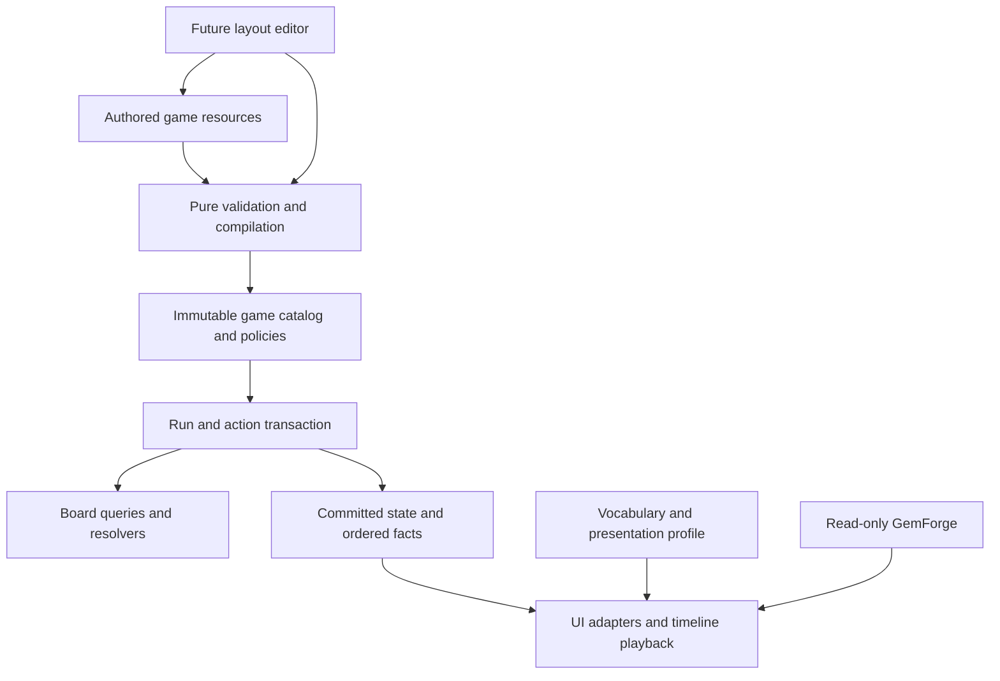

# Prototype architecture — pivot and authoring audit

**Successor routing, 2026-09-22:** the historical atomic-action and stable-only
save guidance below remains the baseline for the old profiles. The implemented
[merge-window foundation](../core/run/MERGE_WINDOW_PREPARATION.md) adds detached
batch computation, repeated paid interventions, isolated default lookahead and
complete parked-state replay/restore. [P3 preparation](../core/run/P3_PREPARATION.md)
owns the reconciled future disk-save contract. The original whole-action 5 ms
failure is retained; successor main-thread and animation-deadline metrics are
different measurements, with G6/G7 readiness still open in
[the journal](../plans/P3_READINESS_JOURNAL.md).

Status: implementation-plan hardening, 2026-09-14. Complements the [P0 freeze](P0_BASELINE.md), [rewrite review](GAMEPLAY_REWRITE_REVIEW.md) and [presentation production specification](PRESENTATION_ASSETS.md). No runtime change or new gameplay acceptance is claimed. P0's frozen files remain unchanged; this document tightens the implementation boundaries before P1.

Post-implementation addendum, 2026-09-14: P1's functional baseline is now verified,
but the sequential reference introduced a normal-play fluidity regression and
the latency target is unmet. The [verified assessment](FLUIDITY_AND_REACTIVE_PLAY.md)
and [P1-A amendment](../plans/P1_FLUIDITY_AMENDMENT.md) add required presentation
and performance work before first-room pacing acceptance. Earlier hardening
requirements remain; the original freeze is unchanged.

## 1. Verdict and practical pivot costs

The proposed foundation is viable, but the previous plan left terminology, presentation production, authoring admission, RNG persistence and topology scheduling too implicit. Make the boundaries below explicit in P1–P3. Do not build a universal game engine: a replaceable policy still needs correct implementation and tests when its behavior changes.

| Pivot | Expected scope after hardening | Limits |
|---|---|---|
| Rename Work/Craft/tools; change workshop to another setting | Vocabulary, UI theme, sound/VFX and background presentation profile | No replay/rule change; fitting and recognition still need review |
| Tune budgets, weights, tool costs, family limits | Versioned rule/content resources | New runs use new content digest; old saves retain their admitted rules or reject explicitly |
| Change a trigger condition or effect amount | Typed reaction/predicate parameters | A new effect kind needs code and tests, not arbitrary resource scripting |
| Add an irregular layout, gravity zone, portal or immovable occupant | Layout/room data within admitted policies | Termination, contention, reachability and visual trajectories must pass |
| Replace merge promotion with collection-only matches | Match-outcome policy, event tests and presentation mapping | Storage, input, gravity and authoring can remain; balance/fixtures change |
| Change match length, permit 2×2, change survivor preference | Match grammar/classification policy plus previews/tutorials | Not a scene-only or tuning-only edit if event ownership changes |
| Change tier count or allow multiple identities per match class | Roster/progression policy and content/UI/art coverage | Eight silhouettes and one definition per tier are current game decisions, not free arbitrary support |
| Add hex grids, graph-only matching, continuous movement or realtime play | New topology/input/scheduler implementations | Explicitly outside the prototype's guarantees |

The prototype supports a finite rectangular address space with missing cells and discrete directional movement. It can express asymmetric square-grid rooms; it does not promise every conceivable board game. Preserve this honest boundary rather than adding unused abstractions for all future possibilities.

## 2. Ownership and workspace organization

These are planned paths; create a directory only when its first implementation lands. Retain established `core/board`, `core/run`, `core/rules`, `data/tiles`, `resources/definitions` and all optical/delivery paths. Move current files only as part of an owned repair, with callers/export entries updated.

```text
core/board/                       occupancy, topology queries, matching, settling
core/rules/                       RNG, canonical codec, actions/events, policy context
core/run/                         transaction, room/run lifecycle and objectives
core/game/                        family/tool/reward handlers and typed effect dispatch
resources/definitions/            pure content schemas; no scene/Node references
data/tiles/                       logical piece definitions; stable IDs
data/game/rules/                  named rulesets, limits, costs, supply
data/game/reactions/              typed predicates, selectors, effects, cap parameters
data/game/families/               membership and shared reaction references
data/game/settings/               equipment definitions/contributions
data/game/layouts/                reusable raw board layouts
data/game/rooms/                  layout + objective + pressure + reward references
data/game/encounters/             authored initial occupants/counters when needed
resources/presentation/           game UI/audio/VFX profile schemas
data/presentation/               gem catalog plus game profile / cue mappings
data/localization/               UI keys, terminology, descriptions and translations
assets/ui/                       accepted icons/theme resources; shipped
assets/backgrounds/              accepted optional textures; shipped
assets/audio/sfx/                 accepted WAV files and audio bus resource; shipped
scenes/app/                      composition/session owner and navigation
scenes/ui/                       reusable controls and screen panels
scenes/board/                    input, BoardView, TimelinePlayer and cell layers
scenes/effects/                  bounded reusable game VFX, no rule mutation
tools/game/                      headless content/layout checks, tuning, asset builders
addons/facets_board_editor/       later editor plugin only
art_source/game/                  recipes, vector source, prompts, provenance; not shipped
generated/game/                  disposable candidates / compiled intermediates
tests/game/                      focused rule, save and presentation boundary suites
tests/fixtures/game_prototype_v1/ frozen P0 cases, retained verbatim
artifacts/game/                  reports, screenshots, measurements; not shipped
```

`data/game/rules/` is the chosen path; it replaces the earlier proposed `run_rules/` directory name before either exists. `data/tiles/` stays the single piece catalog. Runtime exports include only explicitly used resources/assets/classes; editor plugins, generators, source art and checks stay outside the package. Extend the existing explicit package allowlists rather than copying whole directories.

Each implemented subsystem gets a short adjacent README/contract: purpose, permitted imports, resource IDs, maintained command, one minimal example and owning tests. Stable IDs are not file paths, translated labels or resource filenames. Renaming a folder updates references; renaming a label does not migrate saves.

The dependency direction is:



Bootstrap may read Nodes/resources and inject compiled immutable data. Core rules do not consult scene paths, translated strings, animation state, wall time or optical resources. Board storage does not decide room victory, family identity or tool costs. Game handlers do not allocate textures or play sounds.

## 3. Modular rules without an overbuilt framework

Select one validated `RuleSet` at run creation. It contains concrete IDs/parameters for match grammar, match-key selection, outcome/progression, survivor ordering, supply, settling policy, objective types and resource budgets. Small pure functions or RefCounted services implement those policies. Introduce an interface only where a real caller or alternate policy needs it; no reflection-based service locator, ECS rewrite or generic dependency-injection framework.

Keep **detection**, **classification**, **outcome planning**, **conflict resolution** and **commit** separate. A match detector returns source cell/instance groups; the selected outcome policy decides merge versus removal. Fixed `MAX_STANDARD_TIER=8` and hardcoded move refunds belong to the current game policy during migration, not general board storage. The first policy still implements exactly P0's eight-tier merge rules.

Reaction resources can contain a small vocabulary of predicates (event kind, cause, tier range, family, size/shape, source role), selectors (self, survivor, adjacent lowest eligible, source component) and typed effects. Use bounded AND lists and named compound predicates when needed. Reject unknown kinds, invalid parameters, contradictory filters and missing references at admission. Do not permit arbitrary property-path mutation or executable scripts embedded in saved content. Current three families can use explicit handlers selected by stable IDs.

Authoring content and runtime state are different objects. A loaded `.tres` is never mutated to spend charges or preview a change. Compile resources into detached dictionaries/typed records; state owns counters, occupants and equipped choices. Data tuning creates a new immutable rules snapshot at a run boundary. Existing runs retain their snapshot. A development-only restart-with-new-tuning command makes that boundary visible.

Small example: a family reaction definition selects `match_committed`, filters `primary_family=quartz`, calls `grant_resource(tactic_charge,1)`, and caps by `family/quartz/root_action`. Its text, emblem and sound come from presentation references. Increasing the amount changes the rules digest; changing the sentence or sound does not.

## 4. Game language and visual setting

Use neutral mechanical IDs, with current names in localization/presentation data:

| Stable mechanical key | Current English label | Example alternate label |
|---|---|---|
| `resource.action_budget` | Work | Moves |
| `resource.tactic_charge` | Craft | Focus |
| `action.exchange` | Reposition | Shift |
| `action.clear_target` | Chisel | Break |
| `action.promote_target` | Refine | Upgrade |
| `equipment.setting` | Setting | Relic |

These are naming conventions for the new code, not a demand to rewrite every historic word or rename the optical engine. P0 fixtures' `work`/`craft` fields are documented adapter aliases; preserve their frozen bytes. Resource counters and commands use canonical IDs internally. Presentation maps IDs to text keys, icons, colors and cues. A game label must never be a dictionary key controlling matching or save loading.

Descriptions use localization templates with named, typed placeholders populated from admitted rules: e.g. `Spend {cost} {resource_name} to exchange two adjacent pieces.` Do not copy a cost into both a script and a sentence. Display full sentences through translators/templates, not English word concatenation. Keep mineral factual notes distinct from fictional ability descriptions. Prototype ships English plus a generated expanded-text test catalog; additional translations and RTL layouts are later work.

One game presentation profile selects vocabulary, Godot Theme, icons, board background/decoration, event-to-VFX/audio mapping and motion settings. It references the existing gem delivery catalog independently. A theme switch happens at a safe UI boundary and rebuilds presentation only. Saved appearance preference has its own digest; state hashes exclude vocabulary, theme and media bytes. The Godot Theme workflow supports shared control styling; use it rather than scattered per-scene overrides. [Godot Theme editor](https://docs.godotengine.org/en/4.6/tutorials/ui/gui_using_theme_editor.html).

Required pivot proof in P4: replay the same saved action sequence under workshop and neutral high-contrast profiles, with Work/Craft renamed Moves/Focus. Final simulation hash and events must match. Verify HUD, tool descriptions, rewards, modal dialogs, errors and results use the new terms and actual configured numbers. Swapping only the main HUD is not sufficient.

## 5. Board topology, blockers and deterministic settling

### Definition and query contracts

Keep `BoardLayoutResource` as raw authorable data, then validate/compile an immutable topology before creating BoardState. Use a stable flat cell index within width/height plus an active-cell mask. The raw definition distinguishes missing cells, gravity zones, ordered fill sources, directed portal edges and explicit spawn policy. Runtime blocking objects do not rewrite the mask.

Extend the existing BoardState adjacency authority with an explicit query purpose: grid match/swap, gravity travel, or fill-source lookup. Matching/swaps use ordinary active orthogonal neighbors. Gravity applies the directed portal override for that direction. Fill-source policy is explicit: prototype diagonal sources use local grid offsets and do not accidentally inherit gravity portals. This fills an unspecified corner of the old contract; record its policy ID and regression cases when implemented.

`get_effective_gravity` retains tile override, nonzero cell/zone value, then DOWN. Directions are cardinal for admitted initial layouts. Zone names/editor colors are authoring metadata; compile their final per-cell directions. Overlapping zone paint resolves to one explicit cell assignment at authoring time, not dictionary insertion order at runtime. Gravity is re-evaluated at each visited cell, so a tile can turn when crossing a zone boundary.

Distinguish capabilities: may enter cell, may move occupant, may swap occupant, may participate in matching, may be consumed, blocks extraction. A seal may prevent movement yet allow matching; rubble occupies space without a gem; a permanent hole supports no occupant. Put these queries in board/game rule services. Renderer mouse filters never decide a gem is immovable. Terminal collection and damage policies remain separate from movement permissions.

### Scheduling and termination

The current `BoardPhysics` scans bottom-to-top/right-to-left and mutates in place. With upward movement, a tile can enter a cell still to be visited in the same scan; the informal “one move per tile per round” description is therefore unsafe. Freeze the initial repaired scheduler as a named **legacy scan policy** retaining canonical scan and fill-source order, and record every actual segment. Do not silently replace it with simultaneous intents during an optimization: contention winners and later spawn consumption can change.

Support sideways/upward zones through that deterministic policy, with test fixtures and explicit author-facing contention diagnostics. A future orientation-neutral scheduler can be another rules/protocol version with different golden outputs. Do not rotate scan order opportunistically by camera/view orientation.

Admit acyclic effective travel graphs for the first transport content. Check both primary and optional fill edges conservatively; report the cycle path and involved fields. Permanently circulating conveyors require an action-ticked transport policy later, not a higher settling cap. Dynamic tile-gravity effects are deferred; if introduced, revalidate the affected transition graph or reject the effect transaction. Occupied cycles that happen not to move today are not reliable proof of eventual stability.

Runtime still detects repeated physical occupancy states and bounded-work exhaustion. Report explicit nontermination/cap failure and restore the transaction snapshot/RNG; never accept an unresolved board. An authored maximum cell/work bound prevents huge malformed layouts from exhausting the process. Initial production target is 8×8; test support up to 16×16 as a declared envelope, not unlimited maps.

### Spawning and travel events

Use explicit `spawn_policy`: `fill_empty_cells` for the P0 prototype, `entry_only` for transport fixtures/future lanes. Do not infer policy from whether an entry happens to be empty. Occupied entry-only boards wait for space. Refill and gravity proceed until physical stability independently of matching, then matching resumes under the turn contract. All spawn selection uses canonical cell order and integer draws.

A movement records stable instance ID plus all cell/portal segments. Presentation coalesces a journey without discarding bends, teleports, entry direction or phase dependencies. Renderer maps cell IDs to positions and knows how to draw a portal transition; it never recomputes where the tile should have gone. UI previews query the same topology and action validator used by simulation.

Required additional P1/B04 fixtures: irregular mask with separate supported pockets, sideways-to-down turn, upward zone, directed portal landing, two sources contending for one cell, immovable occupant above an entry, local diagonal fill beside a portal, mixed-edge cycle rejection and a no-match refill that fills a lane. They supplement the frozen P0 fixtures rather than modifying them. Transport rooms themselves still wait for P6.

## 6. Determinism, replay and controlled tuning

The current wrapper holds a Godot RandomNumberGenerator and seed, while current save/replay omit its position. Preserve the SeededRng boundary; add exact capture/restore and an explicit implementation/version identifier. Godot documents both state restoration and that its underlying RNG algorithm is an implementation detail. Pin the Godot/RNG version for accepted replays; do not promise seeds survive arbitrary engine upgrades. [Godot RNG](https://docs.godotengine.org/en/4.6/classes/class_randomnumbergenerator.html).

For the new simulation protocol, use a small bank of passed **SeededRng** streams with literal IDs `board`, `rewards`, `routes`, `recovery`. No naked RNG instances outside the wrapper. Proposed derivation `facets-stream-v1`: SHA-256 the UTF-8 bytes of `facets-stream-v1\n<master seed in canonical signed decimal>\n<stream ID>` with no final newline; interpret its first 15 hex digits as a nonnegative integer seed. Record derivation version and actual seeds; add fixed input/output vectors at implementation. Restore the original seed first, then its captured state. Save every stream's actual state. This prevents changing a reward offer from consuming a future board draw. Visual noise/pitch/particles use an entirely separate presentation seed and cannot touch simulation streams.

This stream split is a new protocol choice before the first prototype replay goldens are established, not a claim of compatibility with the old demo's single stream. Keep `facets.prototype.v1` as the P0 mechanics target and assign the first implementation's RNG/codec/settling versions explicitly. Any later sequence-changing modification needs a new protocol/content identity.

Define a canonical state codec: typed fields, schema version, fixed field order, sorted map/set keys, ordered sequences preserved, explicit null and integer representation. Hash canonical bytes with SHA-256; do not use engine object hashes or JSON pretty-print output as the protocol. Integer RNG state, seeds and large counters must round-trip exactly. If saves use JSON, encode 64-bit fields as validated decimal strings and restore integers at the boundary; small numeric fields also require type/range admission. Godot JSON parsing uses floating-point number conversion. [Godot JSON](https://docs.godotengine.org/en/4.6/classes/class_json.html).

Specify the first canonical codec in code/tests before using checkpoints: explicit type tags, signed 64-bit little-endian integers, one-byte booleans, UTF-8 strings with bounded integer byte lengths, schema-ordered record fields and bytewise-sorted map keys. Stable content IDs use admitted ASCII identifiers; user-facing Unicode text is not rule identity. Arrays representing order retain order; membership sets sort. Reject unsupported types, noncanonical integer strings and overflow. Bound positive summed spawn weights to the signed 32-bit sampling range; changing weights must never pass a float sampler. Add byte-level golden vectors rather than relying on a serialization library's incidental output.

An accepted replay contains initial admitted game snapshot/content digest, rules ID, simulation protocol, RNG versions/states, ordered user commands and canonical checkpoints. Input actions are coordinates/IDs, not pixels or translated labels. Rejected actions do not mutate simulation/RNG; optional telemetry records them separately. Save/restore at stable boundaries initially. Save atomically through a temporary file and verified replacement, retaining the last known good save; validate slot names, schema, counts and references before allocating. A corrupt or incompatible save produces a clear UI error, never a silent fresh run.

An action computes on a detached state or restorable transaction snapshot, including RNG. Commit only after termination and invariant checks. A renderer cancel cannot roll back a committed action; it snaps to the committed view snapshot. Replay/bots run the same resolver with no scenes, audio or frame waits. Canonical rule facts and optional detailed debug traces are separate so log truncation cannot lose simulation correctness or reuse IDs.

Implement a small headless tuning runner after P2: named rules profile + seed list + policy → JSON results containing exact digests, outcomes, Work/Craft, chain depth, legal-action counts, reshuffles, resolver timings and failures. The developer may compare profiles; no live tuning mutates an existing run. Golden replay tests cover same-build repeatability, save/resume, dictionary-order independence, negative/boundary 64-bit values and cosmetic profile changes. Claim cross-platform equality only after actual second-platform comparisons.

## 7. Efficiency without changing rules

At 64 cells, prioritize simple complete scans and correct transactions. Precompile active cell IDs, neighbor tables for each purpose, reverse incoming edges, ordered spawn entries and fixed scan order. Separate immutable layout/catalog data from small mutable occupant/counter state so snapshots share definitions and copy only state. Rebuild caches only when their dependency changes; dynamic topology, if later allowed, invalidates them explicitly.

Measure simulation time independently of animation, frame time and asset loading. Initial acceptance target: p95 ≤5 ms per ordinary complete 8×8 action on the stated workstation and admitted seed workload, with max time, tile moves, reaction count and allocations reported. This is a proposed target, not a measured result. Include 16×16 stress, convergence, long refill and near-cap failures; those results define future support, not a requirement to ship larger boards.

Do not scan all effects on every event: index the small handler set by event kind. Avoid per-cell scene-tree lookup, repeated resource loads and repeated string construction in hot loops. Keep buffers bounded by admitted board/action sizes and retain unique sequence IDs. Event batching may compress presentation data, not omit rule facts required by replay.

Only add dirty-cell matching, graph-scheduled gravity or action delta snapshots after profiling demonstrates need. Retain the simple reference resolver and compare complete final state plus canonical event sequence across the same fixture/seed corpus. A faster final board alone is insufficient if survivor, resource, RNG or event order differs. GPU gem rendering is unrelated to optimizing board logic.

The new small-sample diagnostic identifies repeated compatibility board hashing
as approximately 70% of resolver time; inspect redundant intermediate digests,
canonical encoding and full re-admission before changing the physical scheduler.
This does not replace the original 100-seed latency result or measure allocations.
Keep complete authoritative identity and full external admission. P1-A specifies
fresh actual-action CPU/frame evidence and exact checkpoint comparisons.

Presentation scheduling is a separate optimization: derive concurrent journeys
from immutable facts and stable paths. Do not serialize unrelated tile movement
because facts have a canonical sequence. Preserve bends/portals, support and
reservation dependencies; retain whole-wave barriers where necessary. No Tween
completion decides match readiness in core. A future interactive cascade needs a
resolver-owned continuation or logical event clock, versioned command/replay and
complete pending-state identity. Current playback stepping is not that interface.
Retain clean phase boundaries now; defer unused time fields and a general event
scheduler until an explicit reactive-mode trial is authorized.

## 8. Future visual map editor

Use a Godot EditorPlugin later, sharing the raw layout/room schema and the same pure admission/compiler used by headless checks and game loading. Do not serialize a live BoardScene or maintain a second editor-only physics implementation. Godot provides editor plugin and undo/redo APIs for this purpose. [Editor plugins](https://docs.godotengine.org/en/4.6/tutorials/plugins/editor/making_plugins.html), [EditorUndoRedoManager](https://docs.godotengine.org/en/4.6/classes/class_editorundoredomanager.html).

The prototype must establish these editor seams now:

- Raw layout remains editable even when invalid. Admission returns structured issues: code, severity, resource ID, field path, cell/edge IDs and message key. It does not silently discard out-of-bounds entries by first applying them to BoardState.
- Separate layout shape/transport from encounter occupants/obstacles and room objectives/budgets. One layout can serve several room themes without duplicated geometry.
- Definitions have schema versions and stable layout/portal/zone IDs. Canonical saves produce reviewable diffs; UI-only selection, pan, zoom and layer colors stay in editor metadata outside gameplay identity.
- A paint action edits a detached authoring document through a command, with undo/redo and dirty tracking. Prototype uses hand-authored resources; no unused editor shell is built now.
- A playtest compiles a copy, chooses a seed/roster and launches the real resolver. Restart restores the authored state; playing never overwrites authored occupants or rolls back through shared Resource mutation.

Later editor tools: active-mask paint, obstacle/lock/floor layer paint, cardinal gravity zone brush, ordered fill-source brush, spawn/outlet markers, directed portal pair tool, objective inspector and roster/seed controls. Draw arrows, source order, path ghosts, reachability and cycle witnesses. Clicking an error selects its actual offending field/cell. Preview grids use the same BoardGeometry mapping as the game, while authoring widgets own their input separately from TileView.

Editor acceptance: save/load/compile round trip; undo entire paint stroke and portal edit; duplicate-ID and malformed-edge errors remain visible; deleting/resizing referenced cells requires an explicit repair operation; headless and editor admission reports agree; playtest cannot mutate source resources. The plugin and its textures stay excluded from desktop exports.

## 9. Phase commitments and audit closure

P1 owns neutral rule identity, typed action/state boundaries, canonical codec/RNG versioning, explicit topology/spawn policy and structured raw admission. P2 owns concrete game handlers, a functional presentation profile and first non-gem asset subset. P3 extends content/room ownership, complete persistence and the tuning runner. P4 finishes the [non-gem asset specification](PRESENTATION_ASSETS.md), theme/terminology pivot proof, audio/VFX lifecycle and presentation QA. P5 accepts release performance/package behavior. The visual editor remains later work.

P1-A additionally owns restoration of coherent concurrent motion and remediation
of the measured action-latency gap. P4 owns polish and broader presentation
decomposition; P5 revalidates performance under the full expedition workload.
Neither later phase substitutes for a usable foundation. The user has approved
the [required intervention-window trial](../plans/P2_INTERVENTION_TRIAL.md) after
P2, before P3 save/reaction contracts freeze. Testing is required; production
adoption remains optional. It does not block the concurrent-motion repair.

No changes to the frozen P0 snapshot are needed: this audit makes implementation protocols explicit before code lands. The new local-fill portal policy, RNG partition and scheduler version must be recorded in the owning gameplay contract/guide alongside P1 implementation and new fixtures, not silently treated as existing behavior. AGENTS.md routes to those owners and does not duplicate their implementation details. Existing engine/delivery contracts remain protected.

Audit evidence: a [fresh small Godot probe](../artifacts/foundation-audit/probe.json) confirmed that numeric JSON round-trip loses the test integer `9007199254740993`, a decimal-string representation preserves it, and setting seed then captured state restores the tested RNG sequence. The [log](../artifacts/foundation-audit/probe.log) includes its positive completion marker and the existing root-certificate-store warning. This supports the serialization decision; it does not validate an unimplemented codec or establish cross-platform determinism. No broad simulation/engine suite, media generation or live UI review was performed for this documentation audit.
