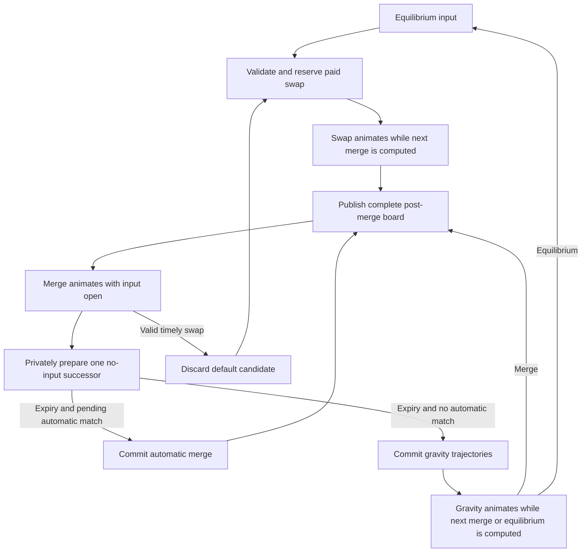

# P3 readiness successor: repeated merge-window play

Status: G0–G5 implemented and checkpointed, 2026-09-22. Awake native rechecks pass on the feedback build; r6 now passes the full normal CPU corpus after completion-observer and timing-boundary corrections. G6/G7 remain open for final r6 stress/native/control checks and delivery. This is the
accepted execution goal requested by the user. It incorporates the explicit
choice that interventions precede pending automatic matches, and the subsequent
request to precalculate and discard the default automatic result when necessary.

## Goal and meaning of ready

Deliver a verified, separately versioned P2 room with repeated board-wide merge
interventions, normal move accounting plus intervention hooks, incremental
resolution and presentation, isolated default-path lookahead, deterministic
replay/restore, and measured animation-deadline headroom. Reconcile P3's family,
objective, carry and persistence contracts with that model, then deliver one
tested build and optional review form. P3-ready means the new foundation passes
the specified engineering exits and P3 implementation can proceed without an
unresolved continuation/accounting contract. It does not mean P3 content already
exists or that the interaction has proven fun, readable or comfortable for players.

The user is the sole current reviewer and defers broader human testing, possibly
until after P5. No participant count, human trial or adoption vote blocks this
goal. The existing delivered P2 review build remains evidence of the old runtime,
not evidence that this successor exists.

Durable behavior is in [MERGE_WINDOW_PREPARATION.md](../core/run/MERGE_WINDOW_PREPARATION.md).
The [30 acceptance specifications](../tests/game/MERGE_WINDOW_ACCEPTANCE.md)
own exact witnesses, proposed timing thresholds and measurement procedures.
Both are tracked; this local plan follows the repository's ignored plans policy.

## Step 0 reconciliation

The prior atomic P3 plan is superseded as the next execution direction. Its room,
reward and family design remains input for P3; atomic transaction, save-phase,
Craft timing and per-action scope assumptions require explicit reconciliation.
P0/P1/P2 and trial protocols/goldens remain frozen. The old trial's one window,
selected survivor, automatic-chain-first ordering and shared episode accounting
are not a shortcut implementation of the new mechanic.

The old complete-action CPU gate still failed: P2 p95 37.640 ms against 5 ms in
the retained release measurement. This proposal defines successor deadlines; it
does not retroactively pass or erase that metric. G0 records the replacement
readiness contract and G7 reports both the old evidence and new measurements.
The chosen 5 ms main-thread budget is a different measurement and must be named
as such. The old app goal must not be marked achieved merely to replace it.

Ten pre-amendment source/design/status documents were archived with verified
SHA-256 entries in
[the preservation manifest](archive/p3-readiness-before-merge-windows-20260921/manifest.json).
Historical closeout results and goldens are not rewritten. Capture fresh source,
dirty-state and tool/package manifests before runtime work; distinguish changes
made after the prior tested release from the release's measured evidence.

| Existing owner | Verified gap | Successor responsibility |
|---|---|---|
| `core/run/turn_controller.gd` | Resolves promotion-created chains before its optional gravity park | Yield after exactly one canonical merge batch; explicit pending-match/gravity cursor |
| `core/run/room_transaction.gd`, `run_controller.gd` | Whole command resolution, admission, hashes and publication are synchronous | Retain atomic legacy API; add transactional session batches and detached executor |
| `core/run/intervention_trial.gd` | One selected-survivor window, full continuation, expensive clock cloning | Preserve experiment; implement repeated any-legal-swap session and lightweight clock metadata separately |
| `scenes/debug/intervention_view.gd` | Prefix animation completes before its timed window begins | New room integration opens input at the first actionable merge frame |
| `scenes/board/action_player.gd`, `board_scene.gd` | Complete-result playback; view ownership follows whole-action locking | Stream committed batches, separate ghosts/live IDs, overlap accepted swap with decoration |
| `core/rules/action_legality.gd`, `room_action_legality.gd` | Endpoint match checks plus equilibrium phase gate | Reuse topology/matching; explicit unsettled admission, prices and context |
| `core/run/P3_PREPARATION.md`, `tests/game/p3-preparation.json` | Atomic P3 reserved schemas/scopes and structural fixtures | Reconcile incremental accounting, failure boundary, save phases and future objective policies |

## Resolution design

The diagram omits terminal/error exits for readability; they are mandatory in
the contract. A decision uses the published post-merge board, not interpolated
sprites or a speculative future. Automatic-match redirection is intentional:
the newly promoted gem may leave its pending automatic match for a stronger
legal adjacent match, so pending matches must be rescanned after the intervention.

Default lookahead solves two actual timing gaps: expiry-to-automatic-merge and
expiry-to-first-gravity. It uses a detached board/context/RNG and calculates only
one next batch. Nothing speculative charges Work, awards Craft, advances live
RNG/IDs, emits public facts or reaches the renderer. Expiry may commit the exact
candidate only against its still-current window/revision. A timely intervention
wins, cancels it and receives executor priority. This is bounded useful
speculation, not a search over possible player commands or all future cascades.

Every paid intervention has ordinary default cost/effects, a fresh move scope
and an engine-derived intervention tag. Free expiry continues the active scope.
There is one accepted command per window and no arbitrary limit on subsequent
windows. All matching components in one scan form one batch. Tools remain
equilibrium commands, but tool-caused merges also permit ordinary paid swaps;
the new paid scope ends inherited tool suppression for its own effects.

Use a persistent detached simulation worker plus a synchronous reference over
the same kernel. Before enabling the worker, audit catalog/resources, codec
caches, mutable dictionaries and callbacks for ownership. The main thread owns
input arbitration, commit publication and visuals. Bounded queues, cancellation
generation, immutable packets and deterministic recording are requirements, not
optional optimization. No rule reads animation callbacks or wall-clock duration;
the adapter supplies explicit admitted tick/decision events.

## Ordered implementation checkpoints

Each checkpoint ends with an implementation/evidence journal entry and a commit
of its successfully verified tracked changes. Do not checkpoint a failed gate as
complete. Keep functional presentation alongside kernel work; the final step
integrates and measures it rather than beginning all UI work then.

| Step | Work and deliverable | Exit before checkpoint |
|---|---|---|
| G0 — reconcile and freeze | Recheck inherited code/phase evidence against current HEAD; preserve baselines; freeze timing/branch/scope semantics and successor versions; enumerate shared mutable worker dependencies; create registry/evidence routing for actual new checks | No contradictory current contract; unchanged legacy expectations; every MW witness has an owner and proposed executable assertion; report initial reference measurements and exact frozen profile |
| G1 — incremental reference kernel | Introduce session/cursor/batch types and phase-aware internal admission. Resolve one canonical match batch, or exact gravity packet, then return. Keep full external hashes/admission and atomic legacy path | MW01-03, MW08, MW13-14 pass against synchronous reference; old controls remain exact; pending match is unresolved at the barrier |
| G2 — repeated paid input and accounting | Admit any legal occupied swap in merge windows; normal costs/turns/Craft/tool refresh and fresh move contexts; rescan pending matches; typed diagnostic pricing/reward hooks | MW04-07 and MW09-12 pass; stronger-match redirection has hand-explained pass/intervene outcomes; four-intervention witness and tool-scope handoff pass |
| G3 — worker and default lookahead | Build detached single-writer executor, immutable mailbox, one speculative default branch, bounded cancellation and atomic publication; instrument all job stages | MW19-23 pass under hostile completion schedules and cancellation; accepted commands equal non-speculative reference; speculative RNG/cost/facts never leak; shared mutable ownership audit closed |
| G4 — playable streaming room | Integrate streaming player and hit map, first-frame promoted identity, noninteractive ghosts, immediate swap feedback, tick arbitration, repeated windows, reduced-motion/assisted policies | MW15-18 pass in native playback, including earliest/latest inputs and remote matches; MW03/04/20 visibly work in the room; timing telemetry includes actual presentation boundaries |
| G5 — persistence and P3 contract audit | Implement complete session replay/in-memory restoration; reconcile P3 scopes, failure boundaries, extraction policy, carry IDs, reserved versions and disk-save requirements. Update future P3 fixtures with reasons | MW24-27 pass at applicable implemented seams; old schema incompatibility rejects explicitly; every new phase has a save/objective disposition; structural P3 checks do not masquerade as gameplay tests |
| G6 — performance and iterative correction | Run frozen release corpus and required stress; profile failing stages; correct implementation while preserving semantics; replay exact witnesses after each correction | MW28-29 and all frozen performance exits pass; three complete corpus repetitions; no missing transitions or discarded slow runs; new release integrated checks pass after last correction |
| G7 — release, audit and handoff | Verify production-mode successor entry, legacy entries, lifecycle and source/package identity; rerun final affected controls; reconcile readiness ledger and P3 batches; package one build/form | MW30 and all MW01-30 evidence present; registered completion counts match; actual executable passes at both sizes; checksum manifest and complete exit ledger; no unresolved engineering gate labelled done |

Potential executable group names are `test_merge_kernel`, `test_merge_commands`,
`test_merge_accounting`, `test_merge_executor`, `test_merge_clock`,
`test_merge_replay`, `test_merge_playback`, and `merge_release_probe`. These names
are proposals, not commands to run before registration. Extend existing test
owners when that keeps responsibility clearer. Use the current check runner's
fresh-output/source-stability/completion-marker discipline.

## Performance and failure handling

The target is a fully admitted next result before its presentation deadline,
with prompt feedback and a responsive main thread. One merge per decision makes
the work unit more bounded; modifiers can still make an individual batch costly,
and cloning/encoding a large session can dominate regardless of cascade count.
Preserve exact telemetry for those costs. Moving work to a worker improves main
thread availability but does not make work disappear.

Initial normal-profile targets are p95 <= 16.7 ms input feedback, p95 <= 5 ms
total main-thread simulation work per active frame, zero missed batch deadlines,
and p95 compute readiness within one quarter of the available animation interval
(maximum one half). Default candidates must be ready at expiry. The acceptance
document defines all boundaries, maxima, native frame/resource checks and the
required modeled 2x-compute stress. Current hardware is the reference machine;
simulated delay does not establish performance on arbitrary weaker hardware.

On a failure: preserve raw evidence, isolate the responsible stage, form a
specific correction hypothesis, change the smallest responsible owner, replay
the failing witness and affected controls, then run fresh integrated acceptance.
Profile before selecting internal validation shortcuts, copy/cache changes or a
native kernel. Never remove complete external admission/hash coverage, silently
relax targets, make animation slower to conceal starvation or regenerate legacy
goldens to fit a changed result. Intentional fault injection passes only when its
specified recovery and honest telemetry occur; normal starvation remains failure.

The runtime fallback on a late result is a coherent hold with input closed and
an explicit starvation record. The next window receives its full duration once
ready. Technical failure discards only unpublished work and releases its reserved
cost; earlier published batches stay committed. A partially animated provisional
swap explicitly returns to the last committed board. There is no rollback of
already shown and committed history.

## Final deliverables and deferred scope

- Tracked successor contracts, runtime, test fixtures and registry entries, with
  successfully verified checkpoint commits and a fresh integrated report.
- One packaged build containing the new room and labelled legacy/diagnostic
  entries as needed, a manifest of exact tested bytes and one optional form.
  The form demonstrates promoted-gem redirection, a remote match, repeated
  interventions, no-input automatic chains and gravity; it asks for observations
  without claiming the sole reviewer represents an audience.
- Updated P3 implementation package whose family, per-move scope, suppression,
  stable/parked save states, terminal boundaries and carry ownership agree with
  the successor. Keep full P3 content, expedition and disk Continue in P3.
- A readiness ledger separating passing engineering exits, retained old 5 ms
  failure, measured current-machine headroom and deferred human/design evidence.

Execution instruction: implement G0-G7 in order, preserve historical evidence,
verify each specified exit, iterate on failures and checkpoint completed work.
Declare P3-ready only after the final ledger is complete. Do not require human
sessions or interpret the old trial's success as proof of this architecture.

## Design-stage verification

This document and the tracked contract/acceptance specifications are design
artifacts only. Link integrity, archive checksums and consistency are checked
before the design checkpoint; no new gameplay or performance pass is claimed.

Verified at the design checkpoint: 112 local links across 12 edited/new design
documents resolve; all 10 archived file hashes match their preservation manifest;
the acceptance inventory contains exactly MW01-MW30 and the execution table
contains G0-G7 in order. Review reconciled tool-window eligibility, cancellation
of speculative failures and explicit early-terminal compatibility differences.
No runtime tests were rerun for these documentation-only changes.

## Execution handoff, 2026-09-22

The [final readiness evidence](../tests/game/MERGE_FINAL_READINESS.md) and [case ledger](../tests/game/merge-readiness-status.json) record passing G0–G7 engineering exits, preserved failures and the exact delivered build. Runtime/probe checkpoint is b0b9437. One build and optional form are delivered in generated/desktop/facets-p3-ready-20260922.zip. Native acceptance is scoped to the explicitly visible, awake current-machine profile. No threshold was waived and no human acceptance is claimed. P3 content, expedition and disk Continue remain the next implementation work.

### User feedback amendment, 2026-09-22
Implement reversible tool targeting and committed audio parity, then one pending identity-following swap during swap/gravity presentation. The user selected gem identity over fixed cells. Verify mouse/keyboard, replacement/cancel, removed or invalid targets, normal cost/context/replay, full swap animation and lifecycle cleanup. Preserve existing engineering gates. After these pass, investigate native stalls with explicit idle/display/session evidence before attributing them to game logic or graphics. No human test gate is introduced.

## Confirmed presentation preference, 2026-09-22
Preserve simultaneous board-wide matches and concurrent clear/promotion animations. The user specifically liked large cascades clearing much of the board. This is existing behavior, not a requested artificial board-clear rule: resolve all current match components in a batch, with no one-match or swap-neighborhood restriction. Keep deterministic resolution, intervention boundaries and runaway safeguards. Automated native policies use ordinary seeded rooms; separate fixed witnesses can arrange exaggerated boards but share the same resolver/player.

### Current readiness continuation
The latest candidate is b0b9437/r8. The full r6 normal and doubled-computation corpora pass; r8 changes native probe observation only. Native both-size1x/2x and a repeat pass with an explicitly visible test window and the unchanged mailbox/120FPS defaults. See MERGE_HEADROOM_EVIDENCE.md for preserved failures, rejected rendering experiments, corrected admission attribution and qualified environment evidence. Final integrated31-stage, ten-stage actual-executable legacy controls, candidate smoke/characterization and exact-byte delivery all pass. This supersedes the older handoff's description of the next diagnostic action, without waiving performance or asserting human acceptance.
