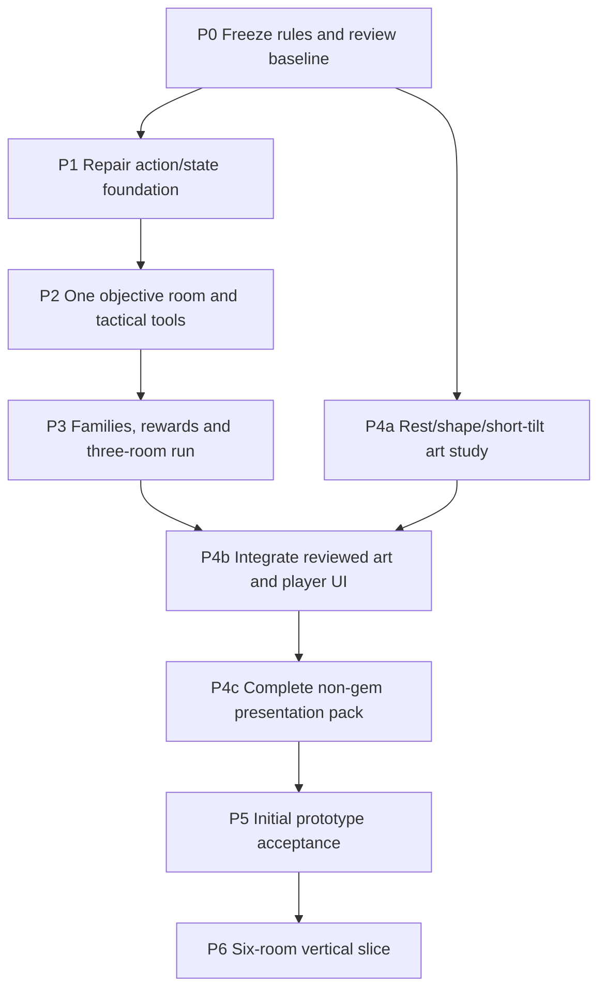

# Facets — phased prototype build plan

Status: recommended plan, 2026-09-14. The [game design](GAME_DESIGN.md) owns intended behavior. The [rewrite review](GAMEPLAY_REWRITE_REVIEW.md) owns source findings; [integration](GAME_ENGINE_INTEGRATION.md) and [art review](GEM_ART_REVIEW.md) own the delivery/content work. The [content systems design](CONTENT_SYSTEMS.md) owns expansion semantics. This plan authorizes no automatic engine expansion and claims no new gameplay implementation.

The [architecture audit](ARCHITECTURE_HARDENING.md) and [presentation asset specification](PRESENTATION_ASSETS.md)
are the final pre-P1 hardening addendum. They preserve P0's frozen mechanics and
require concrete implementation boundaries and non-gem production work below.

## Milestone definitions

**Mechanics proof:** one objective room using existing delivered art, legal actions, bounded tools and a real win/fail result.

**Initial playable prototype:** a complete three-room expedition with carryover, two rewards, one route choice, three family reactions and readable placeholder game UI. Starter eight plus aquamarine are sufficient. Goal: determine whether build choices and spatial objectives reinforce each other.

**Complete vertical slice:** six rooms, three hazard types, six settings, reviewed game art, save/resume, accessibility controls and a clean tested desktop package. Goal: assess run pacing and production readiness. This is larger than the initial prototype and should not be treated as its entry requirement.

Do not equate engine readiness, a developer-board demo or a successful bake with any of these milestones.

## Dependency map

Art studies can proceed independently of rule repair. Final rebakes, UI polish and broader content depend on the mechanics proof. This is a work dependency diagram, not a requirement to use parallel agents.

## P0 — Establish a reviewable baseline

**Completed 2026-09-14:** [P0 baseline and decisions](P0_BASELINE.md), named rules
`facets.prototype.v1`, 23 controlled target fixtures, source/asset snapshot,
ordered backlog and contract migration register. P1 remains unstarted. The P0
report distinguishes data validation from future gameplay acceptance.

Deliverables:

- Adopt the proposed three-room experiment as a named rules version. Record decisions for Work/Craft, one gem per appraisal tier, collection versus supply, family triggers, survivor ordering, carryover and extraction timing. Remove separate numerical appraisal; commissions use tier/count demands. Record one provisional grade intent per gem without recalibrating optics.
- Preserve source revision, current working-tree delta, pack/catalog hashes and seed fixtures. The current `project.godot` local edit must be understood before any future settings change.
- Turn the source-confirmed gaps into an ordered game backlog; copy the diagnostic cases into appropriate real regression tests when implementing repairs.
- Record explicit AGENTS.md updates needed by intentional mechanics changes. Do not rewrite the engine's physical contracts to accommodate game preferences.
- Choose the first controlled board fixtures: basic 3/4/5/L-T, intersecting multi-run, first/last action win, occupied spawn entry, extraction outlet, locked gem and recovery/no-recovery boards.

Exit: a developer can state the whole three-room loop and identify which statements are proposed versus implemented. All required prototype art already has a baseline delivery binding. No dependency on unavailable optical phenomena.

## P1 — Repair deterministic actions and state

Work:

1. One `can_apply_action`/`apply_action` boundary for swaps; validate adjacency, occupancy, phase, locks and match creation. Expose a shared legal-action query for UI, hints and bots.
2. Correct matching topology and intersecting-component classification. Make survivor ordering explicit and keep all adjacency in BoardState.
3. Correct spawn-entry detection and settle/refill until stable, including no-match refill passes. Return explicit cap/invalid-layout failures.
4. Inject immutable game catalog/config into simulation instead of looking up Nodes inside rule services. Preserve `SeededRng` integer behavior.
5. Add stable instance/event IDs and canonical complete state serialization/hash. Include topology, obstacles, roster, explicit supply targets/weights, counters, inventory, RNG state and content/rule version as introduced. Keep presentation-only choices outside the simulation hash.
6. Preserve immutable lifecycle facts for existing transitions: source/old/new identities, match component/shape, removal reason, root/parent cause, stable movement path and assisted-swap classification. These are data contracts, not an unused generic event scripting system.
7. Commit a complete action transaction before playback; support cancellation/skip without repeated rule finalization. Keep a compatibility adapter only while callers migrate, with one underlying implementation.

Additional foundation commitments from the final audit:

- Use stable mechanical IDs, typed RuleSet policies and separate rule/presentation
  digests. Keep match detection/classification independent of merge outcomes.
- Define canonical exact-integer encoding, full RNG state restoration and explicit
  simulation/RNG/settling protocol versions. Introduce the passed SeededRng stream
  bank before new replay goldens; no promise of old demo sequence compatibility.
- Validate raw layouts before applying them; return field/cell/edge error records.
  Make adjacency purpose, local diagonal-fill policy and spawn policy explicit.
- Preserve the named in-place scan behavior while repairing termination/refill;
  add cycle/contention/upward-zone/portal-path/immovable fixtures and bounded limits.
- Keep schema/compile/admission usable by a future editor, without building its UI.

Files: `core/board/`, `core/rules/`, `core/run/turn_controller.gd`, RunController adapter, game resource definitions and focused tests. Keep optical layers untouched.

Exit tests:

- Illegal/rejected actions alter neither state nor RNG; distant swaps and no-op blocked swaps cannot succeed through an unrelated match.
- Matching never traverses gravity portals; portal cycles terminate or reject; L/T/multi-intersection tiles belong to one component.
- Entry-only refill fills reachable lanes without spawning through occupied entries; blocked/invalid entries are rejected.
- Every gameplay field change affects serialization/hash as intended; insertion order does not.
- Swapping the displaced helper, consuming a gem, promoting into another family and traversing a portal preserve correct event identities/causes. Generic removal and its subtype share one removal ID.
- Identical seed/config/actions produce identical complete state and ordered rule events. Repeated playback acknowledgment cannot change them.
- Existing 113 smoke assertions remain accounted for: pass unchanged where behavior is retained; any changed expectation documents the intended rule change.

Playable checkpoint: the existing board still swaps, merges and animates, now through the repaired transaction boundary. No new room features yet.

## P2 — Prove one tactical room

Work:

- Add minimal RoomDefinition/RoomState and RunRules data with 16 Work, Craft 0–6, one initial Craft and the proposed once-per-normal-turn match rewards.
- Implement rubble, clear-the-seam objective, deterministic objective progress and last-action completion precedence.
- Implement Chisel, Reposition and Refine one at a time. Enforce one tool between swaps and no tool-origin resource/reaction rewards.
- Add explicit run/room phases: briefing, ready, resolving, presenting, complete, failed. Presentation is a UI gate; rule state is already committed.
- Build plain objective/Work/Craft/tool HUD and a win/fail/restart panel using the existing gem pack.
- Implement the P2 functional presentation kit from `PRESENTATION_ASSETS.md`: shared
  Theme/vocabulary, procedural background, required early icons/rubble states and
  basic audio/VFX with mute/focus. UI reads view models; game facts map to cues.
  Generate small original SVG/WAV candidates using the specified repo tools.
- Add legal-action detection and bounded low-rank reshuffle recovery. Record unrecoverable board locks separately from Work exhaustion.

Exit:

- One room can be won and lost without debug controls. Restart clears prior async activity and state.
- Matched survivors/removed cells damage rubble under one unambiguous rule; a single component cannot double-hit through multiple touching cells.
- Each tool has legal/illegal and chain cases; no Craft/refund loop is possible through tool-origin cascades.
- Win on final Work succeeds; failure prevents new actions; invalid clicks do not tick hazards or spend budgets.
- A fixed seed can be replayed through both instant/no-animation and normal presentation with identical results.

Playtest: 3–5 short sessions with the one-room slice. Require players to understand survivor placement and use at least two tools for purposeful board changes. If tools merely bypass matching, tune this phase before adding rewards.

## P3 — Build expression and the three-room expedition

Implement in this order:

1. Curated Quartz/Corundum/Beryl tags and three concrete family reactions. Source family identity from the matched tiles before upgrading. Beryl targets the survivor's post-merge neighborhood; target order and once-per-turn usage are deterministic. Use one bounded reaction queue and typed intents for these handlers. Resource gains are settled under the shared cap; inherited cause restrictions suppress tool/extraction/setup rewards. Do not implement future family handlers yet.
2. One gem replacement: Sapphire → Aquamarine. Show the complete before/after ladder and family access, including carried-tile conversion if applicable.
3. Two settings first: Steady Hand and Beryl Bridge. Add more of the six candidates only when a reward pool needs them; conservative fallback prevents empty offers.
4. Carry selection and new-room staging, preserving stable pieces and excluding already extracted ones. Opening generation must keep carry pieces unchanged and reject unsatisfiable content explicitly.
5. Commission and flagship extraction: three T3+ deliveries or one T5+ delivery, minimum-tier outlets, dust-ready lock conditions and deterministic post-settle collection. Emit extraction with its unique removal identity; terminal recovery never satisfies outlet demands.
6. Three-room run, two rewards and one two-card route choice. Reward/route rolls happen once and are saved; no reroll-on-reopen.
7. Complete snapshot/restore for the implemented state at stable boundaries. UI may offer Continue only when restoration is actually supported.
8. Complete functional expedition presentation coverage (carry/reward/route/results,
   family and extraction cues) using the shared catalog. Add a headless tuning runner
   accepting immutable rules profiles/seed lists and reporting digests and outcomes.

Exit:

- Player completes or fails a three-room run without console/debug actions.
- Beryl can be reached through aquamarine and changes a planned cascade; Corundum demonstrably changes rubble clearance; Quartz funds a meaningful tool choice.
- Reward choices do not add extra match colors, strand carried pieces or depend on unbuilt assets.
- Carry/roster/route/reward choices are recorded actions, replayable with full state checks.
- Extraction cannot count a gem twice; extracted pieces cannot carry; room completion stops further hazard/refill work.
- At least two builds have distinct useful lines of play on paired board fixtures. A fixed mandatory “best reward” is a tuning defect, not a reason to add more content.

Playable checkpoint: the first real roguelike prototype exists using baseline engine art and functional UI.

## P4 — Game presentation and curated art

### P4a: controlled art study

Begin after P0, using separate candidate assets:

- Compare shared rest poses, point-up triangles, stronger ovals and a short upgrade tilt.
- Reauthor candidate quartz and sapphire first. Keep other current stones unless a specific recognition failure requires change.
- Test always-visible tier numerals, family icons, selection ring and rubble overlays at 112px/80px. Include grayscale silhouette masks, fluorite/tourmaline/emerald stress boards and optional clean tier backings, even though two of those alternates are not initial rewards. Do not rely on facet detail to identify family.
- Freeze exact accepted requests, retain prints, produce only the starter eight and aquamarine for the first content integration.

Exit: native-size still/motion review records, clear specimen/asset IDs and no invented optical capability. No final acceptance inferred from enlarged images.

### P4b: integrate game UI

- Split BoardScene into input/view/playback/overlay responsibilities while retaining pooled gem views and known sequential timing.
- Replace diagnostic HUD and menu/run shell with briefing, objective, collection, tools, settings, carry, rewards, route and results panels.
- Add keyboard navigation, inspect action, audio volume/mute, animation speed and reduced-motion presentation.
- Use asynchronous preflight for active/reward/carry assets; measure total live page ownership across transitions. Error gates remain locked after failed loading.
- Add minimal sound cues for selection, merge, promotion, obstacle hit, family reaction and extraction; cap voice overlap and escalating volume.

Exit: no source-state mutation from scenes; no per-frame inspector/HUD polling for unchanged rule data; no asset cold loads during prefetched cascades; no navigation/cancellation unlock race; all TileView children ignore mouse input.

### P4c: finish and verify the non-gem presentation pack

Required work, fully specified in [PRESENTATION_ASSETS.md](PRESENTATION_ASSETS.md):

- Finish 19 semantic icons, eight tier glyphs, two rubble states, reusable themed
  controls, the procedural work surface and the eight listed feedback treatments.
- Generate and audition the 14 original WAV cues from versioned Python recipes;
  wire UI/GameSFX buses, conservative levels, voice caps, mute and cancellation.
- Complete workshop and neutral high-contrast presentation profiles. Demonstrate
  Work/Craft → Moves/Focus without any simulation-state/event change.
- Build the presentation gallery, reference/audio-header checker and provenance
  manifest. Validate expanded text, grayscale, 1080p/720p, keyboard focus, reduced
  motion and restart/fast-forward without stale cues.
- Add all used UI/audio/effect resources to explicit export allowlists; keep source
  recipes, editor plugins and generated candidates out of the game package.

Exit: every prototype state has coherent non-gem art/text/audio coverage, with
native-size screenshots and actual audio review. No purchased pack, music, voice
acting or new optical feature is required. P2/P3 already provide functional assets;
P4c finishes their consistency and verifies replacement/lifecycle behavior.

## P5 — Accept or revise the initial prototype

Deliver a clean Windows build with the complete three-room run and source/bundle identity. Use the runtime package pipeline and exact release executable, not only editor play.

| Gate | Proposed acceptance |
|---|---|
| Rules correctness | All focused game regression tests and retained delivery boundary tests pass with positive completion markers |
| Determinism | At least 100 fixed seeds per tested policy/build replay identically on the measured platform; another platform before claiming cross-platform equality |
| Robustness | No unhandled exceptions, silent caps, missing assets or stuck input; all board-lock recoveries/failures logged |
| Reachability | Scripted witness cases complete every room/build combination; simulation distributions expose unreachable/overly easy goals rather than hiding them |
| Choice quality | In 5–8 unfamiliar tester sessions, players can explain one chosen reward/route and demonstrate a build-dependent tactical decision; record failures as well as successes |
| Recognition | Target ≥90% rank identification after instruction at 112px; investigate systematic pair confusion; inspect 80px stress failures |
| Pacing | Target 10–15 minute three-room sessions; record decision time separately from animation; tune if waiting dominates |
| Difficulty | Establish novice/experienced completion baselines; do not choose a win-rate target from bot success alone |
| Delivery | All required roles/pages validated, no optical work in release, no cold page loads in declared animation bursts |
| Performance | p95 application frame interval ≤16.7 ms on the stated test workstation/workload; ≤16 MiB prototype live texture-payload target; report other memory separately |
| Lifecycle | Menu/restart, invalid swap, final-action win/fail, all rewards/routes/carry, Continue and missing/corrupt pack tested in release |
| Pivot/UX | Both vocabulary/theme profiles reproduce the same simulation; no stale terms/costs, text clipping, inaccessible focus or reduced-motion discrepancies |
| Non-gem media | Complete required asset/cue references, no audible clipping or stale voices, ≤16 MiB active non-gem texture and ≤2 MiB decoded SFX targets measured separately |
| Simulation cost | Proposed p95 ≤5 ms for complete ordinary 8×8 actions on a stated fixture workload; max/near-cap behavior reported; optimizations preserve canonical outcomes/events |

If failed, revise the smallest responsible system:

- Wrong survivor expectations → interaction/preview and tie-break rules.
- Family cannot activate → roster access and reward timing.
- Tools dominate → costs/eligibility/reward caps.
- Finale feels inevitable → carry and extraction layout.
- Dark/confusing gems → specific art candidates and semantic cues.
- Long cascades → rules economy first, then presentation compression.

Do not respond to these failures by automatically adding more gems, new optical features or a second game mode.

## P6 — Expand to a six-room vertical slice

Only after P5 supports the direction:

- Add seals, then scheduled dust, each with its own objective/hazard fixtures.
- Add the remaining candidate settings and a curated small set of mechanically distinct gem replacements. First test a Garnet consumption or Tourmaline assist signature using existing art and a paired room fixture. A new family needs several useful decisions before more artwork; the broader family map is not a content quota.
- Expand to six rooms and a rank-7 extraction finale; keep rank 8 an optional exceptional outcome until measured attainable without stalling/exploits.
- Add board shape variations using blocked cells first; explicit spawn lanes next. Portals/custom gravity enter only after their simulation and presentation contracts are proven.
- Add collection unlocks, room challenge modifiers and a small mineral log. Consider shops or risk/reward treatments only if free rewards no longer provide adequate choices.
- Repeat package, usability, accessibility and performance acceptance with the expanded workload.

No date commitment is implied. Relative effort: P1 and P3 are high; P2 and P4b medium/high; P0/P4a/P5 are bounded review/content tasks whose duration depends on iteration and render reuse. Estimate calendar time only after P1 exposes the actual refactor cost and P2 establishes the interaction quality.

## Scope guard: foundations versus content

| Establish in P0–P3 | Keep out of the initial prototype |
|---|---|
| One appraisal tier, reviewed grade intent and explicit collection/supply mapping | Dynamic grading, grade-exchange workshop, high-tier supply setting |
| Event IDs, source snapshots, removal causes, assist facts, ordered paths and inherited reward eligibility | A general scripting DSL, arbitrary callbacks, every lifecycle handler |
| Shared reaction budgets and typed intents used by the three families/tools | Additional families, mass clears, Work-refund builds, arbitrary merge graphs |
| Typed occupancy/lock/floor boundaries; rubble implementation | Coatings, transport biomes, catalysts and T9/masterworks |
| Stable presentation key, neutral vocabulary IDs, shared Theme/cue profile and required non-gem asset kit | Cut-technique system, extensive skins, music/voice acting, automatic mineral palettes |
| Shared raw layout/schema admission, structured diagnostics and editor-independent compile | Visual map editor UI, hex boards, continuous physics, perpetually circulating transport |

Add focused fixtures as each owner lands: a source-family change on promotion; a nonmatching displaced swap helper; multiple consumed members sharing a family cap; overlapping match predicates; a stale target ID; a tool descendant attempting a reward; one extraction/removal counted once; budget persistence across save; and independent art changes leaving simulation results unchanged. Test legal supplied-tier data through admission; a synthetic redirected supply fixture can verify the separation without shipping its setting/UI.

Only introduce per-instance enhancements, catalyst states or prevention policies when a concrete admitted feature uses them. Fixed enums/IDs and a few explicit handlers are sufficient now. The expansion design prevents expensive identity mistakes; it is not permission to restore all archived scaffolding.

## First implementation batch

The next coding task should be **P1 legality, match ownership and complete state identity**, using existing sprites. Deliver focused tests and a still-playable board; do not combine it with UI redesign, shader edits or a new gem catalog. The next task is the single rubble objective room. That sequence makes each change independently reviewable and gives the first useful gameplay feedback early.
