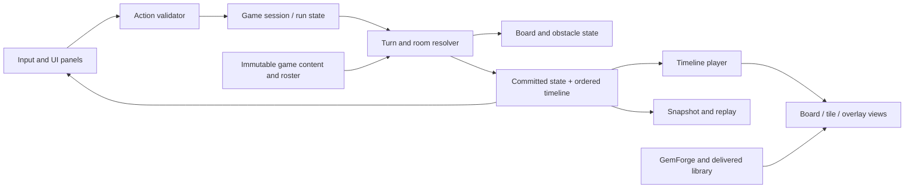

# Gameplay and application rewrite review

Reviewed 2026-09-13. Scope: the non-optical game, its UI/scenes, content definitions, persistence, tests, tools and delivery seam. This is an implementation assessment for the [proposed design](GAME_DESIGN.md), not an instruction to rewrite working engine code. No production source or authored gem was changed by this review. `project.godot` already had a working-tree modification at the start and was left untouched.

## Recommendation

**Keep and repair the board simulation; replace the run/application layer; refactor the board renderer around explicit playback and input boundaries; retain the delivered-asset service.** A blanket rewrite would discard useful deterministic gravity, merge and playback behavior. Simply adding rooms to the current `RunScene` would preserve incomplete transactions, persistence and legality checks.

The engine readiness milestone proves its defined authoring/delivery cases. It does not establish that the gameplay is a complete roguelike, that the general board API enforces every stated invariant, or that all catalog gems are final art.

## Actual current behavior

- `RunController.start_new_run()` selects one tile ID per tier with `SeededRng`, then uses that selection for both spawning and upgrades. The two authored merge chains do **not** remain two independently selectable runtime ladders: overrides can mix their slots.
- The game is one board, with a move counter and random start seed. There are no rooms, objectives, family reactions, reward choices, carry inventory, shops or run win screen.
- All 16 tile resources omit `family_tags`; the schema exists but content has no family membership. Matching falls back to tile ID.
- All match categories merge to one upgraded survivor. The best match **anywhere in the turn**, including upgrade chains, determines `-1 / 0 / +1` moves. Some comments incorrectly describe first-cascade-only accounting.
- Initialization resolves opening matches for free and can create higher ranks before input. It does not check whether any legal swap remains.
- Board playback retains pooled TileViews and can overlap independent spatial regions. TileView consumes real delivered clips; there is no production tint fallback or optical baking.
- The HUD updates every frame with moves, seed, FPS and timing. There is no player-facing rules inspector or accessible rank/family/status system.
- `SaveService` is JSON file I/O, not a run save implementation. `ReplayService` records seed/actions/checkpoints, not a complete versioned reproducible run specification.

## Source-confirmed repair priorities

Line/function names below refer to the reviewed checkout. The small diagnostic [probe](../artifacts/game-design-review/probe.gd) and [results](../artifacts/game-design-review/probe.json) reproduce selected findings without changing production files.

| Priority | Finding and source | Consequence | Required repair |
|---|---|---|---|
| P0 | `core/run/run_controller.gd`, `begin_swap`/`attempt_swap`: only bounds/moves checks; `BoardState.swap_cells` returns no success result | Direct callers can attempt distant/empty/same-cell swaps; a pre-existing match can make an unsuccessful swap look valid. UI adjacency is not authoritative legality. | One pure action validator: phase, adjacency mode, occupancy, lock/immovable, actual swap, newly created match involving swap cells. Invalid actions preserve all state/RNG. |
| P0 before portals | `MatchDetector._collect_run` follows portal-aware `get_neighbor` with no visited set | Probe confirms nonlocal portal matches. Same-group cycles can loop indefinitely; documented gravity-only portals are not enforced. | Add an explicit adjacency purpose to the BoardState authority, default preserving movement callers; matching/swaps request nonportal topology. Bound traversal. Update callers/tests/contracts together. |
| P0 | `MatchClassifier.classify` pairs one horizontal run with one vertical run | A horizontal run crossing two vertical runs produces overlapping classified components; probe confirms duplicate membership. Removal-only deduplication cannot define correct survivors. | Build connected components of intersecting same-group runs, then classify once; one ownership claim per tile and canonical survivor. |
| P0 | `BoardState.compute_hash` omits dimensions, portals, spawn flags, fill sources, cell tags, match groups, merge target, family tags and status values | Distinct gameplay states share checkpoints; probe confirms status-value/portal changes are invisible. Hash iteration also depends on status insertion order. | Canonical full gameplay-state serialization and hash; sort keys, include values, complete topology and run/RNG state. Do not call current checkpoints anti-cheat. |
| P0 for lanes | `BoardPhysics.find_spawn_eligible_cells` falls back to all empties when no **empty** entry exists | Occupied entries permit interior spawning; probe confirms it. | Distinguish “no configured entries” from “configured but occupied.” |
| P0 for lanes | `TurnController.step_cascade` starts with matching and stops when none exist; refill happens only after a match | A newly spawned entry tile is not guaranteed to settle/refill the whole lane if it creates no match | Resolve gravity/refill to occupancy stability independently of match existence, then recheck matches. Record each stage. |
| P1, contract conflict | `BoardState.get_effective_gravity` returns a cell's ZERO unchanged; physics treats it as floating | The documented ZERO→DOWN fallback is not the implemented rule | Use the documented fallback for this design. If floating cells are later desired, introduce an explicit supported mode rather than an ambiguous sentinel. |
| P1 | `finalize_swap` applies move delta/checkpoint after animation and has no once-only guard; two swap APIs duplicate logic | Repeated finalization can charge twice; interruption/navigation can leave a partially committed transaction | Resolve and commit the complete action once in simulation; playback acknowledgment changes presentation/input state only. |
| P1 | Cascade/chain/settling limits silently terminate | “Completed” state may still contain matches or unsettled tiles | Explicit failure reason and rollback/snapshot on exhaustion. Guards must not determine ordinary game outcomes. |
| P1 | `reroll_board` reconstructs config without layout; `run_state.board_size` may differ after a layout resize | Debug reroll can silently remove topology or misreport size | Store canonical room/config and derive board size from admitted layout; reroll an explicit command. |
| P1 | `RunState.to_dict` omits board, spawn table content, RNG position and state loading; replay stores seed only | Save/resume and replay across changed configuration/content cannot be promised | Versioned snapshot/action log with content/rules identity and integer RNG state. |
| P1 | `EffectResolver`/`SpawnResolver` find `/root/TileRegistry`; RunController references `GameConfig`, `TileRegistry`, `ReplayService` | The classes extend RefCounted but the complete runtime path still depends on scene-tree services | Inject immutable game catalog/config and a recorder boundary. Keep scene-tree lookup in bootstrap adapters only. |
| P1 | `ConflictResolver` deduplicates only removals; `protected` and `can_be_protected` have no active protective behavior | New hazards/traits cannot safely assume these flags or generic effect arbitration work | Add concrete effect ordering/target ownership with tests; remove unused protection exports from game schema when migrating, unless a real rule uses them. |
| P1 | `RunScene` writes `board_scene._input_locked`; playback completion can unlock without checking a later delivery failure | Private cross-scene state and competing async paths make lifecycle/error behavior fragile | Public gate with loading/playback/modal/error causes; generation tokens/cancellation on navigation. Error causes remain locked. |
| P2 | `BoardValidator` iterates `all_cells()` to test blocked spawn entries, excluding those cells first; out-of-bounds entries disappear on layout application | Authoring admission can miss invalid entries despite having a validator | Validate raw layout references before applying it, then validate reachability with real blocking/fill rules. |
| P2 | `EventTimeline.all_events` flattens by event type, although `chain_steps` carries sequence | It is a statistics view, not a safe chronological gameplay event stream | Explicit ordered effect batches/event sequence IDs. Objective/trait logic consumes committed rule events, never this flattened convenience list. |
| P2 before special topology | `BoardScene._play_cascade_step` collapses a tile's gravity path into original/final cells and stages all spawns above their column | Portal, lateral-gravity and bent-lane motion would be drawn as straight travel or downward entry even when simulation differs | Preserve trajectory/portal segments and actual spawn-entry direction in presentation events; do not infer them from destination columns. |

“P0” here means before the corresponding new game feature depends on the behavior. It does not claim the rectangular shipped delivery demonstration currently exercises every defect.

## Whole-repository disposition

Every non-engine production area is accounted for below. Engine numerical tools/tests were classified by ownership, not subjected to a second optical audit. Generated binaries, caches and editor-generated imports are artifacts, not rewrite candidates.

| Area/files | Decision | Work |
|---|---|---|
| `core/board/board_state.gd`, `cell_state.gd`, `tile_state.gd` | Retain and extend | Complete state identity/serialization; stable tile instance IDs; explicit obstacle state; topology-purpose API; immutable view snapshots |
| `match_detector.gd`, `match_classifier.gd` | Repair | Match adjacency/cycle safety and connected-component ownership before new match grammar |
| `effect_planner.gd`, `conflict_resolver.gd`, `effect_resolver.gd` | Refactor around existing stages | Keep plan→validate/conflict→commit; inject roster/catalog; add only damage, promote, collect and resource effects needed by the design |
| `board_physics.gd`, `spawn_resolver.gd` | Retain and repair | Complete settling/refill; validated integer weights; strict missing-definition failures in production |
| `core/rules/seeded_rng.gd` | Retain, extend persistence | Save/restore state; ban float calls from gameplay paths; keep wrapper ownership. A Windows-only reference run is not cross-platform proof. |
| `event_log.gd`, `event_timeline.gd` | Evolve | Ordered typed payloads, action/round/instance IDs, trigger cause, budget records. `EventLog` truncation must not reuse sequence IDs. |
| All `core/run/` | Replace orchestration, reuse resolver components | Explicit room/run phases, transactions, objectives, rewards, carry inventory and route data; remove duplicate monolithic/incremental rule implementations |
| `resources/definitions/` | Retain focused schemas, add concrete definitions | Separate immutable content from mutable state; no scene dependencies. Add Room, Obstacle, Setting, RunRules and validated roster schemas. |
| `data/tiles/*.tres` | Migrate game metadata | Verified family/group tags, rank, role/trait references. Active roster owns next-slot upgrades; stop maintaining misleading dual chain semantics. |
| `data/spawn_tables/` | Author actual data | Currently README only; use explicit integer content instead of one hidden controller factory |
| `scenes/run/*`, `scenes/menu/*`, `scenes/main/*` | Replace application flow | Bootstrap/session owner, start/continue/settings/results, briefing/reward/route panels. Main script is presently empty; avoid redundant navigation shell. |
| `scenes/board/board_scene.gd` | Split while preserving behavior | BoardView geometry/pool, BoardInput adapter, TimelinePlayer and cell overlays. Keep sequential playback as reference; suspend spatial overlap until all new global effects have dependencies. |
| `scenes/board/animation_sequencer.gd` | Retain tuning intent, move to a presentation profile | Avoid mutable static globals controlled by release debug sliders; expose speed/reduced-motion options through settings |
| `scenes/tile/*` | Retain delivered playback core | Add separate status/rank/family layers with mouse-ignore; public clip player interface. Never derive matching from sprite color/rotation. |
| `scenes/debug/debug_panel.gd` | Replace tool UI | Current panel chiefly tunes animation. Development-only seed/room/action/event/state inspector and export replay; no rule mutations from sliders |
| `autoloads/game_config.gd` | Reduce to defaults or bootstrap resource | Room/run config is content, not mutable global rules |
| `autoloads/tile_registry.gd` | Retain loader adapter; inject catalog | Validate uniqueness/references/ranks; eliminate production debug-tile fallback. Loader's sorted filenames are useful deterministic behavior. |
| `autoloads/replay_service.gd`, `save_service.gd` | Rewrite persistence boundary | Atomic/versioned saves, restore validation, schema/content mismatch handling, explicit user slot semantics |
| `autoloads/gem_forge.gd`, `core/delivery/`, `resources/delivery/` | Preserve engine seam | Extend consumers/prefetch scopes, not transport or optical responsibilities; see integration plan |
| `data/presentation/default.tres` | Preserve schema, author a new game catalog | Stable logical IDs with reviewed still/short-tilt bindings; no implicit optical variants |
| `project.godot` | Later targeted edit only | Public input actions, application settings, bootstrap; preserve measured render defaults until profiling justifies changes. Existing local edit untouched. |
| `export_presets.cfg`, `tools/build_game_package.ps1`, package/probe tools | Preserve and update allowlists | New scenes/resources/classes need explicit packaging/audit entries; editor/Atelier remains excluded from release |
| `tools/board_validator.gd` | Repair and expand admission | Raw layout validation plus objective/extraction accessibility; no claim of puzzle solvability from graph reachability alone |
| `tests/test_smoke.gd`, RNG tests | Preserve regressions, extend selectively | Add focused legality, topology, full-state and transaction suites; retain successful existing physics/merge cases |
| `tests/test_simulation.gd/.tscn` | Rewrite policy harness | Current greedy bot favors move-saving patterns, directly probes swaps and cannot evaluate rooms/builds. Use authoritative action query; scripted, random and objective-aware policies with recorded configurations. |
| `tests/lapidary/test_board_consumer.gd`, `test_run_delivery.gd`, delivery fixture | Keep as boundary tests | Add new UI/event/prefetch cases; naming migration optional, behavior preservation mandatory |
| `tools/board_visual_check.*`, `source_check.*` | Review callers during scene split | Keep delivered-frame and parsing checks; neither is a full gameplay acceptance test |
| `tools/scene_setup_benchmark.gd`, `compare_scene_setup.py` | Preserve as optical-engine tools | These benchmark dense optical geometry/setup and compare linear films; their names do not imply game scene/UI ownership |
| `tools/check_engine.ps1`, `engine_checks.json` | Preserve engine runner | Add a separate game gate registry or clearly named game group; do not weaken optical acceptance to accelerate gameplay work |
| `README.md`, `data/*/README.md`, `tests/README.md`, AGENTS.md | Update with implementation | Distinguish current code from proposed game; fix stale deferred-plan link, family/ladder descriptions and transaction rules when changes land |
| `feature_profiles/`, `script_templates/`, `text_editor_themes/`, export templates | Keep local development assets | No game-system rewrite needed; no runtime dependency on personal editor setup |
| `.gitignore`, `.gitattributes`, `.gitmodules`, icon | Housekeeping only | Docs/plans are ignored by current policy. `.gitmodules` names `native/godot-cpp` although that directory is absent; verify tracked gitlink intent before removing stale metadata. Default icon is not final branding. |
| `core/lapidary/`, `resources/lapidary/`, `scenes/design/`, optical data/tools/tests | Protect | Use supported authoring workflow; no gameplay rewrite inside the tracer, workers, cut compiler or Atelier |

## Target ownership

The run resolver owns Work, Craft, hazard ticks, extraction and room completion. Scene navigation follows the resulting phase. The board owns occupancy/topology only. Rendering may skip or accelerate playback without changing a single rule result.

For new family effects, collect triggers from committed matches, snapshot source identity before upgrading, select targets deterministically, then apply a bounded reaction batch through conflict resolution. Never let visual completion or a signal callback decide when a perk is used. Log skipped targets and exhausted per-turn budgets for explanations.

## Proposed contract updates, not silent violations

The new action-budget rule, roster-directed upgrades and complete-before-playback transaction supersede documented prototype behavior. They must be deliberately revised in AGENTS.md alongside implementation and regression updates. Existing topological/rendering/RNG separation remains the baseline.

`board_changed` remains exclusive to `start_new_run`/`reroll_board`. For room boundaries, add a separate explicit `room_started` snapshot handoff; do not reuse `board_changed` after swaps. Fix ZERO gravity and gravity-only portal behavior to match the documented invariant rather than changing documentation to bless an accidental implementation.

## Verification performed and limits

- Read all three current `docs/` documents, all six `plans/archive` documents, current game sources and relevant engine/delivery contracts; inspected all four latest delivered-frame review sheets.
- Smoke test completed: **113 passed, 0 failed**, with `CHECK_COMPLETE: test_smoke`.
- Final explicit-path smoke output is retained in [smoke-final-output.txt](../artifacts/game-design-review/smoke-final-output.txt); RNG output is in [rng.log](../artifacts/game-design-review/rng.log).
- RNG test completed with same-run determinism PASS and reference arrays. No second operating system was tested.
- Diagnostic probe completed and reproduced the six booleans in `probe.json`; a `true` indicates the observed gap, not a passing product requirement.
- Initial default-log invocations crashed before tests. Explicit workspace log paths allowed execution; an intermediate relative-log invocation reported directory trouble. A Windows root-certificate-store error remains environmental and is not suppressed. These observations do not establish the crash's root cause.
- The 107-stage engine result, appearance acceptance and release timing remain **previously recorded evidence** from ENGINE_READINESS_REPORT.md. They were not rerun for this documentation task.
- No interactive playtest, new asset bake, full release rebuild or usability study was performed. Recognition and balance recommendations are review hypotheses, not measured player results.
