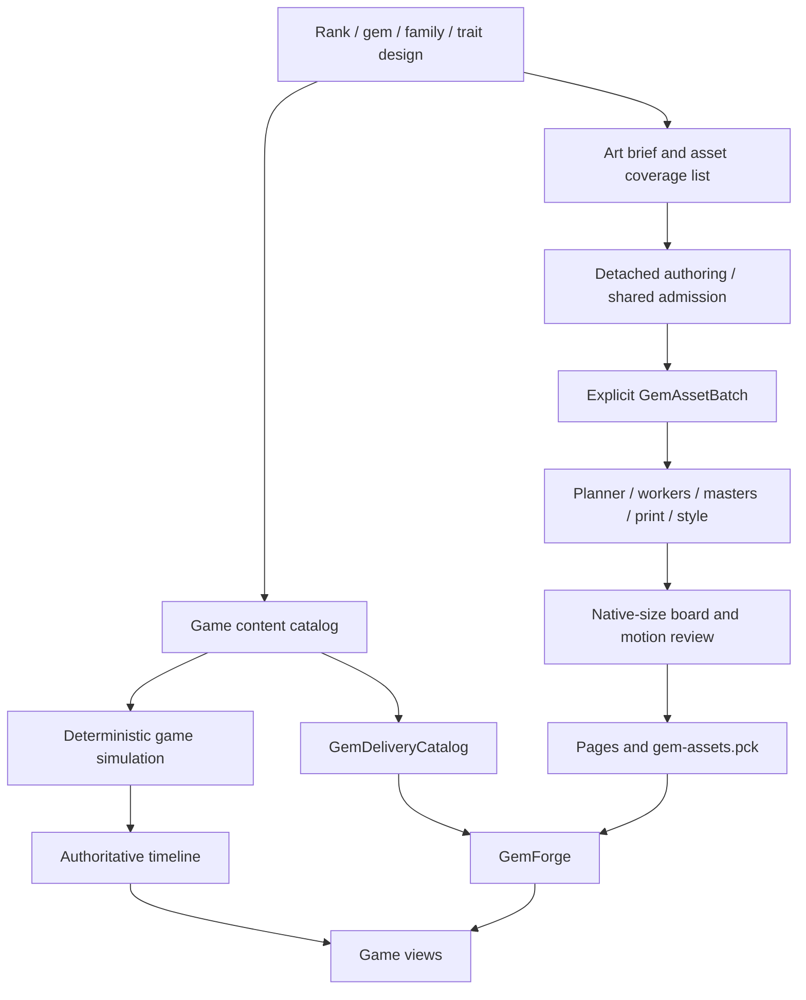

# Integrating the gem engine with Facets

Status: recommended implementation plan, 2026-09-14. Depends on the [game design](GAME_DESIGN.md) and preserves the current [authoring workflow](AUTHORING_WORKFLOW.md), [factory contract](../core/lapidary/factory/CONTRACT.md) and [delivery contract](../core/delivery/CONTRACT.md).

The [architecture hardening](ARCHITECTURE_HARDENING.md) defines the final workspace,
rule/terminology separation, topology/admission and replay protocols before P1.
The [non-gem production specification](PRESENTATION_ASSETS.md) covers UI,
backgrounds, audio and VFX; those assets live in the game PCK, not the gem pack.

## 1. Preserve the existing separation

The optical engine is an offline content-production system. Game rules consume an immutable gameplay catalog; the renderer consumes prebuilt assets. No gameplay decision reads optical grade, index curves, rendered brightness, specimen seed, cut geometry or clip time.



The current foundation already provides detached editing, admission, immutable jobs, resumable optical masters, reprinting, style identity, clip sampling, packaging and a bounded runtime reader. Implementing the game does not require another renderer or a new asset-file format.

## 2. Identity and ownership

| Owner | Data | Never owns |
|---|---|---|
| Gameplay gem definition | Logical gem ID, rank, verified family/group tags, concise gameplay reaction IDs, presentation/text keys | Optical resources, texture paths, animation timing |
| Run roster | Selected definition per appraisal tier, supply target/weight entries, equipped settings, later technique IDs | Physical cut program or runtime grade calculation |
| Tile instance | Stable instance ID, current rank/definition, actual gameplay statuses | Unique runtime specimen seed or baked-image variation |
| GemStone | Physical material, geometry, condition, crystal frame and specimen seed | Match rank, rewards or economic value |
| GemAssetRequest | Explicit delivery ID, stone/recipe, rig, print/style, presentation, clips, resolution/policy | Run state or board cell |
| GemDeliveryCatalog | Logical tile ID → asset ID + semantic roles | Game logic inferred from names |
| Game presentation profile | Vocabulary keys, Theme, UI icons, backgrounds, semantic audio/VFX cues | Gameplay parameters and simulation RNG |
| Tile/board UI | Position, selection/status symbols, timeline playback | Authoritative state mutation |

Example: gameplay `quartz` can map to `quartz.board.v1`, baked from a newly authored `quartz_board_study` specimen. That does not rename or replace the current physical `quartz` record. A later print change can replace the asset binding without changing a replay's rule result. Stable tile instance IDs distinguish several quartz pieces; they do not force separate images.

Game tier is an authored appraisal band justified partly by a specimen grade profile. It is not computed from `GemGrade`, renderer rung or physical size. A rendered size correction must use presentation/framing/output policy, not change `size_mm` merely to fill more pixels: physical size also changes transport.

## 2a. Expansion seams to establish with the prototype

Follow the [content-system rules](CONTENT_SYSTEMS.md); keep optical and gameplay definitions independent.

| Seam | Minimal prototype representation | Later extension, not required now |
|---|---|---|
| Appraisal | One `appraisal_tier` per gameplay definition; no separate numerical value field | Curated adjacent-band specimen variants and complete grade exchanges |
| Grade provenance | Authoring-side definition/grade-profile/specimen association, with review rationale | Workshop choices among admitted profiles; never runtime optical grading |
| Collection / supply | Eight tier entries plus explicit integer-weight supply targets | High-tier supply redirection; no second match/value tier |
| Families / affinities | Primary family ID and three concrete reaction IDs; verified membership | Signatures and explicit thematic filters, with deduplicated owner scope |
| Lifecycle | Immutable IDs, source snapshots, cause, parent/root action, target/path, match component/shape | New event predicates and handlers without reconstructing identity from cells |
| Effects | Typed grants, promotion, obstacle damage and existing tool operations; bounded dispatcher | Clears, routing, protection with individual resolver admission |
| Layers | Gem occupant, obstacle/lock state, floor state and topology are distinct | Catalyst/cargo piece kinds and layered coatings |
| Appearance | Presentation key resolves to an existing delivery tile binding; stable tier badge independent of art | Reviewed cut/grade/skin variants, not random runtime optics |

Use one grade source of truth for authoring provenance, not copied floating-point axes scattered across tile resources. A content build exports only the chosen profile ID/display description and admitted tier if needed by the UI. Simulation rules read explicit integers/IDs; neither `GemGrade` nor an optical `Resource` enters core board state. Current specimens have look-development grade metadata; game appraisal review must not mislabel it measured certification.

Stable runtime identity should distinguish `definition_id`, `instance_id` and `presentation_key`. Prototype keys can equal current tile IDs. Later a presentation resolver can select a composite catalog key for a grade/cut/skin variant, then call the existing GemForge API. That adapter is future consumer work; GemForge currently accepts tile/role bindings, not arbitrary variant parameters. Do not pass new fields and assume support. Tier/instance semantics never come from the asset ID.

Save a run's selected appearances for stable recognition, but separate presentation configuration from the **simulation** hash: changing an accessible backing or cosmetic skin cannot change a replay's rule result. Save/hash all gameplay grade-definition, technique, supply and setting selections. A restore verifies both rules compatibility and required asset coverage; visuals may require an explicit admitted replacement if the old presentation bundle is unavailable.

No speculative handlers for all future effects are needed. Emit facts for transitions already implemented, preserve their causes, and implement the three family reactions using a shared deterministic queue and budget context. Tool/extraction/setup suppression is an inherited eligibility restriction, separate from source mineral identity. This prevents future spawn/removal handlers from accidentally rewarding a tool cascade.

## 3. Content structure and migration

Proposed additions, names subject to implementation conventions:

```text
data/game/rooms/                 authored objectives/layout references
data/game/settings/              six concrete candidate settings
data/game/rules/                 budgets, weights, starting rosters
data/game/families/              curated membership and game reactions
data/lapidary/game/requests/     explicit board/inspector asset requests
data/lapidary/game/specimens/    reviewed game variants, detached from baseline
data/lapidary/game/clips/        game upgrade tilt; generic clip schema
data/lapidary/batches/           prototype game batch
data/presentation/              prototype semantic catalog
```

Keep `data/tiles/` as the logical gem definition directory unless there is a concrete migration benefit. New gameplay data is runtime content; the `data/lapidary/game/` source assets are still authoring-only and excluded from the game package.

Migration sequence:

1. Preserve the current complete 16-gem pack/catalog as the comparison baseline, with hashes.
2. Admit the starter roster and family metadata in gameplay without changing optics.
3. Create a new named game batch/catalog; never overwrite hand-authored source via `generate_lapidary_data.gd`.
4. Iterate on the high-priority gems and short tilt clip as detached candidates. Freeze exact approved requests.
5. Validate coverage for every starter/reward/carry/reachable upgrade ID. Bind only complete admitted content.
6. Switch the prototype's catalog at a loading boundary, retaining explicit failure behavior. Update export/audit allowlists for all new runtime content.

A gameplay replacement has one roster operation and a separate presentation preflight. The old room remains frozen while the next required set loads. Do not allow an unavailable asset to commit a reward and reveal an invisible piece. No random gem art selection per cell.

## 4. Semantic roles and animation

| Meaning | Implementation | Bake requirement |
|---|---|---|
| Rest | Stable face-up pose | One still, required |
| Upgrade | Short tilt/return of the resulting gem plus scene convergence/scale | One admitted oneshot, required |
| Selection / hover / focus | Ring, corners, outline UI, text inspector | No optical clip |
| Swap / fall / portal traversal | Board timeline transforms with an explicit motion path | No optical clip |
| Rubble hit / seal break / dust | Dedicated game overlay/VFX/audio | No gem rebake |
| Family reaction | Family icon pulse and target/path cue | No optical clip |
| Extraction | Board translation into outlet + result-card reveal | Reuse rest; optional later hero asset |
| Collection inspection | Larger still or full turn | Optional explicit asset request, separate memory budget |

The existing `rest`/`upgrade` contract is sufficient for the prototype. Do not proliferate roles until a real animation requires a different optical view. A loop such as `tilt_return` cannot be bound as upgrade unchanged: author a oneshot request/clip that passes completion admission.

Target a 6–10 frame tilt with no edge-on pose and a 0.25–0.4 second optical duration; initial trial is 8 frames at 24 fps. Exact time derives from delivered frames/fps. A shorter scene merge may overlap the oneshot, but interruption must be explicit and verified. Full turns belong in inspection/reward showcases, not every cascade.

Start playback sequentially for new game events. The old spatial-overlap scheduler only understands known cell effects; a global Craft award, a family budget or a room completion introduces dependencies that cannot be inferred from touched cells alone. Later overlap is allowed only with explicit event dependencies and equivalent final visual state. Faster/reduced-motion playback never alters simulation.

## 5. Quality and art iteration

First compare in this order:

1. Rest orientation and fixed framing, on the actual board background.
2. Shape proportions and facet readability.
3. Rig and print settings.
4. Small `GemStyle` adjustments using retained prints.
5. Physical material/condition changes only where the actual specimen appearance needs them.

This order prevents costly material edits to solve a UI contrast problem. It is not a ban on reauthoring: quartz may need a simpler cut, and a sapphire color study may need actual absorber changes.

Existing `GemStyle` supports saturation, tint, contrast, optional luminance bands and an inner alpha contour. It does not implement the archive's haze/brilliance/grade sliders. Keep bands off for the first motion study. More samples cannot add fluorescence, directional silk, healed fractures or other unsupported mechanisms.

Use `AUTHORING_WORKFLOW.md` profile settings as measured starting points: draft/detail/refined are complete request settings, not grades or auto-quality modes. Production candidates need independent seed/noise comparison and native-size acceptance, particularly if contrast exaggerates temporal variation. Preserve optical source evidence separately from authored derivative choices.

Retain unstyled prints during art iteration. Print changes reuse XYZ masters; style changes reuse prints; material, geometry and relevant pose changes require appropriate new work. Do not assume moving a label invalidates optics or that a cache hit proves final visual acceptance.

## 6. Bounded asset scope and cost

Minimum first game batch: 8 starter gems × (1 rest + 8 upgrade frames) = **72 requested frames before deduplication**. The same policy for all 16 current game gems is 144 requests. These are planning counts, not predictions of masters/pages/bake time. Endpoints, poses, shared jobs and packing affect realized cost.

Adding Aquamarine for the first family draft makes the initial playable prototype's nine-gem batch 81 requested frames under that same policy.

For reference, 72 full 112×112 RGBA frames contain 3,612,672 uncompressed pixel bytes before trimming/page padding; 144 contain 7,225,344. This is arithmetic for a frame payload, not total VRAM or a promise about compression. The current measured 16-page runtime payload is about 6.17 MB for a different 304-request catalog. Do not compare those as equivalent jobs.

No product of gem × tier × grade × cut skin × condition × board cell × idle variation × light variant. Add a variant only when a game screen needs it. Board and 256px inspector outputs should be explicit requests; larger masters are not silently required for every board sprite.

## 7. Loading, lifetime and failure

At each room entry, compute the presentation closure from the active roster, supply targets, all reachable upgrades, visible carry pieces, selected appearance variants, and any reward thumbnails that are actually shown. Prepare required roles before showing that content. Avoid following obsolete static ladder edges when the roster is authoritative.

GemForge remains the sole owner of library mounting and page access. The current default LRU is 32 MiB; prefetch admission defaults to 128 MiB. These are caps, not budgets already earned by future content. Set an initial prototype target of ≤16 MiB live texture payload across board and open UI, then measure. Inspector images require an explicit additional allowance.

At a room/reward transition, retain old pages while live views need them, load the admitted next set, replace views, and release old prefetch/view references. Audit actual live ownership rather than only LRU entries. If the existing API cannot release/replace prefetch scope cleanly for transitions, add a focused ownership API with tests; do not bypass GemForge.

Missing/corrupt assets or budget failures show a clear loading/error panel, keep input locked and offer return to menu/retry. Preserve the last committed game snapshot. Retrying an asset load does not reseed, reroll rewards or recompute a turn. No runtime optical fallback and no synthetic production gems.

## 8. Release and compatibility gates

Each new content drop must pass:

1. Gameplay content admission: IDs, roster rank coverage, family references, nonnegative integer weights, effect parameters, admitted layouts and objective reachability.
2. Authoring/job admission and exact appearance record for changed physical/print/clip/style requests.
3. Delivery validation of every declared semantic role and referenced frame/page, including reward and carry transitions.
4. Clean package inventory from a fresh staging project; source engine/Atelier/tests/artifacts remain excluded. Runtime class and scene allowlists grow deliberately with the game.
5. Real release interactions: start, last-action win/failure, carry, reward, branch, pause/resume, menu/restart and missing/corrupt asset handling.
6. Native-size board readability, frame capture and texture ownership during worst-case cascades/transitions. Retain the existing p95 ≤16.7 ms desktop target, with machine/workload stated; it is not an all-device guarantee.

Use maintained `build_gem_assets.ps1`, `validate_gem_delivery.gd` and `build_game_package.ps1` commands from the active tool docs. Do not claim a headless package probe is equivalent to a human release-executable test.

Gameplay replay compatibility is tied to rule schema, content digest and RNG implementation. Presentation changes can remain replay-compatible if logical IDs/rules are stable, but visual acceptance must refer to the new pack. A gameplay patch that changes action outcomes needs explicit version rejection or a supported migration, not silent replay under new rules.

## 9. New material and special-shape admission

The current engine's convex faceted programs, general geometry paths and supported analytic cabochons do not imply that every named gemstone phenomenon or carved outline is ready. A heart/star request needs a supported geometry construction and native-size acceptance; do not force it through a convex facet program. Nacre interference, directional tiger's-eye chatoyancy and asterism are not established by the current readiness evidence. Increasing samples or renaming a material cannot add them.

For malachite, coral or other patterned/opaque candidates, first define the game role and decide whether a conventional UI illustration is sufficient. A future illustrated gem asset producer must explicitly create compatible metadata/frames and pass delivery admission; no current arbitrary-image import path is claimed here. Keep provenance clear between physically modeled specimens and illustrative art. Missing required assets continue to fail explicitly, with no silent fallback or runtime bake.

Use a capability brief per proposed material: required shape, body pattern, surface behavior, optical phenomenon, acceptable illustration status, board role and required clips. Approve only the smallest content set that demonstrates that role. The prototype needs none of these new materials or producer paths.
