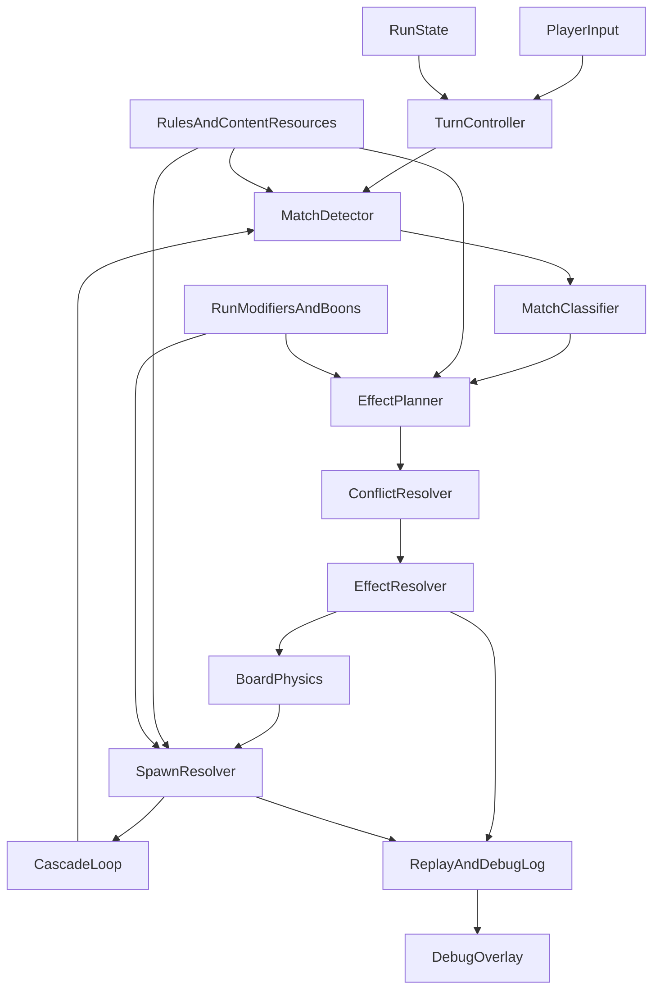

# Gem Engine Proposal

## Executive Summary
The concept is strongest when treated as a **move-limited, floor-based roguelike puzzle game** where the player's main objective is to **forge a flagship high-tier gem during a run** rather than merely chase score. The merge-upgrade loop gives the project a clear identity, while match-3 style 4+ rewards provide tactical spikes of satisfaction and pacing control.

The main design risk is not theme or content volume. It is the interaction between:

- persistent, valuable high-tier pieces
- exponential merge costs in a 3-to-1 chain
- board-space pressure
- destructive match-3 rewards that can erase investment

Because of that, the engine should be built around a **deterministic simulation core** with **data-driven rules**, so the project can quickly test competing board-resolution philosophies without rewrites.

## Concept Evaluation
### Why the concept is promising
- It combines two strong satisfaction loops: short-term combo payoff and long-term value growth.
- The 8-tier gemstone ladder naturally supports readable progression, rarity, and collection goals.
- The roguelike structure fits the idea well because runs can vary through spawn rules, gem replacements, boons, hazards, and board modifiers without needing heavy between-run maintenance.
- The gem theme is strong enough to support both mechanical language and content categorization: tiers, families, hazards, boons, crafting, and rare artifacts all fit cleanly.

### Strongest core fantasy
The clearest fantasy is:

> Build a run around a set of gem behaviors, survive escalating board pressure, and engineer one or more transcendent high-tier gems through clever merges, accelerators, and synergies.

That is stronger than a generic score-chase because it gives the player a concrete run narrative:

- early game: stabilize the board and shape the build
- mid game: create momentum through accelerators and special effects
- late game: protect investments and push for apex conversions

### Main design strengths
- **Readable macro-goal**: forging a highest-tier gem is a better north star than abstract score alone.
- **High build variety**: alternate gems, families, workbench boons, hazards, and board rules can all reshape runs.
- **Good content scaling**: the base system can start with 8 default gems, then expand through variants without replacing the underlying loop.
- **Mobile-friendly planning**: moves-as-resource is easier to parse than timers and better supports deliberate merge strategy.

### Main design risks
- **Exponential cost wall**: pure 3-to-1 merging makes top tiers unreachable without accelerators.
- **Conflicting reward languages**: classic match-3 clears can feel good moment-to-moment but undermine long-term merge planning.
- **Board lock and clutter**: because pieces persist, the board can become strategically dead unless the game provides conversion, cleanup, or compression tools.
- **Over-content too early**: 72 gems, multiple families, T0 hazards, T9 artifacts, boons, and match-pattern variations are too much for the first playable version.
- **Architecture drift**: if the board logic is tightly coupled to visuals or hardcoded special cases, iteration will become expensive very quickly.

## Recommended Product Direction
### Default primary mode
Use this as the default mode for the project:

- **Mode**: floor-based roguelike run
- **Run goal**: forge and extract a target apex gem, or reach a target tier before the final floor ends
- **Loss condition**: run out of moves
- **Between floors**: choose one boon, gem replacement, shop action, or risk/reward event

This is the most coherent version because it keeps merge progression central while still leaving room for match-3 style spikes.

### Recommended secondary modes
These are good later, but should not drive the first engine version:

- **Score attack**: useful as a tuning and replay mode
- **Boss mode**: high-tier gems become ammo, charge, or objective fuel
- **Endless mode**: useful for sandbox balancing and content discovery

### Best first design stance on unresolved questions
- **Board topology**: start with a fixed rectangular grid
- **Match rules**: start with line matches and L/T classification only
- **2x2 block matches**: treat as disabled by default, but design the matcher so they can be enabled later
- **4+ rewards**: prototype both destructive and merge-forward versions early, but bias the architecture toward merge-forward effects
- **High-tier safety**: keep protection thresholds configurable from the start

## Design Taxonomy
### A. Core systems that define the game
These materially affect engine architecture and should be treated as first-class systems.

| System | What it controls | Why it matters |
|---|---|---|
| Board topology | Cell layout, adjacency, gravity lanes, holes, transport rules | Determines data model and match detection assumptions |
| Match classification | 3-line, 4-line, 5-line, L/T, optional block/blob | Drives how groups are detected and resolved |
| Merge economy | 3-to-1 rules, accelerators, protection, compression | Determines pacing and reachability of top tiers |
| Effect resolution | Clear, convert, upgrade, spawn, protect, transform | Core to reconciling match-3 and merge behavior |
| Spawn system | Spawn table, biasing, rarity, family weighting | Controls variance and build expression |
| Run state | Moves, floor progression, modifiers, inventory, rewards | Makes the game roguelike instead of pure puzzle |
| Modifier pipeline | Global boons, curses, hazards, floor rules | Enables variety without rewriting board logic |

### B. Content layers that sit on top of the core
These should be data-driven and mostly separable from the simulation engine.

| Content layer | Current examples |
|---|---|
| Standard tier chain | Quartz to Diamond default ladder |
| Alternate gem replacements | Different gems per tier with different traits |
| Gem families | Quartz, Corundum, Beryl, Garnet, Tourmaline, Feldspar, Chalcedony, Spodumene |
| T0 hazards/utilities | Obsidian, Pyrite, Hematite, Galena, Cinnabar, Magnetite, Copper |
| T9 special artifacts | Conch Pearl, Ammolite, Amber, Pearl, Coral, Moldavite |
| Passive boons | Settings and Treatments |
| On-board effects | Polished, Brilliant, Faceted, Cabochon states |

### C. Decisions safe to postpone
These should not block engine design if the engine is properly modular.

- final narrative framing
- final art style
- full gem roster
- late-game rarity balance
- boss-specific mechanics
- alternate board biomes
- advanced economy layers like crafting materials and extended shops

### D. Experimental avenues worth exploring later
These are promising, but should not shape the first prototype.

- graph-like boards with portals and conveyors
- wave-defense or combat-bridge modes
- 2x2 or blob match rules as relic/perk-driven variants
- family-specific board rules
- hybrid score-and-tier objective structures
- high-risk destructive builds that intentionally sacrifice top-tier safety

### E. Option matrix for the biggest design forks
This is the shortest way to separate "decide now" from "prototype later."

| Area | Options discussed | Recommendation now | Why |
|---|---|---|---|
| Primary objective | Score threshold, flagship gem, boss damage, artifact assembly | Flagship gem or target-tier extraction | Best aligns with the merge fantasy |
| End condition | Timer, moves, survival pressure, enemy waves | Moves | Better for planning and mobile readability |
| 4+ rewards | Destructive clears, merge-forward accelerators, mixed system | Prototype destructive and merge-forward side by side | This is the highest-value unresolved fork |
| Board shape | Fixed rectangle, handcrafted odd boards, graph boards | Fixed rectangle first | Fastest to validate core loop |
| Match grammar | Line-only, line plus L/T, line plus block/blob | Line plus L/T first | Predictable and easier to resolve |
| Progression | Heavy meta, light unlock log, mostly in-run decisions | Mostly in-run with light unlock log | Matches the stated design goal |
| Gem roster | Full gemstone set immediately, curated starter set | Curated 8-gem default set plus a few alternates | Keeps readability and balancing manageable |
| Boon model | Generic relics, gem-specific traits, jewelry-themed systems | Jewelry-themed global boons plus a few gem-specific traits | Best thematic fit and cleanest content language |

## Architecture Proposal
### Core principle
The board engine should be built as a **simulation-first game rules engine**. The board state must be valid and testable without any rendering, tweening, or scene tree logic.

### Architectural goals
- deterministic and replayable
- easy to test headlessly
- data-driven for content and rule variation
- safe to extend with new effects and match patterns
- decoupled from presentation and animation

### Recommended high-level model


### Core runtime modules
#### 1. `BoardState`
Pure simulation data:

- board dimensions
- cells
- tile occupancy
- holes or blocked cells
- optional cell tags for future board mechanics

Start with a rectangular grid, but store each cell as an addressable object so adjacency can later become configurable.

#### 2. `TileState`
Per-tile runtime data:

- tile definition id
- current tier
- family tags
- traits or status flags
- special-effect state
- protection flags
- metadata for origin and temporary modifiers

This should be lightweight and serializable.

#### 3. `RunState`
Holds everything outside the board itself:

- move count
- floor number
- selected gem set
- current boon/curses
- consumables
- RNG seed and step
- reward history

The board should not own run data directly.

#### 4. `MatchDetector`
A pure service that scans the board and returns candidate groups. It should support configurable detection modes:

- horizontal and vertical line matches
- intersection-based L/T recognition
- optional future block/blob recognition
- future non-standard adjacency rules

The detector should not mutate the board.

#### 5. `MatchClassifier`
Turns raw groups into semantic match types:

- base merge
- line-4
- line-5
- L/T
- mega group
- future special cases

This is where overlap priority and tie-breaking rules live.

#### 6. `EffectPlanner`
Generates an **effect plan** from current matches and run modifiers without mutating state yet. Effects should be atomic and composable:

- remove tile
- upgrade tile
- downgrade tile
- convert tile
- spawn tile
- move tile
- protect tile
- award move
- add consumable
- apply status

This is the key boundary that keeps experimentation cheap.

#### 7. `ConflictResolver`
Handles cases like:

- two effects targeting the same cell
- an effect trying to destroy a protected tile
- a spawn and a fall targeting the same destination
- multiple match groups claiming the same tile

Keep this deterministic and rule-driven. This is one of the most important systems in the whole project.

#### 8. `EffectResolver`
Applies the approved effect plan to state and emits structured events for:

- animation
- sound
- UI feedback
- debug replay
- analytics

#### 9. `BoardPhysics`
Handles:

- gravity
- collapse
- refills
- optional future side gravity or conveyor transport

Do not embed gravity inside effect code.

#### 10. `SpawnResolver`
Creates new tiles based on:

- floor config
- spawn table
- enabled gem pool
- run boons and curses
- family weighting
- rarity
- scripted encounter rules

This system should consume deterministic RNG, never `randf()` directly from arbitrary scripts.

#### 11. `ModifierPipeline`
A unified way for boons, curses, hazards, and floor rules to alter simulation behavior through hooks such as:

- before match detection
- after match classification
- before effect planning
- before spawn resolution
- end of turn
- start of floor

This keeps special rules out of the board engine core.

## Rule Philosophy Recommendation
### What the engine must support
The design discussion has two competing reward languages:

- **destructive match-3**: line clears, color clears, explosions
- **merge-forward**: catalysts, compressors, upgrades, protection, conversions

The first prototype should support both, but the architecture should assume that the long-term healthiest design is likely **merge-forward with selective destruction**.

### Recommended default resolution philosophy
- Low-tier tiles are expendable.
- Mid-tier tiles are situational.
- High-tier tiles are investments.
- Big rewards should usually create momentum, not erase investment.

That suggests these defaults:

- allow destructive effects on low tiers
- keep high-tier destruction gated or configurable
- let 4+ matches produce effects that can be reinterpreted as clear, convert, compress, or upgrade depending on rule data

In practice, this means the engine should not hardcode "match 4 means line clear." It should encode "match type X spawns effect Y" and let effect Y be data-selected.

## Godot 4 Technical Proposal
### Language and scripting
Recommended baseline:

- **Engine**: Godot 4.x
- **Primary language**: GDScript for rapid iteration
- **Optional path**: move performance-critical simulation pieces to C# only if profiling proves it necessary

Reasoning:

- GDScript is faster to iterate with for a solo project
- custom `Resource` workflows are straightforward in Godot
- the board size and simulation complexity are unlikely to justify early C# complexity

### Scene and code boundaries
Recommended split:

- `Main.tscn`: bootstrap scene
- `RunScene.tscn`: owns the active run and top-level UI
- `BoardScene.tscn`: visual board container only
- `TileView.tscn`: visual representation of a tile
- `WorkbenchScene.tscn`: between-floor rewards and shop UI
- `DebugScene` or overlay widgets: seed control, event stepping, board inspection

Simulation should live mostly in plain scripts and resources, not in scene nodes.

### Recommended project structure
```text
res://
  core/
    board/
      board_state.gd
      cell_state.gd
      tile_state.gd
      match_detector.gd
      match_classifier.gd
      effect_planner.gd
      conflict_resolver.gd
      effect_resolver.gd
      board_physics.gd
      spawn_resolver.gd
    run/
      run_state.gd
      floor_state.gd
      run_controller.gd
    rules/
      rule_hooks.gd
      modifier_pipeline.gd
      event_log.gd
      seeded_rng.gd
  data/
    tiles/
    effects/
    boons/
    hazards/
    floors/
    spawn_tables/
  resources/
    definitions/
  scenes/
    main/
    run/
    board/
    tile/
    ui/
    workbench/
  tests/
  tools/
```

### Data format recommendation
Use **custom Godot `Resource` classes** as the primary content format.

Examples:

- `TileDefinitionResource`
- `EffectDefinitionResource`
- `BoonDefinitionResource`
- `HazardDefinitionResource`
- `FloorDefinitionResource`
- `SpawnTableResource`

Why `Resource` over raw JSON as the main source:

- inspector-friendly editing
- better validation
- typed fields
- easier references between assets
- clean integration with editor tooling

JSON is still useful for:

- analytics dumps
- replay export
- batch simulation input/output
- optional external balancing spreadsheets

### Recommended Autoloads
Keep autoloads minimal:

- `GameConfig`
- `SaveService`
- `ReplayService`
- `DebugFlags`

Do **not** put board rules, active run state, or scene logic in autoload singletons.

### Rendering recommendation
Do not use `TileMap` as the authoritative board model.

Recommended approach:

- simulation owns the board
- board view reads simulation snapshots/events
- tile visuals animate to reflect resolved state

This makes special movement, overlays, protection states, and future non-grid effects easier to manage.

## Setup Details Needed Early
### Project configuration
Configure early for multiplatform 2D:

- portrait or landscape choice should be decided immediately because it affects board framing and UI layout
- use a fixed design resolution with Godot stretch settings appropriate for mobile and PC
- set up input actions for mouse and touch from day one
- enable a deterministic debug seed input in the main debug UI

Recommended initial settings:

- rendering: 2D only
- VSync enabled for normal play
- separate debug build profile
- integer scaling only if pixel art becomes the visual direction

### Platform and export strategy
Recommended initial platform order:

- Windows desktop for fastest iteration
- Android for touch validation and performance checks
- Linux desktop if it is part of your normal development environment
- iOS only after the interaction model is stable

Console support should be treated as a later publishing concern, not a core-engine requirement. Do not distort the first architecture around console specifics.

Godot-specific setup worth doing early:

- create export presets as soon as the first playable loop exists
- keep save paths and file IO behind a small service wrapper
- test safe-area behavior and aspect-ratio handling on mobile early
- keep touch-target sizing and font scaling configurable from the start

### Input strategy
Support both:

- drag-and-swap
- tap-select then tap-target

This matters for mobile feel and accessibility. The board engine should consume abstract actions like:

- `swap(cell_a, cell_b)`
- `activate_special(cell)`
- `use_item(item_id, cell)`

### Save and replay format
Implement replay support early. Each turn should be reproducible from:

- initial seed
- initial run config
- sequence of player actions

This is valuable for:

- debugging
- balance testing
- sharing seeds later
- regression tests

### Debugging tools that should exist in prototype one
- board inspector overlay
- effect-step viewer
- seed entry and replay reload
- toggle for high-tier protection threshold
- buttons to spawn test tiles
- buttons to enable alternate rule packs

These tools will save far more time than extra content.

## Testing Strategy
### What to test outside the scene tree
Write tests against pure simulation services for:

- match detection
- overlap classification
- merge resolution
- protection rules
- gravity and refill
- effect conflict handling
- spawn distribution invariants

### Godot test tooling
Use a Godot-compatible unit test framework such as **gdUnit4** or **GUT**. Either is acceptable; the important part is that the simulation layer is easy to instantiate in tests without loading the full game scene.

### Simulation and analytics tooling
Add a small headless or batch-run mode early that can:

- run thousands of seeded boards
- report highest tier reached
- report move gain/loss
- report frequency of dead boards
- compare alternate 4+ reward packages

This is especially important because the merge economy is exponential.

## Prototype Roadmap
### Phase 1: smallest viable vertical slice
Build only this first:

- fixed 8x8 board
- 8 default gem tiers
- 3-to-1 merge rule
- move counter
- gravity and refill
- seeded spawn table
- replay log
- one inter-floor reward choice

No alternate gems, no hazards, no T9 artifacts, no shops beyond a simple choose-1 reward screen.

### Phase 2: resolve the biggest design fork
Prototype two rule packs side by side:

#### Rule Pack A: destructive
- line clear
- area clear
- color clear

#### Rule Pack B: merge-forward
- facet or upgrade seed
- compressor
- catalyst
- protection threshold

Compare them using the same board engine and logging.

The point is not to decide in theory. It is to learn which version better preserves the game's identity.

### Phase 3: add one layer of build expression
After the best rule pack is clearer, add:

- a small boon pool
- 2 to 3 alternate gems
- one hazard type
- one floor modifier type

This is enough to validate the roguelike layer.

### Phase 4: expand content only after the core loop survives
Only then should the project scale into:

- more gem families
- T0 hazard roster
- T9 artifact roster
- workbench economy depth
- alternate board shapes
- extended progression systems

## Recommended MVP Scope
### Include
- default 8-gem ladder
- move-limited floor run
- deterministic engine
- one reward choice between floors
- one experimental 4+ rule pack at a time
- basic debug tools

### Exclude for now
- full 72-gem content plan
- full crafting economy
- multiple run modes
- fancy biome mechanics
- shaped boards
- final art polish

## Final Recommendations
### Design
- Make the merge ladder the star of the game, not the score counter.
- Treat large matches as tools for momentum and board control, not just destruction.
- Use moves as the main failure pressure.
- Keep the first win condition simple and legible: reach or extract an apex gem.

### Architecture
- Build a pure simulation core first.
- Make rules, tile definitions, and modifiers data-driven from day one.
- Keep the matcher, planner, resolver, physics, and spawner separate.
- Add replayability and debug tooling immediately.

### Godot 4
- Use GDScript and custom `Resource` assets as the default workflow.
- Keep scenes focused on presentation and UI.
- Avoid `TileMap` as the source of truth.
- Build the project structure around testing and iteration, not around final content volume.

If this proposal is used as the project baseline, the next most valuable artifact would be a **concrete Godot 4 module skeleton**: class names, resource schemas, and signal/event contracts for the board engine.
