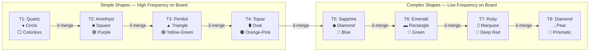
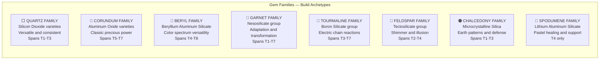
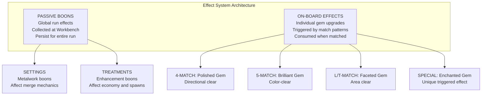

# Gemstone Match-3 + Merge Roguelike — Game Design Proposal

## Table of Contents

1. [Standard Gems & Tier Shapes](#1-standard-gems--tier-shapes)
2. [Available Cut Variants per Shape](#2-available-cut-variants-per-shape)
3. [Material Type Families](#3-material-type-families)
4. [Alternate Gem Tiering](#4-alternate-gem-tiering)
5. [Special Gems: Tier 0, Tier 9 & Untiered](#5-special-gems-tier-0-tier-9--untiered)
6. [Passive Boons & On-Board Effects](#6-passive-boons--on-board-effects)
7. [Omitted Gems & Future Additions](#7-omitted-gems--future-additions)

---

## 1. Standard Gems & Tier Shapes

### Design Principles

The 8 default gems form the starter merge chain. Every player begins with this set. The design must satisfy:

- **Maximally distinct colors** between adjacent tiers
- **Universally recognizable** gem names (a casual player should know them)
- **Intuitive value ladder** (the progression should "feel right")
- **Shape = Tier identity** (silhouette is the primary tier indicator on the grid)
- **Simple shapes for common tiers, complex shapes for rare tiers** (frequency-appropriate visual complexity)

### Board Frequency Context

In a match-3 merge game, tile frequency follows an exponential distribution:

- **T1-T3**: ~70-85% of visible tiles (constantly spawning, constantly matched)
- **T4-T5**: ~10-20% of visible tiles (active merge targets)
- **T6-T8**: ~1-5% of visible tiles (rare prizes, board highlights)

Low-tier shapes must be **instantly scannable** at glance speed, while high-tier shapes can afford to be **more visually complex** since they are rare enough to draw focused attention.

### Shape Complexity Ranking

> **Note:** The tier-shape mapping was revised. Hexagon is no longer a core tier shape; it is reserved for T0 polygon-family gems. Marquise was promoted from an oval variant to its own core shape at T7. Oval moved to T4, diamond/lozenge to T5.

| Shape | Sides | Symmetry Axes | Scan Speed | Complexity |
|---|---|---|---|---|
| Circle | 0 (smooth) | Infinite | Fastest | Lowest |
| Square (0°) | 4 | 4 | Very fast | Low |
| Triangle | 3 | 3 | Very fast | Low |
| Oval | 0 (smooth, elongated) | 2 | Fast | Low-Medium |
| Diamond (45° square) | 4 | 4 (rotated) | Fast | Medium |
| Rectangle | 4 (elongated) | 2 | Medium | Medium |
| Marquise | 0 (pointed, elongated) | 2 | Medium-slow | Medium-High |
| Pear | 0 (asymmetric) | 1 | Slowest | Highest |

### The Default Chain

| Tier | Shape | Default Gem | Color | Gem Reasoning | Shape Reasoning |
|---|---|---|---|---|---|
| **T1** | **Circle** (Cabochon) | **Quartz** | Colorless / Pale White | Everyone knows quartz. It is the "common stone" archetype. Most commonly sold as cabochons or tumbled stones. | Circle is the simplest shape. No edges, no corners. Perfect for the most common tile on the board. Cabochon (smooth dome) reinforces "uncut, raw, common." |
| **T2** | **Square** (Cushion, rounded corners) | **Amethyst** | Purple | Universally known purple gem. Same mineral family as quartz (amethyst IS purple quartz), giving the first merge a satisfying lore justification. | Square is a basic geometric primitive. Rounded/cushion corners give it a softer feel than T5's sharp diamond. Amethyst is commonly cushion-cut commercially. |
| **T3** | **Triangle** (Trillion, curved edges) | **Peridot** | Olive / Yellow-Green | Distinctive yellow-green that clashes with nothing above or below. Well-known birthstone. No precious gem strongly claims the triangle shape, so Peridot fits without conflict. | Triangle is simple but adds the first "directional" element (point-up). Three sides make it instantly distinguishable from the 4-sided square. |
| **T4** | **Oval** | **Topaz** | Orange-Pink | Imperial Topaz bridges the gap between common and precious. The warm orange tone is unique in the chain. Topaz is a well-known name. | Oval introduces smooth curves after three angular shapes. The elongated ellipse is instantly distinct from circle, square, and triangle. |
| **T5** | **Diamond** (45° rotated square, sharp corners) | **Sapphire** | Blue | One of the "big three" precious gems. Blue is the most popular gem color globally. The lozenge/diamond shape's step-cut tiers complement sapphire's crystalline clarity. | The diamond shape is universally recognized and signals "you're entering valuable territory." Sharp corners at 45° rotation clearly distinguish it from T2's rounded square at 0°. |
| **T6** | **Rectangle** (Emerald cut) | **Emerald** | Green | The emerald cut (rectangular step-cut) is literally named after this gem, the strongest gem-to-cut association in all of gemology. The step-cut was developed specifically for emerald's brittle crystal structure. | Rectangle with cropped/angled corners is the iconic emerald-cut silhouette. Elongated shape contrasts with T5's compact diamond. |
| **T7** | **Marquise** | **Ruby** | Deep Red | The red counterpart to sapphire (both corundum). Universally understood as precious. The marquise's dramatic pointed boat shape suits ruby's intensity and rarity. | Marquise is a pointed, elongated boat shape with two sharp tips. Its dramatic silhouette signals high rarity and contrasts with all preceding shapes. |
| **T8** | **Pear** (Drop) | **Diamond** | Brilliant White / Prismatic | The ultimate gem in popular culture. Perfect apex. Many famous diamonds are pear-cut (Taylor-Burton, Cullinan III, Star of South Africa). The pear resembles a teardrop or flame. | Pear is the most visually distinctive shape, asymmetric with a point and a curve. As the rarest tile on the board, it deserves the most eye-catching silhouette. |

### Merge Chain Visualization

### Color Adjacency Check

No two adjacent tiers share a similar hue:

| Transition | Colors | Confusable? |
|---|---|---|
| T1 to T2 | Colorless to Purple | No |
| T2 to T3 | Purple to Yellow-Green | No |
| T3 to T4 | Yellow-Green to Orange-Pink | Slight warmth overlap, but green vs orange is clear |
| T4 to T5 | Orange-Pink to Blue | No |
| T5 to T6 | Blue to Green | Adjacent on spectrum but shape difference compensates |
| T6 to T7 | Green to Deep Red | No |
| T7 to T8 | Deep Red to White/Prismatic | No |

### Shape Adjacency Check

No two adjacent tiers share a confusable silhouette:

| Transition | Shapes | Confusable? | Distinguishing Feature |
|---|---|---|---|
| T1 to T2 | Circle to Square | No | Round vs angular |
| T2 to T3 | Square to Triangle | No | 4 sides vs 3 sides |
| T3 to T4 | Triangle to Diamond | No | 3 points vs 4 points; different orientation |
| T4 to T5 | Diamond to Hexagon | No | 4 sides sharp vs 6 sides wide |
| T5 to T6 | Hexagon to Rectangle | No | Compact/wide vs elongated |
| T6 to T7 | Rectangle to Oval | No | Angular corners vs smooth curves |
| T7 to T8 | Oval to Pear | Low risk | Both smooth + elongated, but pear has a visible point; T8 is extremely rare; color difference is maximal |

### Exponential Cost Context

With 3-to-1 merging across 8 tiers:

| Target Tier | Base Tiles Needed | Reachability |
|---|---|---|
| T2 | 3 | Trivial |
| T3 | 9 | Easy |
| T4 | 27 | Moderate |
| T5 | 81 | Achievable in a good run |
| T6 | 243 | Requires some acceleration |
| T7 | 729 | Requires significant acceleration |
| T8 | 2,187 | Requires multiple accelerators; the "perfect run" goal |

---

## 2. Available Cut Variants per Shape

Each tier's base shape has 3-4 cut variants that change the **internal facet pattern** and **corner/edge treatment** while keeping the overall silhouette recognizable. This is how unlockable gems within the same tier get unique sprites.

The visual identity stack:

1. **Silhouette (shape)** — Identifies tier (readable at any zoom)
2. **Color (hue + saturation)** — Identifies which gem (readable at small zoom)
3. **Facet pattern (internal lines)** — Identifies cut variant / skin (readable at medium zoom)
4. **Special effect (animation)** — Identifies rarity / ability (readable at any zoom)

### T1 — Circle Variants

| Cut Variant | Edge Profile | Internal Pattern | Visual Description |
|---|---|---|---|
| **Cabochon** (default) | Smooth dome | No facets, smooth gradient with light reflection spot | Clean dome with a single highlight; the "raw" look |
| **Round Brilliant** | Smooth circle | Star/arrow facet pattern with 8-fold symmetry | Classic diamond-style faceting in a circle; sparkly |
| **Rose Cut** | Smooth circle | Triangular facets radiating from center apex, flat bottom | Vintage look; facets form a low dome pattern |
| **Buff Top** | Smooth circle | Smooth top half, subtle faceted ring around the edge | Hybrid: dome center with a faceted border |

### T2 — Square Variants (all at 0° orientation)

| Cut Variant | Corner Profile | Internal Pattern | Visual Description |
|---|---|---|---|
| **Cushion** (default) | Rounded corners | Brilliant-style facets, large central culet | Soft "pillow" square with sparkling interior |
| **Old Mine Cut** | Rounded corners, chunkier proportions | Fewer, larger facets with visible center dot | Antique feel; less precise, more characterful |
| **Radiant** | Slightly beveled corners | Dense brilliant facets in square outline | More geometric than cushion; crisper faceting |
| **Asscher** | Cropped/angled corners approaching octagon | Step-cut concentric squares forming windmill pattern | Art Deco feel; geometric step-cut lines |

### T3 — Triangle Variants (all point-up orientation)

| Cut Variant | Edge/Corner Profile | Internal Pattern | Visual Description |
|---|---|---|---|
| **Trillion** (default) | Slightly curved edges, pointed vertices | Brilliant triangular facets | Organic triangle with sparkling facets |
| **Trilliant** | Straight edges, pointed vertices | Modified brilliant, sharper geometric look | Crisp, angular triangle |
| **Shield** | One flat base edge, two pointed top vertices | Asymmetric brilliant facets | Heraldic shield shape; distinctive asymmetry |
| **Kite** | Elongated triangle taller than wide, pointed top | Long brilliant facets | Stretched triangle; more vertical emphasis |

### T4 — Oval Variants

| Cut Variant | Proportions | Internal Pattern | Visual Description |
|---|---|---|---|
| **Oval Brilliant** (default) | Standard oval at ~1.4:1 ratio | Brilliant-style facets | Classic precious gem look |
| **Antique Oval** | Standard oval, smaller table, taller crown | Brilliant with vintage proportions | Warmer, deeper look with more light return |
| **Oval Step** | Standard oval | Parallel step-cut lines following oval contour | Elegant, understated; "hall of mirrors" in oval |
| **Oval Mixed** | Standard oval | Brilliant top half + step-cut bottom half | Complex; signals "special" variant |

### T5 — Diamond Variants (all at 45° rotation, sharp corners)

| Cut Variant | Proportions | Internal Pattern | Visual Description |
|---|---|---|---|
| **Lozenge** (default) | Elongated vertically | Step-cut concentric diamond tiers | Clean, crystalline; elongated diamond with step-cut clarity |
| **Kite Brilliant** | Offset shoulders, asymmetric diamond | Brilliant-style facets | Dynamic offset diamond; more vertical emphasis |
| **Lozenge Radiant** | Standard diamond proportions | Radiant-style mixed facets | Step-cut outline with brilliant interior; hybrid sparkle |
| **Rhombus Brilliant** | Standard proportions | Dense brilliant facets with many small facets | Maximum sparkle; busy but dazzling |

### T5 note — Hexagon shapes are no longer core tier shapes

> Hexagon (and other regular 5--7 sided polygons) are reserved for T0 hazard/obstacle gems. See "Tier 0" section below.

### T6 — Rectangle Variants

| Cut Variant | Corner Profile | Internal Pattern | Visual Description |
|---|---|---|---|
| **Emerald Cut** (default) | Cropped/angled corners | Parallel step-cut lines, horizontal | The iconic "hall of mirrors" effect |
| **Baguette** | Sharp 90° corners | Minimal parallel lines, very clean | Sleek, minimal; architectural feel |
| **Radiant Rectangle** | Cropped corners | Brilliant facets in rectangular outline | Step-cut outline but brilliant interior; hybrid |
| **Scissor Cut** | Cropped corners | Criss-cross diagonal facet pattern | Dynamic X-pattern; more energetic than step-cut |

### T7 — Marquise Variants

| Cut Variant | Proportions | Internal Pattern | Visual Description |
|---|---|---|---|
| **Marquise Brilliant** (default) | Standard marquise at ~2:1 ratio, two pointed tips | Brilliant-style facets with 10-fold symmetry | Classic boat-shaped brilliant; dramatic fire |
| **Navette** | Narrower and more elongated (~2.5:1), sharper tips | Brilliant facets, tighter arrangement | Sleek, needle-like marquise; elegant and sharp |
| **Marquise Step** | Standard marquise | Step-cut lines following the pointed contour | Clean and architectural; unusual for marquise |
| **Modified Marquise** | Broader shoulders, less pointed tips | Rounded brilliant facets | Softer boat shape; less aggressive than standard |

### T8 — Pear Variants

| Cut Variant | Proportions | Internal Pattern | Visual Description |
|---|---|---|---|
| **Pear Brilliant** (default) | Standard pear at ~1.5:1, one point, one curve | Brilliant-style facets | Classic teardrop with maximum fire |
| **Briolette** | Fully faceted teardrop with no flat table | All-over triangular facets covering entire surface | "3D" look; no flat top; entirely covered in facets |
| **Pendeloque** | Elongated/narrow pear at ~2:1 ratio | Long brilliant facets | Dramatic, slender; chandelier-drop feel |
| **Modified Pear** | Wider shoulders, shorter point | Broader facet layout | Stubbier, more compact; "chubby teardrop" |

---

## 3. Material Type Families

Families group gems by **mineral lineage or thematic connection**. They serve as **build archetypes**. When a player focuses on gems from one family, they unlock synergies. Each family has members spread across multiple tiers, allowing family-focused builds at different power levels.

### Family Overview

### Family Details

#### ⬜ Quartz Family (Silicon Dioxide)

The most abundant mineral family. In-game, the "starter" family: versatile, reliable, but not flashy.

**Synergy theme: Consistency and cascades** (more matches, more reliable spawns).

| Gem | Tier | Color | Notes |
|---|---|---|---|
| Quartz (Rock Crystal) | T1 | Colorless | Default T1 |
| Amethyst | T2 | Purple | Default T2 |
| Citrine | T2 | Deep Orange-Yellow | Warm counterpart to Amethyst |
| Rose Quartz | T2 | Pink | Soft pink; very recognizable |
| Smoky Quartz | T2 | Brown-Gray | Dark, moody variant |
| Tiger's Eye | T2 | Golden-Brown | Chatoyant shimmer |
| Ametrine | T3 | Purple-Yellow bi-color | Bi-color; visually unique |
| Rutilated Quartz | T3 | Golden inclusions in clear | Needles visible inside |

#### 🔵 Corundum Family (Aluminum Oxide)

The "classic precious" family. Sapphire and ruby are the same mineral in different colors.

**Synergy theme: Power and direct damage** (stronger match effects, combat bonuses).

| Gem | Tier | Color | Notes |
|---|---|---|---|
| Sapphire | T5 | Blue | Default T5 |
| Ruby | T7 | Deep Red | Default T7 |
| Padparadscha Sapphire | T6 | Orange-Pink | Lotus-blossom sapphire; rare |
| Star Ruby | T5 | Red with star | Asterism effect overlay |
| Star Sapphire | T5 | Blue with star | Asterism effect overlay |
| Kashmir Sapphire | T7 | Velvety Blue | Legendary sapphire variant |

#### 💚 Beryl Family (Beryllium Aluminum Silicate)

One mineral, many colors: emerald (green), aquamarine (blue), morganite (pink), heliodor (yellow), red beryl (red).

**Synergy theme: Color manipulation and versatility** (change gem colors, wildcard matching).

| Gem | Tier | Color | Notes |
|---|---|---|---|
| Heliodor | T4 | Yellow | Golden beryl |
| Aquamarine | T5 | Light Blue | Sea-blue; AAA Santa Maria |
| Morganite | T5 | Pink | Peach/pink beryl |
| Emerald | T6 | Green | Default T6 |
| Red Beryl (Bixbite) | T6 | Red | Rarest beryl; Utah only |
| Top Colombian Emerald | T8 | Vivid Green | Alternate T8 skin |

#### 🔴 Garnet Family (Nesosilicate Group)

The most diverse mineral family. Garnets come in every color except blue (until the ultra-rare color-change variety).

**Synergy theme: Adaptation and transformation** (bonuses that change based on board state, color-shifting).

| Gem | Tier | Color | Notes |
|---|---|---|---|
| Garnet (Almandine) | T1 | Red | Common red garnet |
| Pyrope Garnet | T3 | Deep Red | Rich, wine-red |
| Hessonite Garnet | T3 | Orange-Brown | Cinnamon stone |
| Rhodolite Garnet | T4 | Purple-Red | Pyrope-almandine blend |
| Spessartite Garnet | T4 | Orange-Gold | "Mandarin" garnet |
| Tsavorite Garnet | T6 | Chrome Green | Vivid green grossular |
| Demantoid Garnet | T6 | Yellow-Green | "Diamond-like" fire; andradite |
| Blue Garnet | T7 | Blue to Red shift | Ultra-rare color-change |

#### 🌈 Tourmaline Family (Boron Silicate)

Known for extreme color variety and electrical properties (tourmaline is pyroelectric and piezoelectric).

**Synergy theme: Chain reactions and electrical effects** (cascade bonuses, chain lightning-style clears).

| Gem | Tier | Color | Notes |
|---|---|---|---|
| Tourmaline (Watermelon/Bi-color) | T3 | Pink center, green rim | Bi-color; visually distinctive |
| Chrome Tourmaline | T4 | Chrome Green | Chrome-green |
| Rubellite Tourmaline | T5 | Pink-Red | Hot pink-red |
| Indicolite Tourmaline | T5 | Deep Blue | Deep blue tourmaline |
| Paraiba Tourmaline | T7 | Neon Blue | Electric neon glow; the star of the family |

#### 🌙 Feldspar Family (Tectosilicate Group)

Known for optical phenomena: adularescence, labradorescence, aventurescence.

**Synergy theme: Illusion and misdirection** (hidden matches revealed, phantom tiles, preview abilities).

| Gem | Tier | Color | Notes |
|---|---|---|---|
| Amazonite | T2 | Green | Green microcline |
| Moonstone | T3 | White/Blue flash | Adularescence |
| Labradorite | T3 | Gray/Blue flash | Schiller/labradorescence |
| Sunstone | T4 | Orange with shimmer | Copper aventurescence |

#### 🟤 Chalcedony Family (Microcrystalline Silica)

Patterned, opaque, earthy stones.

**Synergy theme: Defense and resilience** (board protection, blocker resistance, decay immunity).

| Gem | Tier | Color | Notes |
|---|---|---|---|
| Agate (Banded) | T1 | Mixed bands | Banded patterns |
| Jasper | T1 | Mixed opaque | Opaque chalcedony |
| Carnelian | T2 | Orange-Red | Warm chalcedony |
| Onyx | T2 | Black | Strong contrast |
| Bloodstone | T2 | Green with red spots | Heliotrope; distinctive pattern |
| Chrysoprase | T3 | Apple Green | Nickel-colored green |

#### 💜 Spodumene Family (Lithium Aluminum Silicate)

Pastel-colored lithium minerals. Small family but distinctive.

**Synergy theme: Healing and support** (move restoration, curse cleansing).

| Gem | Tier | Color | Notes |
|---|---|---|---|
| Kunzite | T4 | Intense Pink | Pink spodumene |
| Hiddenite | T4 | Green | Chrome-green spodumene |

### Independent Gems (No Family)

These gems do not belong to a mineral family large enough to form a group. They are "wildcards" that can complement any build.

| Gem | Tier | Color | Material |
|---|---|---|---|
| Fluorite | T1 | Purple/Green/Blue | Fluorite |
| Lapis Lazuli | T2 | Blue | Lazurite |
| Peridot | T3 | Olive-Green | Olivine |
| Turquoise | T3 | Blue-Green | Turquoise |
| Nephrite Jade | T3 | Medium Green | Nephrite |
| Kyanite | T3 | Blue | Kyanite |
| Larimar | T3 | Light Blue | Pectolite |
| Topaz (Imperial) | T4 | Orange-Pink | Topaz |
| Opal (White/Fire) | T4 | Multi-color flash | Opal |
| Zircon (Blue) | T4 | Blue | Zircon |
| Ammolite | T4 | Multi-color iridescent | Ammonite Fossil |
| Moldavite | T4 | Dark Green glassy | Tektite |
| Tanzanite | T5 | Blue-Violet | Zoisite |
| Chrysoberyl Cat's Eye | T5 | Golden-Gray | Chrysoberyl |
| Diaspore (Zultanite) | T5 | Color-change green/pink | Diaspore |
| Spinel (Pink) | T5 | Vivid Pink | Spinel |
| Black Opal | T5 | Dark with play of color | Opal |
| Alexandrite | T6 | Color-change green/red | Chrysoberyl |
| Jadeite (Imperial) | T6 | Emerald-green translucent | Jadeite |
| Spinel (Red) | T6 | Vivid Red | Spinel |
| Taaffeite | T7 | Purple-Lilac | Taaffeite |
| Grandidierite | T7 | Bluish-Green | Grandidierite |
| Benitoite | T7 | Sapphire Blue | Benitoite |
| Painite | T7 | Orange-Brown | Painite |
| Diamond | T8 | Prismatic/Colorless | Carbon |
| Fancy Red Diamond | T8 | Red | Carbon |
| Fancy Blue Diamond | T8 | Blue | Carbon |

---

## 4. Alternate Gem Tiering

### Complete Tier Assignment

Below is every gem assigned to a tier, with its color, shape (determined by tier), cut variant, and family. The combination of **tier (shape) + color + cut variant** is unique for every gem.

#### Tier 1 — Circle Shape

| Gem | Color | Cut Variant | Family | Unique Combo |
|---|---|---|---|---|
| **Quartz** ★ | Colorless | Cabochon | Quartz | Circle + Colorless + Cabochon |
| Fluorite | Purple/Green/Blue multi | Round Brilliant | Independent | Circle + Multi-color + Round Brilliant |
| Garnet (Almandine) | Red | Rose Cut | Garnet | Circle + Red + Rose Cut |
| Agate (Banded) | Mixed bands | Buff Top | Chalcedony | Circle + Banded + Buff Top |
| Jasper | Mixed opaque | Cabochon (textured) | Chalcedony | Circle + Opaque Mixed + Cabochon textured |

★ = Default gem for this tier

**Distinctiveness**: Colorless smooth dome vs multi-color faceted vs red faceted vs banded smooth vs opaque textured. All clearly different.

#### Tier 2 — Square Shape (rounded corners)

| Gem | Color | Cut Variant | Family | Unique Combo |
|---|---|---|---|---|
| **Amethyst** ★ | Purple | Cushion | Quartz | Square + Purple + Cushion |
| Citrine | Deep Orange-Yellow | Old Mine Cut | Quartz | Square + Orange-Yellow + Old Mine |
| Rose Quartz | Pink | Radiant | Quartz | Square + Pink + Radiant |
| Tiger's Eye | Golden-Brown | Asscher | Quartz | Square + Golden-Brown + Asscher |
| Smoky Quartz | Brown-Gray | Cushion | Quartz | Square + Brown-Gray + Cushion |
| Carnelian | Orange-Red | Old Mine Cut | Chalcedony | Square + Orange-Red + Old Mine |
| Onyx | Black | Asscher | Chalcedony | Square + Black + Asscher |
| Lapis Lazuli | Blue | Radiant | Independent | Square + Blue + Radiant |
| Bloodstone | Green with red spots | Cushion | Chalcedony | Square + Green-Red spotted + Cushion |
| Amazonite | Green | Radiant | Feldspar | Square + Green + Radiant |

**Distinctiveness**: 10 gems across 9 distinct colors and 4 cut variants. Smoky Quartz (brown-gray cushion) vs Tiger's Eye (golden-brown asscher) distinguished by color warmth and facet pattern. Carnelian (orange-red old mine) vs Citrine (orange-yellow old mine) distinguished by red vs yellow undertone.

#### Tier 3 — Triangle Shape (curved edges)

| Gem | Color | Cut Variant | Family | Unique Combo |
|---|---|---|---|---|
| **Peridot** ★ | Olive/Yellow-Green | Trillion | Independent | Triangle + Yellow-Green + Trillion |
| Moonstone | White/Blue flash | Trilliant | Feldspar | Triangle + White-Blue + Trilliant |
| Turquoise | Blue-Green | Shield | Independent | Triangle + Blue-Green + Shield |
| Labradorite | Gray/Blue flash | Trilliant | Feldspar | Triangle + Gray-Blue + Trilliant |
| Chrysoprase | Apple Green | Kite | Chalcedony | Triangle + Apple Green + Kite |
| Kyanite | Blue | Shield | Independent | Triangle + Blue + Shield |
| Larimar | Light Blue | Trillion | Independent | Triangle + Light Blue + Trillion |
| Nephrite Jade | Medium Green | Kite | Independent | Triangle + Medium Green + Kite |
| Pyrope Garnet | Deep Red | Trilliant | Garnet | Triangle + Deep Red + Trilliant |
| Hessonite Garnet | Orange-Brown | Trillion | Garnet | Triangle + Orange-Brown + Trillion |
| Ametrine | Purple-Yellow bi-color | Shield | Quartz | Triangle + Purple-Yellow + Shield |
| Rutilated Quartz | Golden inclusions in clear | Kite | Quartz | Triangle + Gold-in-Clear + Kite |
| Tourmaline (Watermelon) | Pink-Green bi-color | Trillion | Tourmaline | Triangle + Pink-Green + Trillion |

**Distinctiveness**: 13 gems across 12 distinct color profiles and 4 cut variants. Moonstone (white-blue trilliant) vs Labradorite (gray-blue trilliant) distinguished by base color (white vs gray). Kyanite (blue shield) vs Turquoise (blue-green shield) distinguished by pure blue vs blue-green.

#### Tier 4 — Oval Shape

> **Note:** T4 was previously Diamond shape. Gems in this tier now use the oval silhouette family (Oval Brilliant, Antique Oval, etc.).

| Gem | Color | Cut Variant | Family | Unique Combo |
|---|---|---|---|---|
| **Topaz** ★ | Orange-Pink | Princess | Independent | Diamond + Orange-Pink + Princess |
| Kunzite | Intense Pink | French Cut | Spodumene | Diamond + Pink + French |
| Hiddenite | Green | Lozenge | Spodumene | Diamond + Green + Lozenge |
| Opal (White/Fire) | Multi-color flash | Rhombus Brilliant | Independent | Diamond + Multi-flash + Rhombus |
| Zircon (Blue) | Blue | Princess | Independent | Diamond + Blue + Princess |
| Sunstone | Orange with shimmer | French Cut | Feldspar | Diamond + Orange-shimmer + French |
| Rhodolite Garnet | Purple-Red | Lozenge | Garnet | Diamond + Purple-Red + Lozenge |
| Spessartite Garnet | Orange-Gold | Rhombus Brilliant | Garnet | Diamond + Orange-Gold + Rhombus |
| Ammolite | Multi-color iridescent | Lozenge | Independent | Diamond + Iridescent + Lozenge |
| Moldavite | Dark Green glassy | French Cut | Independent | Diamond + Dark Green + French |
| Heliodor | Yellow | Princess | Beryl | Diamond + Yellow + Princess |
| Chrome Tourmaline | Chrome Green | Rhombus Brilliant | Tourmaline | Diamond + Chrome Green + Rhombus |

**Distinctiveness**: 12 gems across 11 distinct colors and 4 cut variants. Topaz (orange-pink princess) vs Sunstone (orange-shimmer french) distinguished by pink undertone vs shimmer effect and facet pattern. Three greens (Hiddenite, Moldavite, Chrome Tourmaline) distinguished by shade and cut variant.

#### Tier 5 — Diamond Shape (lozenge / kite)

> **Note:** T5 was previously Hexagon shape. Gems in this tier now use the diamond/lozenge/kite silhouette family. Hexagon shapes are reserved for T0 polygon gems.

| Gem | Color | Cut Variant | Family | Unique Combo |
|---|---|---|---|---|
| **Sapphire** ★ | Blue | Hexagonal Step | Corundum | Hexagon + Blue + Step |
| Tanzanite | Blue-Violet | Hexagonal Brilliant | Independent | Hexagon + Blue-Violet + Brilliant |
| Aquamarine | Light Blue | Portuguese Hex | Beryl | Hexagon + Light Blue + Portuguese |
| Morganite | Pink | Flower Cut | Beryl | Hexagon + Pink + Flower |
| Rubellite Tourmaline | Pink-Red | Hexagonal Brilliant | Tourmaline | Hexagon + Pink-Red + Brilliant |
| Indicolite Tourmaline | Deep Blue | Hexagonal Step | Tourmaline | Hexagon + Deep Blue + Step |
| Chrysoberyl Cat's Eye | Golden-Gray | Flower Cut | Independent | Hexagon + Golden-Gray + Flower |
| Diaspore (Zultanite) | Color-change green/pink | Portuguese Hex | Independent | Hexagon + Green-Pink shift + Portuguese |
| Spinel (Pink) | Vivid Pink | Hexagonal Brilliant | Independent | Hexagon + Vivid Pink + Brilliant |
| Black Opal | Dark with play of color | Portuguese Hex | Independent | Hexagon + Dark-rainbow + Portuguese |
| Star Ruby | Red with star | Flower Cut | Corundum | Hexagon + Red-star + Flower |
| Star Sapphire | Blue with star | Flower Cut | Corundum | Hexagon + Blue-star + Flower |

**Distinctiveness**: 12 gems across 11 distinct color profiles and 4 cut variants. Sapphire (blue step) vs Indicolite (deep blue step) distinguished by medium vs dark blue. Star Ruby and Star Sapphire share flower cut but have asterism overlays plus red vs blue.

#### Tier 6 — Rectangle Shape (Emerald cut base)

| Gem | Color | Cut Variant | Family | Unique Combo |
|---|---|---|---|---|
| **Emerald** ★ | Green | Emerald Cut | Beryl | Rectangle + Green + Emerald Cut |
| Tsavorite Garnet | Chrome Green | Baguette | Garnet | Rectangle + Chrome Green + Baguette |
| Demantoid Garnet | Yellow-Green | Baguette | Garnet | Rectangle + Yellow-Green + Baguette |
| Padparadscha Sapphire | Orange-Pink | Scissor Cut | Corundum | Rectangle + Orange-Pink + Scissor |
| Red Beryl (Bixbite) | Red | Radiant Rectangle | Beryl | Rectangle + Red + Radiant |
| Alexandrite | Color-change green/red | Radiant Rectangle | Independent | Rectangle + Green-Red shift + Radiant |
| Jadeite (Imperial) | Emerald-green translucent | Emerald Cut | Independent | Rectangle + Translucent Green + Emerald Cut |
| Spinel (Red) | Vivid Red | Scissor Cut | Independent | Rectangle + Vivid Red + Scissor |

**Distinctiveness**: 8 gems across 7 distinct color profiles and 4 cut variants. Emerald vs Jadeite distinguished by transparency (faceted vs translucent/waxy). Red Beryl vs Spinel distinguished by cut variant (radiant vs scissor).

#### Tier 7 — Marquise Shape

> **Note:** T7 was previously Oval shape. Gems in this tier now use the marquise silhouette family (Marquise Brilliant, Navette, etc.).

| Gem | Color | Cut Variant | Family | Unique Combo |
|---|---|---|---|---|
| **Ruby** ★ | Deep Red | Oval Brilliant | Corundum | Oval + Deep Red + Brilliant |
| Kashmir Sapphire | Velvety Blue | Oval Step | Corundum | Oval + Velvety Blue + Step |
| Taaffeite | Purple-Lilac | Oval Mixed | Independent | Oval + Purple-Lilac + Mixed |
| Grandidierite | Bluish-Green | Oval Step | Independent | Oval + Bluish-Green + Step |
| Blue Garnet | Blue to Red shift | Oval Brilliant | Garnet | Oval + Blue-Red shift + Brilliant |
| Benitoite | Sapphire Blue | Oval Mixed | Independent | Oval + Sapphire Blue + Mixed |
| Painite | Orange-Brown | Oval Cabochon | Independent | Oval + Orange-Brown + Cabochon |
| Paraiba Tourmaline | Neon Blue | Oval Brilliant | Tourmaline | Oval + Neon Blue + Brilliant |

**Distinctiveness**: 8 gems across 8 distinct color profiles and 4 cut variants. Kashmir Sapphire (velvety blue step) vs Benitoite (sapphire blue mixed) distinguished by texture and facet pattern. Blue Garnet has color-change animation.

#### Tier 8 — Pear Shape (Drop)

| Gem | Color | Cut Variant | Family | Unique Combo |
|---|---|---|---|---|
| **Diamond** ★ | Prismatic/Colorless | Pear Brilliant | Independent | Pear + Prismatic + Brilliant |
| Fancy Red Diamond | Red | Briolette | Independent | Pear + Red + Briolette |
| Fancy Blue Diamond | Blue | Pendeloque | Independent | Pear + Blue + Pendeloque |
| Top Colombian Emerald | Vivid Green | Modified Pear | Beryl | Pear + Vivid Green + Modified |

**Distinctiveness**: 4 gems across 4 distinct colors and 4 distinct cut variants. Every combination is unique on both axes.

### Tier Population Summary

| Tier | Shape | Total Gems | Default | Unlockable |
|---|---|---|---|---|
| T1 | Circle | 5 | Quartz | 4 |
| T2 | Square | 10 | Amethyst | 9 |
| T3 | Triangle | 13 | Peridot | 12 |
| T4 | Oval | 12 | Topaz | 11 |
| T5 | Diamond | 12 | Sapphire | 11 |
| T6 | Rectangle | 8 | Emerald | 7 |
| T7 | Marquise | 8 | Ruby | 7 |
| T8 | Pear | 4 | Diamond | 3 |
| **Total** | | **72** | **8** | **64** |

The distribution is intentionally front-loaded (more options in T2-T5 where the player spends most time) and sparse at T8 (apex gems should feel exclusive).

---

## 5. Special Gems: Tier 0, Tier 9 & Untiered

### Tier 0 — Blocker / Hazard / Utility Tiles

These are non-gem materials that spawn as **obstacles, curses, or risk/reward elements**. They do not participate in the normal merge chain. Their shapes are deliberately **irregular or geometric in ways that do not match any tier shape**, making them instantly recognizable as "not a normal gem."

#### T0 Shape Design Principle

T0 shapes must look **deliberately wrong** on the grid. The polygon family (regular 5--7 sided shapes) is reserved as a distinct T0 identity:

- **Regular polygons** (Pentagon, Hexagon, Heptagon) — equilateral polygons between 5 and 7 sides form a coherent T0 "polygon family." No standard tier uses these regular shapes, making them immediately readable as non-standard gems. Variants include epaulette (pentagon), hexagonal step/brilliant, and unique heptagonal shapes.
- **Cubes** (Pyrite, Galena) — no tier uses a cube; the sharp geometric form reads as "artificial/wrong"
- **Irregular shapes** (Obsidian, Cinnabar, Copper) — no tier uses irregular outlines
- **Flat disc** (Hematite) — distinct from T1 circle because it is flat/metallic, not domed
- **Octahedron top-down** (Magnetite) — a square with an X through it; no tier uses this

#### T0 Items

| Item | Color | Shape | Source Material | Type Family | Role | Mechanic |
|---|---|---|---|---|---|---|
| **Obsidian** | Black, glassy | Jagged shard, irregular polygon | Volcanic Glass | Volcanic | **Blocker** | Occupies a cell; must be "shattered" by making matches adjacent to it. Volcanic glass fractures into sharp conchoidal shapes. |
| **Pyrite** | Metallic Yellow | Cube at 0°, sharp edges | Iron Sulfide | Metallic | **Trickster** | "Fool's Gold" — looks valuable but clogs space. Can be "smelted" (3 pyrites = 1 random T2 gem) for small benefit, or ignored. |
| **Hematite** | Metallic Gray | Flat disc / kidney shape | Iron Oxide | Metallic | **Heavy tile** | Sinks to the bottom of the board each turn. Can be used strategically as an anchor, or it blocks bottom rows. |
| **Galena** | Silver-Gray | Cube, like Pyrite but silver | Lead Sulfide | Metallic | **Poison** | Spreads to one adjacent cell every 3 turns if not cleared. Cleared by matching adjacent gems. Toxic lead theme. |
| **Cinnabar** | Red, toxic | Amorphous blob | Mercury Sulfide | Toxic | **Curse tile** | Damages your move economy (-1 move per turn it exists). Must be cleared quickly. Mercury/toxic theme. |
| **Magnetite** | Black, magnetic | Octahedron top-down: square with X | Iron Oxide | Metallic | **Attractor** | Pulls specific gem types toward it each turn. Can be beneficial (concentrate gems for matching) or disruptive. |
| **Copper** | Copper metallic | Irregular nugget | Native Copper | Metallic | **Conductor** | Chains match effects between non-adjacent gems. If two matches happen near copper, their effects combine. |

#### T0 Type Families

| Family | Members | Theme | Shared Mechanic |
|---|---|---|---|
| **Metallic** | Pyrite, Hematite, Galena, Magnetite, Copper | Ores and metals from deep earth | All interact with board physics (gravity, attraction, conductivity). Smelting 3 of any metallic T0 = 1 random T2 gem. |
| **Volcanic** | Obsidian | Volcanic/igneous materials | Hard blockers that must be shattered by adjacent activity |
| **Toxic** | Cinnabar | Poisonous minerals | Damage the player's economy over time; urgent removal needed |

### Tier 9 — Transcendent / Legendary Drops

These are ultra-rare items that appear as **boss drops, event rewards, or special floor completions**. They have powerful one-shot or persistent effects. Their shapes are **ornate or organic** — forms that do not appear anywhere else in the game.

#### T9 Shape Design Principle

T9 shapes are **organic, asymmetric, and ornate** — the opposite of the clean geometric tier shapes. The `special` shape category is reserved exclusively for T9:

- **Heart brilliant** — the classic heart shape; reserved for T9 transcendent gems
- **Star** — multi-pointed star shapes; reserved for T9
- **Shield brilliant** — heraldic irregular hexagon; reserved for T9
- **Baroque pearl** — lumpy, organic oval
- **Ammonite spiral** — logarithmic spiral; no other shape curves this way
- **Teardrop with glow** — similar to T8 pear but with internal luminescence
- **Perfect sphere** — the only true sphere (T1 is a dome/cabochon)
- **Branching coral** — dendritic/tree-like; completely unique
- **Splash/splat** — irregular, impact-formed; chaotic

#### T9 Items

| Item | Color | Shape | Source | Type Family | Effect Name | Mechanic |
|---|---|---|---|---|---|---|
| **Conch Pearl** | Pink, flame pattern | Baroque organic oval | Calcium Carbonate | Organic/Pearl | **Siren's Heart** | AoE: restores 3 moves and clears all T0 tiles from the board. Natural pearls are never perfectly round. |
| **Ammolite** (top) | Full spectrum iridescent | Freeform spiral, ammonite shape | Ammonite Fossil | Organic/Fossil | **Ancient Prism** | Acts as a wildcard — matches with ANY color. Persists for 5 turns then shatters. |
| **Dominican Blue Amber** | Blue fluorescent | Teardrop with internal glow | Fossil Resin | Organic/Fossil | **Frozen Time** | Freezes all board decay and T0 spread effects for 5 turns. |
| **Pearl** (South Sea) | White/Golden luster | Perfect sphere | Calcium Carbonate | Organic/Pearl | **Moon's Tear** | Duplicates the highest-tier gem currently on the board. The perfect sphere is the ONLY true circle in the game (T1 cabochon is a dome). |
| **Coral** (Precious Red) | Deep Red, organic | Branching form, tiny tree/fan | Coral | Organic/Marine | **Blood Coral** | Sacrifice: lose 5 moves to instantly upgrade any gem by +2 tiers. Powerful but costly. |
| **Moldavite** (museum) | Deep Green, glassy | Splash/splat shape | Tektite | Extraterrestrial | **Star Fragment** | Grants a random powerful boon from a curated pool. Tektites form splash shapes from meteorite impact. |

#### T9 Type Families

| Family | Members | Theme |
|---|---|---|
| **Organic/Pearl** | Conch Pearl, Pearl | Nacre and calcium carbonate; healing and restoration |
| **Organic/Fossil** | Ammolite, Dominican Blue Amber | Ancient preserved materials; time manipulation |
| **Organic/Marine** | Coral | Living ocean materials; sacrifice and blood magic |
| **Extraterrestrial** | Moldavite | Impact glass from space; chaos and randomness |

### Untiered — Crafting / Consumable Materials

These items do not appear on the match grid. They exist in the player's **inventory** and are used at the Jeweler's Workbench or as crafting ingredients.

| Item | Source | Use | Thematic Connection |
|---|---|---|---|
| **Gold Nugget** | Floor completion reward | Currency for purchasing Settings (boons) | Precious metal for jewelry settings |
| **Silver Dust** | Matching 4+ in a single move | Currency for purchasing Treatments | Silver as a treatment/coating material |
| **Rough Crystal** | Random drop from T1-T2 matches | Crafting ingredient for basic consumables | Uncut gem material |
| **Gem Dust** | Salvaging unwanted gems | Universal crafting ingredient | Ground gem powder used in polishing |
| **Fossil Fragment** | Clearing T0 blocker tiles | Ingredient for T9 item recipes | Ancient material connecting to T9 fossils |
| **Meteorite Shard** | Rare floor event | Ingredient for the most powerful consumables | Extraterrestrial material connecting to Moldavite |

---

## 6. Passive Boons & On-Board Effects

### Revised System Overview

With cuts now integrated into the visual identity system (Section 2), the boon system is restructured into two distinct categories:

1. **Passive Boons** — Global effects that apply to your entire run. Collected between floors at the Jeweler's Workbench. Themed around **metalwork, settings, and treatments**.
2. **On-Board Effects** — Special states applied to individual gems on the grid, triggered by match patterns. Visually indicated by **overlays and animations** on the affected gem.

### Part A: Passive Boons (Global Run Effects)

Collected at **The Jeweler's Workbench** between floors. The player chooses from offered boons, some with tradeoffs (risk/reward).

#### Settings (Metalwork and Mountings) — Merge Modifiers

Settings change **how merging and upgrading works**. Each is associated with a metal type that serves as a visual indicator in the UI.

| Setting | Metal | Effect | Rarity | Tradeoff |
|---|---|---|---|---|
| **Prong Setting** | Silver | Merged gem retains one ability from a consumed gem | Common | None |
| **Bezel Setting** | Gold | Merged gem survives one board-clear event (protected) | Common | None |
| **Pave Setting** | White Gold | Clusters of 5+ same-tier gems auto-merge the lowest pair | Uncommon | Auto-merge may not be where you want it |
| **Channel Setting** | Platinum | Complete row/column of same type = all upgrade +1 tier | Uncommon | Requires very specific board state |
| **Tension Setting** | Titanium | Gem placed between two higher-tier gems upgrades for free | Rare | Requires careful positioning |
| **Flush Setting** | Palladium | Newly merged gem is "ethereal" and does not occupy space for 1 turn | Rare | Temporary; timing-dependent |
| **Cathedral Setting** | Rose Gold | Highest-tier gem on board grants +1 to all adjacent gem match values | Legendary | Encourages hoarding your best gem (space cost) |
| **Halo Setting** | Electrum | Merged gem creates a 1-tile "aura" that boosts neighbor match value by 50% | Legendary | Aura occupies visual space; can be overwhelming |

#### Treatments (Enhancement Processes) — Economy/Run Modifiers

Treatments change **spawning, resources, and run pacing**. Named after real gemstone treatment methods.

| Treatment | Process | Effect | Rarity | Tradeoff |
|---|---|---|---|---|
| **Heat Treatment** | Heating to improve color | Spawned gems have 15% chance to arrive at +1 tier | Common | None |
| **Oiling** | Filling fractures with oil | Matching treated gems grants +1 move | Common | Only applies to gems that spawn "oiled" (visual: slight sheen) |
| **Fracture Filling** | Resin/glass filling | T0 curse/blocker tiles slowly heal (1 per 3 turns) | Uncommon | Slow; does not help in emergencies |
| **Irradiation** | Color change via radiation | One random gem changes color each turn | Uncommon | Unpredictable; can break planned matches |
| **Diffusion** | Surface color diffusion | Matching a gem "bleeds" its color to 1 random neighbor | Rare | Can disrupt planned board states |
| **Coating** | Surface coating/plating | Top-row gems are immune to curses and T0 spread | Rare | Only protects top row |
| **Laser Drilling** | Precision inclusion removal | Once per floor: destroy any single tile on the board | Legendary | Single use per floor; must choose wisely |
| **HPHT Process** | Lab diamond creation, high-pressure high-temperature | Unlock 2-to-1 merging for one chosen gem type for the entire run | Legendary | Only affects one type; choosing which is a major decision |

#### Boon Acquisition: The Jeweler's Workbench

Between floors (at rest stops), the player visits **The Jeweler's Workbench**:

1. **Commission a Setting** — Choose from 2-3 offered Settings. Some cost Gold Nuggets; some are free but come with a curse.
2. **Apply a Treatment** — Choose from 2-3 offered Treatments. Some cost Silver Dust; some require sacrificing a gem from your inventory.
3. **Risky Boons** — Occasionally, a "Cursed Setting" or "Unstable Treatment" is offered: powerful effect + permanent downside. Example: "Cursed Prong Setting: merged gems retain TWO abilities, but your board shrinks by 1 column."

### Part B: On-Board Effects (Individual Gem Upgrades)

These are **special states** applied to individual gems on the grid when the player makes specific match patterns. They are the equivalent of Candy Crush's striped/wrapped/color-bomb candies, but themed as gem enhancements.

#### Match Pattern to Effect Mapping

| Match Pattern | Effect Name | Visual Indicator | Behavior When Matched |
|---|---|---|---|
| **4 in a line** | **Polished Gem** | Bright "polish streak" line across the gem (horizontal or vertical, matching direction of original match) | Clears the entire row OR column (depending on streak direction) in addition to the normal match. Like a striped candy. |
| **5 in a line** | **Brilliant Gem** | Intense radial glow / starburst effect; looks like maximum brilliance cut | Clears ALL gems of the same color from the board. Like a color bomb. |
| **L-shape or T-shape** (3+3) | **Faceted Gem** | Visible extra facet lines; looks more intricately cut than normal | Clears a 3x3 area around itself when matched. Like a wrapped candy. |
| **2x2 square** (if enabled) | **Cabochon Gem** | Becomes smooth and dome-like (loses facets, gains a glow) | Clears all gems in a diamond/cross pattern (5 tiles: center + 4 cardinal). |

#### Special Combinations

| Combination | Result | Visual | Effect |
|---|---|---|---|
| **Polished + Polished** | **Cross Polish** | Double streak in both directions | Clears both the row AND column simultaneously |
| **Polished + Brilliant** | **Laser Cut** | Streak transforms into a beam of the brilliant gem's color | Clears the entire row/column AND all gems of that color |
| **Brilliant + Brilliant** | **Prismatic Burst** | Rainbow explosion | Clears ALL gems from the board (full board clear) |
| **Faceted + Polished** | **Extended Facet** | Larger facet pattern | Clears a 5x5 area instead of 3x3 |
| **Faceted + Brilliant** | **Radiant Burst** | Faceted gem with color aura | Converts all gems of one color into Faceted gems, then detonates them all |
| **Faceted + Faceted** | **Master Cut** | Intensely faceted gem | Clears a 5x5 area AND the row AND column |

#### On-Board Effect Visual Design

The key constraint: on-board effects must be **visible on top of the gem's existing shape+color+cut** without obscuring the gem's identity.

| Effect | Overlay Type | Why It Works |
|---|---|---|
| Polished (streak) | A bright white/gold line across the gem | Thin line does not obscure shape or color; direction is informative |
| Brilliant (starburst) | Radial glow emanating from center | Glow extends beyond the gem's bounds; does not cover the gem itself |
| Faceted (extra lines) | Additional facet lines drawn on top | Adds visual complexity without changing silhouette |
| Cabochon (dome glow) | Smooth dome overlay with inner light | Replaces facet detail with smooth glow; clearly different |

### Part C: How Passive Boons Interact with On-Board Effects

The two systems are designed to **synergize**:

| Passive Boon | On-Board Interaction |
|---|---|
| **Prong Setting** | When a Polished/Brilliant/Faceted gem is merged, the resulting higher-tier gem retains the special effect |
| **Bezel Setting** | Special-effect gems survive one board clear (they do not get consumed by another special effect's detonation) |
| **Pave Setting** | Auto-merged gems have a chance to become Polished |
| **Heat Treatment** | Gems that spawn at +1 tier (from heat treatment) have a 10% chance to also spawn as Polished |
| **Diffusion** | Color bleed from matching can trigger chain reactions with Brilliant gems (since Brilliant clears by color) |
| **HPHT Process** | 2-to-1 merges always produce a Polished gem (since you are "saving" a tile, the result is enhanced) |

### Part D: Thematic Integration Summary

The naming convention creates a coherent jewelry-making metaphor:

| Game Concept | Jewelry Metaphor | Player Experience |
|---|---|---|
| Gem type and color | The raw gemstone | "What am I working with?" |
| Tier shape | The cut style | "How refined is this gem?" |
| Cut variant | The specific faceting | "What makes this gem unique?" |
| On-board effects (Polished, Brilliant, Faceted) | Enhancement through cutting | "I made this gem special through skillful play" |
| Passive boons: Settings | The metal mounting | "How is my collection presented?" |
| Passive boons: Treatments | Post-cutting enhancement | "What hidden improvements have I applied?" |
| T0 blockers | Raw ore and impurities | "What obstacles must I work around?" |
| T9 transcendents | Museum-piece masterworks | "What legendary finds have I discovered?" |
| Crafting materials | Workshop supplies | "What resources do I have to work with?" |

---

## 7. Omitted Gems & Future Additions

### Specifically Omitted Gems

These gems from the original CSV are excluded from the tiered system, with reasoning.

#### Omitted Due to Visual Redundancy

| Gem | CSV Tier | Reason | Too Similar To |
|---|---|---|---|
| Hawk's Eye | 6 | Blue Tiger's Eye; same chatoyant effect in different color | Tiger's Eye (T2) |
| Honey Quartz | 6 | Yellow-brown quartz; indistinguishable from Citrine at game scale | Citrine (T2) |
| Lemon Quartz | 6 | Irradiated yellow quartz; same issue as Honey Quartz | Citrine (T2) |
| Moss Agate | 6 | Green/clear silica with inclusions | Agate (T1), Chrysoprase (T3) |
| Dendritic Agate | 6 | White/black silica with tree patterns | Agate (T1) |
| Fire Agate | 6 | Iridescent silica layers | Opal (T4) in effect |
| Sardonyx | 6 | Red-white banded silica | Agate (T1), Carnelian (T2) |
| Chalcedony (Blue) | 6 | Translucent blue | Larimar (T3), Turquoise (T3) |
| Spectrolite | 6 | Finnish Labradorite; literally a variety of Labradorite | Labradorite (T3) |
| Aventurine | 6 | Green quartz with inclusions | Chrysoprase (T3) |
| Pietersite | 5 | Chatoyant chalcedony | Tiger's Eye (T2) |
| Rainbow Moonstone | 5 | Actually labradorite; redundant with both | Moonstone (T3), Labradorite (T3) |
| Thulite | 6 | Pink zoisite | Morganite (T5) |
| Rhodonite | 6 | Pink manganese silicate | Rose Quartz (T2), Morganite (T5) |
| Stichtite | 6 | Purple serpentine | Amethyst (T2) |
| Dolomite | 6 | Pink/white carbonate | Rose Quartz (T2) |

#### Omitted Due to Obscurity (No Public Recognition)

| Gem | CSV Tier | Reason |
|---|---|---|
| Enstatite | 6 | Brown-green pyroxene; no public recognition |
| Kornerupine | 6 | Green-brown; extremely obscure even among collectors |
| Danburite | 6 | Clear/pink; looks like generic clear crystal |
| Phenakite | 6 | Colorless beryllium silicate; too similar to Quartz visually |
| Scapolite | 6 | Yellow/purple; obscure; overlaps with Citrine and Amethyst |
| Bustamite | 6 | Pink manganese silicate; obscure |
| Axinite | 6 | Brown-violet; obscure |
| Epidote | 6 | Pistachio green; overlaps with Peridot |
| Zoisite (green) | 6 | Non-tanzanite zoisite; Tanzanite already represents this mineral |
| Prehnite | 6 | Pale green; overlaps with Chrysoprase |
| Scolecite | 6 | White zeolite; obscure |
| Apophyllite | 6 | Clear/green phyllosilicate; obscure |
| Celestite | 6 | Pale blue strontium sulfate; overlaps with Larimar |
| Angelite | 6 | Pale blue anhydrite; overlaps with Larimar |
| Selenite | 6 | White gypsum; too fragile to be a "gem" thematically |
| Aragonite | 6 | Brown-orange; obscure |
| Nuummite | 6 | Iridescent amphibole; obscure despite being interesting |
| Larvikite | 6 | Norwegian feldspar; too similar to Labradorite |
| Dumortierite | 6 | Blue borosilicate; overlaps with Lapis Lazuli and Kyanite |
| Variscite | 6 | Green phosphate; overlaps with Turquoise and Chrysoprase |
| Seraphinite | 6 | Green clinochlore; obscure |
| Lepidolite | 6 | Purple lithium mica; overlaps with Amethyst |

#### Omitted Due to Non-Gem Nature

| Item | CSV Tier | Reason |
|---|---|---|
| Marble | 6 | Decorative building material, not a gem |
| Sea Glass | 6 | Tumbled glass; not a mineral |
| Resin (Synthetic) | 6 | Artificial material; not a gem |
| Tagua Nut | 6 | Plant seed; too far from gem theme |
| Horn | 6 | Animal material; too far from gem theme |
| Wood (Exotic) | 6 | Plant material; too far from gem theme |
| Bone/Ivory | 6 | Animal material; ethical concerns |
| Shell (Conch/Cowrie) | 6 | Too generic; Conch Pearl covers the pearl aspect |
| Mother of Pearl | 6 | Nacre; Pearl already covers this |
| Paua Shell | 6 | Abalone; too similar to Ammolite in iridescence |

#### Omitted Due to Collector-Only Status

| Gem | CSV Tier | Reason |
|---|---|---|
| Sphalerite | 6 | High dispersion but too soft for jewelry; collector stone |
| Cassiterite | 6 | Tin oxide; collector stone |
| Scheelite | 6 | Calcium tungstate; collector stone |
| Proustite | 5 | Ruby silver; too soft and light-sensitive for jewelry |

### Potential Future Additions

These gems could be added in future content updates, seasonal events, or expansion packs.

#### High Priority — Strong Candidates for New Tiers or Families

| Gem | Proposed Tier | Color | How It Fits |
|---|---|---|---|
| **Charoite** | T3 | Purple | Could join a new "Siberian" or "Russian" themed family with Seraphinite. Distinctive swirling purple pattern. |
| **Sugilite** | T3 | Rich Purple | Another distinctive purple; could be a T3 alternative to Ametrine for purple-focused builds. |
| **Sodalite** | T2 | Blue | Could expand the T2 blue options alongside Lapis Lazuli. |
| **Iolite** | T3 | Violet | "Viking's compass" — pleochroic; could have a unique navigation/preview mechanic. |
| **Apatite** | T3 | Blue-Green | Distinctive neon blue-green; could fill a color gap. |
| **Malachite** | T2 | Green banded | Iconic banded green; could join Chalcedony family as a "patterned" variant. |
| **Azurite** | T2 | Blue | Deep blue copper carbonate; pairs thematically with Malachite. |

#### Medium Priority — Event or Seasonal Content

| Gem | Proposed Use | Concept |
|---|---|---|
| **Fire Agate** | Seasonal event gem | "Summer Solstice" event; iridescent fire layers |
| **Spectrolite** | Upgraded Labradorite skin | Full-spectrum flash version; cosmetic upgrade |
| **Nuummite** | Arctic/winter event | "Northern Lights" event gem; iridescent amphibole |
| **Hawk's Eye** | Tiger's Eye variant skin | Blue chatoyant version; cosmetic |
| **Rainbow Moonstone** | Moonstone variant skin | Enhanced labradorescence; cosmetic |
| **Pietersite** | "Storm" themed event | Chatoyant "tempest stone"; weather event |

#### Low Priority — Deep Expansion Content

| Gem | Proposed Use | Concept |
|---|---|---|
| **Sphalerite** | New T0 "Volatile" tile | High dispersion but fragile; explodes when matched adjacent to, clearing a small area but also destroying one of your gems |
| **Scheelite** | New T0 "Beacon" tile | Fluorescent under UV; glows to reveal hidden matches nearby |
| **Malachite + Azurite** | New "Copper Minerals" family | Could form a small 2-member family focused on T0 interaction (both are copper carbonates, connecting to Copper T0 tile) |
| **Charoite + Sugilite + Lepidolite** | New "Purple Earth" family | Three distinctive purples that could form a small family for purple-focused builds |

#### New Family Expansion Possibilities

| Potential Family | Members | Tier Span | Theme |
|---|---|---|---|
| **Copper Minerals** | Malachite, Azurite, Chrysocolla | T2-T3 | Copper-based; synergy with Copper T0 conductor tile |
| **Siberian Rarities** | Charoite, Seraphinite | T3 | Russian/Siberian origin; cold/ice themed abilities |
| **Purple Earth** | Charoite, Sugilite, Lepidolite | T2-T3 | Purple minerals; spiritual/psychic themed abilities |
| **Phosphates** | Apatite, Variscite, Turquoise | T3 | Phosphate minerals; could expand Turquoise's family |

---

### Final Statistics

| Category | Count |
|---|---|
| **Tiered gems (T1-T8)** | 72 |
| **T0 blocker/hazard tiles** | 7 |
| **T9 transcendent items** | 6 |
| **Untiered crafting materials** | 6 |
| **Omitted gems** | 52 |
| **Future addition candidates** | 13+ |
| **Passive boons (Settings)** | 8 |
| **Passive boons (Treatments)** | 8 |
| **On-board effect types** | 4 base + 6 combinations |
| **Gem families** | 8 + independents |
| **Cut variants per tier** | 4 each = 32 total |