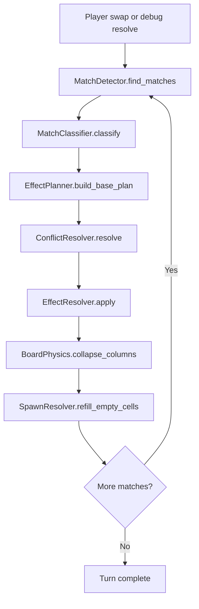

# Facets: Getting Started & Prototyping Guide

## 1. What Is This Project?

Facets is a **gemstone-themed match-3 roguelike** built in **Godot 4.6** using **GDScript**. The core fantasy is not score-chasing — it is engineering high-tier gems through deliberate merges across a floor-based run, surviving board pressure with limited moves.

The repo is currently a **working scaffold**: the full turn pipeline exists, the board renders, matches are detected and resolved, gravity works, and tiles respawn. It is not yet a game — it is the skeleton of one, ready for gameplay prototyping.

### What runs today

When you open the project in Godot and press **F5**, you get:

- A **portrait-oriented** 1080×1920 window
- An **8×8 board** populated with colored tier buttons (T1–T4)
- A **debug overlay** with buttons to reroll the seed, evaluate matches, and resolve the full turn pipeline
- Clicking a cell shows its tile info in the debug panel
- "Resolve matches" runs the complete cascade loop: detect → classify → plan → conflict-check → apply effects → gravity → refill → repeat

### What does not work yet

- **No player swap input** — you cannot drag or tap-swap tiles through the UI yet; [`RunController.attempt_swap()`](../core/run/run_controller.gd:70) exists but nothing in the scene calls it
- **No merge-forward effects** — all match types currently produce `remove_tile` effects; the `EFFECT_UPGRADE` constant exists in [`EffectPlanner`](../core/board/effect_planner.gd:1) but is not generated by any match type yet
- **No tile definitions loaded from data** — spawning uses [`TileState.from_debug_tier()`](../core/board/tile_state.gd:40) which creates anonymous debug tiles, not named gems from `.tres` resources
- **No floor progression** — the current prototype is a single-floor run; floor state, modifier pipelines, and boon/hazard systems are documented in [deferred-systems-reference.md](deferred-systems-reference.md) for later phases

---

## 2. How Godot 4 Works (Crash Course for This Project)

### Scenes and nodes

Everything visible in Godot is a **scene tree** of **nodes**. A `.tscn` file defines a tree of nodes; a `.gd` file is a script attached to a node. Scenes can be **instanced** inside other scenes.

In Facets:

| Scene | Purpose |
|---|---|
| [`main.tscn`](../scenes/main/main.tscn) | Bootstrap — just loads `RunScene` |
| [`run_scene.tscn`](../scenes/run/run_scene.tscn) | The gameplay screen: holds the board and debug overlay |
| [`board_scene.tscn`](../scenes/board/board_scene.tscn) | Visual board: a `GridContainer` that spawns `TileView` instances |
| [`tile_view.tscn`](../scenes/tile/tile_view.tscn) | A single cell visual: a `Button` with tier text and color |
| [`debug_overlay.tscn`](../scenes/ui/debug_overlay.tscn) | Debug panel: seed display, move counter, action buttons |

### Scripts without scenes (the simulation layer)

The most important code in Facets is **not attached to any scene node**. The entire `core/` directory is plain GDScript classes extending `RefCounted` — they have no scene tree dependency and can be instantiated in tests or headless runs.

This is deliberate. The [gem-engine-proposal](gem-engine-proposal.md) mandates a **simulation-first architecture**: the board state must be valid and testable without rendering.

### Autoloads (singletons)

Four scripts are registered as autoloads in [`project.godot`](../project.godot:23):

| Autoload | File | Purpose |
|---|---|---|
| `GameConfig` | [`game_config.gd`](../autoloads/game_config.gd:1) | Default run parameters (board size, tiers, moves, seed) |
| `SaveService` | [`save_service.gd`](../autoloads/save_service.gd:1) | JSON save/load to `user://saves/` |
| `ReplayService` | [`replay_service.gd`](../autoloads/replay_service.gd:1) | Records player actions for deterministic replay |
| `DebugFlags` | [`debug_flags.gd`](../autoloads/debug_flags.gd:1) | Runtime toggles (coordinates, protection threshold, rule pack) |

### Resources (data-driven content)

Godot `Resource` classes are the content format. They are defined as GDScript classes in [`resources/definitions/`](../resources/definitions/) and instanced as `.tres` files in [`data/`](../data/).

Currently defined resource types:

| Resource class | File | Key fields |
|---|---|---|
| `TileDefinitionResource` | [`tile_definition_resource.gd`](../resources/definitions/tile_definition_resource.gd:1) | `tile_id`, `tier`, `match_group`, `merge_target_id`, `debug_color` |
| `EffectDefinitionResource` | [`effect_definition_resource.gd`](../resources/definitions/effect_definition_resource.gd:1) | `effect_id`, `effect_type`, `parameters` |
| `SpawnTableResource` | [`spawn_table_resource.gd`](../resources/definitions/spawn_table_resource.gd:1) | `table_id`, `allowed_tiers`, `weights` |

No `.tres` instances exist yet — the `data/` subdirectories contain only README placeholders. The [`data/tiles/README.md`](../data/tiles/README.md) documents the planned 8-gem ladder.

### Signals (event-driven communication)

Godot uses **signals** for decoupled communication. Key signals in the scaffold:

- [`RunController.board_changed`](../core/run/run_controller.gd:5) — emitted after any board mutation; the scene rebuilds the visual grid
- [`RunController.turn_resolved`](../core/run/run_controller.gd:6) — emitted with turn statistics after a full cascade
- [`TurnController.cascade_step_completed`](../core/run/turn_controller.gd:10) — emitted per cascade iteration
- [`BoardScene.cell_pressed`](../scenes/board/board_scene.gd:3) — emitted when a tile button is clicked
- [`DebugOverlay.reroll_requested`](../scenes/ui/debug_overlay.gd:3) / [`evaluate_requested`](../scenes/ui/debug_overlay.gd:4) / [`resolve_requested`](../scenes/ui/debug_overlay.gd:5) — debug actions

---

## 3. The Turn Pipeline (How a Move Works)

This is the heart of the engine. [`TurnController.execute_turn()`](../core/run/turn_controller.gd:26) owns the loop:



Each stage is a separate `RefCounted` class with a single responsibility:

| Stage | Class | What it does | Current state |
|---|---|---|---|
| Detect | [`MatchDetector`](../core/board/match_detector.gd:1) | Scans for horizontal/vertical runs of 3+ matching tiles | ✅ Working — matches by `match_group` |
| Classify | [`MatchClassifier`](../core/board/match_classifier.gd:1) | Labels matches as `base_match`, `match_4`, `match_5_plus`, or `match_lt` | ✅ Working — detects L/T intersections |
| Plan | [`EffectPlanner`](../core/board/effect_planner.gd:1) | Converts classified matches into atomic effect entries | ⚠️ All types produce `remove_tile` only |
| Conflict | [`ConflictResolver`](../core/board/conflict_resolver.gd:1) | Deduplicates removals targeting the same cell | ✅ Working |
| Apply | [`EffectResolver`](../core/board/effect_resolver.gd:1) | Mutates the board and logs events | ✅ Working — handles `remove_tile` and `upgrade_tile` |
| Physics | [`BoardPhysics`](../core/board/board_physics.gd:1) | Gravity collapse, respects blocked cells | ✅ Working |
| Spawn | [`SpawnResolver`](../core/board/spawn_resolver.gd:1) | Fills empty cells using weighted spawn table | ✅ Working — weighted random from `SpawnTableResource` |

---

## 4. How to Work With the Scaffold

### Running the project

1. Open the project folder in **Godot 4.6**
2. Press **F5** (or click the play button) — the main scene loads `RunScene`
3. The board populates with T1–T4 debug tiles
4. Use the debug overlay buttons:
   - **Reroll seed** — generates a fresh board with a new seed
   - **Evaluate board** — runs detection + classification + planning without mutating (preview)
   - **Resolve matches** — executes the full turn pipeline with cascades
5. Click any cell to see its tile info

### Running tests

From the command line:

```bash
godot --headless --script tests/test_smoke.gd
```

The smoke test in [`test_smoke.gd`](../tests/test_smoke.gd:1) covers board creation, tile state, match detection, classification, effect planning, conflict resolution, effect application, physics, spawning, turn execution, and RNG determinism.

### Adding new simulation behavior

The typical workflow for adding a new game mechanic:

1. **Define the data** — add fields to an existing `Resource` class or create a new one in `resources/definitions/`
2. **Implement the logic** — modify the appropriate pipeline stage in `core/board/`
3. **Test headlessly** — add a test function to [`test_smoke.gd`](../tests/test_smoke.gd:1) or create a new test script
4. **Update the visual** — if the mechanic needs visual feedback, modify [`TileView`](../scenes/tile/tile_view.gd:1) or [`BoardScene`](../scenes/board/board_scene.gd:1)

### Key architectural rules

- **Never put game rules in scene scripts.** Scene scripts read state and emit signals. Logic lives in `core/`.
- **Never call `randf()` directly.** All randomness goes through [`SeededRng`](../core/rules/seeded_rng.gd:1) for deterministic replay.
- **Effects are planned before they are applied.** The plan → conflict → resolve pipeline exists so that competing effects can be arbitrated.
- **The board is the single source of truth.** The visual grid is rebuilt from [`BoardState`](../core/board/board_state.gd:1) after every mutation.

---

## 5. Phased Prototyping Plan

### Design philosophy for iteration

The proposal identifies a critical tension: the architecture needs to be clean enough to support experimentation, but not so rigid that every idea requires a system redesign. The following phases are ordered to **validate the core loop first**, then layer complexity only after the fundamentals feel right.

Each phase ends with a **playable checkpoint** — something you can run, click through, and evaluate.

---

### Phase 0: Make It Playable (Swap Input + Visual Feedback)

**Goal:** Turn the scaffold into something you can actually play — swap tiles, see matches resolve, watch the board cascade.

**What to build:**

- [ ] **Swap input handler** — implement tap-select-then-tap-target in [`RunScene`](../scenes/run/run_scene.gd:1) or a new input controller; call [`RunController.attempt_swap()`](../core/run/run_controller.gd:70) on valid adjacent selections
- [ ] **Selection highlight** — visually indicate the first selected tile (border color, scale pulse, or overlay)
- [ ] **Move counter display** — the debug overlay already shows moves; make it decrement visibly on each swap
- [ ] **Invalid swap feedback** — brief visual cue when a swap produces no matches and reverts
- [ ] **Game-over check** — detect when `moves_remaining` hits 0 and show a simple "Run Over" message

**Why this is first:** Without player input, you cannot evaluate whether the match-resolve-cascade loop *feels* right. Every subsequent phase depends on being able to play turns.

**Checkpoint:** You can tap two adjacent tiles, watch matches clear, gravity collapse, new tiles spawn, and cascades chain. The move counter ticks down. When moves hit zero, the run ends.

---

### Phase 1: Named Gems + Data-Driven Spawning

**Goal:** Replace anonymous debug tiles with the real 8-gem ladder, driven by `.tres` resource files.

**What to build:**

- [ ] **Create 8 tile definition `.tres` files** in `data/tiles/` — Quartz through Diamond, following the table in [`data/tiles/README.md`](../data/tiles/README.md:9)
- [ ] **Create a tile registry** — a simple dictionary or autoload that loads all `TileDefinitionResource` files from `data/tiles/` at startup and indexes them by `tile_id`
- [ ] **Update `SpawnResolver`** to spawn tiles by `tile_id` from the registry instead of using `TileState.from_debug_tier()`
- [ ] **Update `TileView`** to read `debug_color` from the tile definition and display the gem name instead of just "T3"
- [ ] **Create a default spawn table `.tres`** in `data/spawn_tables/` with weighted T1–T4 distribution referencing actual tile IDs

**Why this is second:** Named gems are the foundation of the merge ladder, gem families, and all future content. Getting the data pipeline working early means every subsequent feature can be content-authored, not hardcoded.

**Checkpoint:** The board shows named, colored gems. Spawning is weighted. The data pipeline works end-to-end from `.tres` → spawn → display.

---

### Phase 2: The Merge Loop (3-to-1 Upgrade)

**Goal:** Implement the core merge mechanic — matching 3 of the same gem produces 1 gem of the next tier.

**What to build:**

- [ ] **Modify [`EffectPlanner._plan_base_match()`](../core/board/effect_planner.gd:37)** — instead of removing all 3 tiles, remove 2 and upgrade 1 (the "anchor" tile, e.g., the center of the match or a configurable choice)
- [ ] **Use `merge_target_id`** from `TileDefinitionResource` to determine what the upgraded tile becomes
- [ ] **Handle top-tier matches** — matching 3 Diamonds (T8) should not try to upgrade; fall back to removal or a special reward
- [ ] **Update [`ConflictResolver`](../core/board/conflict_resolver.gd:1)** to handle the case where a tile is both being removed (from one match) and upgraded (from another)
- [ ] **Visual feedback for upgrades** — show a brief tier-change animation or color flash on the upgraded tile

**Why this is third:** The merge ladder is the game's identity. Until 3-to-1 merging works, you are testing a generic match-3 clear game, not the actual design.

**Checkpoint:** Matching 3 Quartz produces 1 Amethyst. Matching 3 Amethyst produces 1 Peridot. You can visibly climb the tier ladder through play. The board feels different from a standard match-3 because pieces persist and grow.

---

### Phase 3: 4+ Match Rewards (The Design Fork)

**Goal:** Prototype the two competing reward philosophies for 4-line, 5-line, and L/T matches.

This is the **highest-value unresolved design question** identified in the [proposal](gem-engine-proposal.md:126). The architecture already supports it — [`EffectPlanner`](../core/board/effect_planner.gd:1) has separate methods for each match type.

**What to build:**

- [ ] **Rule Pack A (destructive):**
  - `match_4` → line clear (remove entire row or column)
  - `match_5_plus` → color clear (remove all tiles of that match group)
  - `match_lt` → area clear (remove a 3×3 area around the intersection)

- [ ] **Rule Pack B (merge-forward):**
  - `match_4` → upgrade the anchor tile by +2 tiers instead of +1
  - `match_5_plus` → spawn a "catalyst" tile that auto-merges with adjacent tiles on the next turn
  - `match_lt` → protect the upgraded tile (set `protected = true`)

- [ ] **Rule pack toggle** — use [`DebugFlags`](../autoloads/debug_flags.gd:1) to switch between packs at runtime; add a toggle button to the debug overlay
- [ ] **Logging comparison** — use [`EventLog`](../core/rules/event_log.gd:1) to track highest tier reached, total upgrades, and total destructions per run for each pack

**Why this is fourth:** The merge loop must work before you can evaluate what 4+ rewards do to it. Testing both packs side-by-side on the same board engine is exactly what the simulation-first architecture was designed for.

**Checkpoint:** You can toggle between destructive and merge-forward rule packs and feel the difference. One pack clears the board aggressively; the other builds momentum toward high-tier gems. You have data to inform which direction to pursue.

---

### Phase 4: Floor Progression + One Reward Choice

**Goal:** Add the roguelike structure — multiple floors with a between-floor reward screen.

This phase introduces systems that were intentionally deferred from the prototype scaffold. See [deferred-systems-reference.md](deferred-systems-reference.md) for the full specification of `FloorState`, `FloorDefinitionResource`, and the modifier pipeline.

**What to build:**

- [ ] **Add `FloorState`** — per-floor config holder (move budget, spawn table, active modifiers)
- [ ] **Add `FloorDefinitionResource`** — `.tres` schema for floor configuration
- [ ] **Floor transition logic** in [`RunController`](../core/run/run_controller.gd:1) — when moves run out, check if a floor-completion condition is met; advance to the next floor or end the run
- [ ] **Floor definition `.tres` files** — 3–5 floors with escalating difficulty
- [ ] **Between-floor reward screen** — a simple scene (`WorkbenchScene`) that presents 3 random choices
- [ ] **Simple win condition** — reach or extract a T6+ gem by the final floor

**Why this is fifth:** Floor progression turns the prototype from a single-board puzzle into a run with narrative arc. But it only matters after the per-turn loop feels good.

**Checkpoint:** You play through 3–5 floors, choose a reward between each, and either forge a high-tier gem or run out of moves. The run has a beginning, middle, and end.

---

### Phase 5: First Modifier + Content Variety

**Goal:** Validate the modifier pipeline with one real boon and one real hazard.

This phase introduces the hook-based modifier system. See [deferred-systems-reference.md](deferred-systems-reference.md) for the full specification of `ModifierPipeline`, `RuleHooks`, `BoonDefinitionResource`, and `HazardDefinitionResource`.

**What to build:**

- [ ] **Add `ModifierPipeline`** — hook-based system with named injection points (before detection, after classification, before planning, before spawn, end of turn)
- [ ] **Add `RuleHooks`** — hook point constants
- [ ] **One boon** — e.g., "Jeweler's Loupe": after each turn, if a T5+ gem exists, grant +1 move
- [ ] **One hazard** — e.g., "Obsidian Intrusion": every 3 turns, spawn an Obsidian (T0) tile that blocks a cell
- [ ] **2–3 alternate gems** — create `TileDefinitionResource` variants for T1–T3 with different `match_group` values
- [ ] **Boon selection in the reward screen** — offer boons as one of the between-floor choices

**Why this is sixth:** The modifier pipeline should only be built once there is real gameplay to modify. One boon and one hazard prove the hook system works without requiring a full content roster.

**Checkpoint:** Boons alter gameplay in a noticeable way. Hazards create board pressure. Alternate gems change the matching landscape. The content pipeline works.

---

### Phase 6 and Beyond: Content Scaling

Only after Phases 0–5 produce a loop that feels good should the project expand into:

- More gem families and alternate gems per tier
- T0 hazard roster (Pyrite, Hematite, Galena, etc.)
- T9 transcendent artifacts
- Full boon pool with rarity tiers
- Score tracking and leaderboards
- Boss floors
- Shaped boards and cell tags
- Art, audio, and polish

---

## 6. Architecture Guidelines for Clean Iteration

### Keep the simulation pure

The `core/` directory should never `preload` a scene, reference a node, or call any rendering function. If you find yourself writing `get_tree()` or `queue_free()` in a `core/` file, something is wrong.

### Use the effect plan as the experimentation boundary

The [`EffectPlanner`](../core/board/effect_planner.gd:1) is where gameplay ideas become concrete. When prototyping a new mechanic:

1. Add a new effect constant (e.g., `EFFECT_COMPRESS := &"compress_tile"`)
2. Generate it in the planner based on match type
3. Handle it in [`EffectResolver`](../core/board/effect_resolver.gd:1)
4. If it conflicts with other effects, add a rule to [`ConflictResolver`](../core/board/conflict_resolver.gd:1)

This keeps experiments contained. You can add, remove, or swap effects without touching detection, classification, physics, or spawning.

### Use resources for anything that might vary

If a value might change between runs, floors, or gem types, it should be a field on a `Resource`, not a constant in code. The scaffold already has resource classes for tiles, effects, and spawn tables. Use them.

### Test at the simulation level

Every new mechanic should have a test in [`test_smoke.gd`](../tests/test_smoke.gd:1) (or a dedicated test file) that runs without the scene tree. The pattern is:

```gdscript
func test_my_mechanic() -> void:
    var board := BoardState.new(Vector2i(5, 5))
    # Set up a specific board state
    board.set_tile(Vector2i(0, 0), TileState.create(&"quartz", 1))
    # ... run the pipeline ...
    # Assert the expected outcome
    assert_eq(board.get_tile(Vector2i(0, 0)).tier, 2, "Should have upgraded")
```

### Do not over-design ahead of need

The proposal wisely defers many decisions (boss mechanics, graph boards, crafting economy, full gem roster). Respect those boundaries. Each phase above is scoped to validate one layer of the design. If a phase reveals that the design needs to change direction, the simulation-first architecture makes that pivot cheap.

Systems that are planned but intentionally excluded from the current scaffold are documented in [deferred-systems-reference.md](deferred-systems-reference.md). Consult that document when you reach Phase 4+.

---

## 7. Quick Reference: File Map

```
core/board/
  board_state.gd      — Grid of CellState objects, tile CRUD, swap, bounds checking
  cell_state.gd       — Per-cell wrapper: tile reference, blocked flag
  tile_state.gd       — Per-tile data: id, tier, match_group, protection, status
  match_detector.gd   — Scans for horizontal/vertical line matches
  match_classifier.gd — Labels matches as base/4/5+/L-T, detects intersections
  effect_planner.gd   — Converts matches into atomic effect entries (remove, upgrade)
  conflict_resolver.gd— Deduplicates effects targeting the same cell
  effect_resolver.gd  — Applies effects to board, logs events
  board_physics.gd    — Gravity collapse
  spawn_resolver.gd   — Weighted tile spawning from SpawnTableResource

core/rules/
  event_log.gd        — Structured event log for debug/replay/animation
  seeded_rng.gd       — Deterministic RNG wrapper

core/run/
  run_state.gd        — Per-run data: board, moves, seed, spawn table
  run_controller.gd   — Run lifecycle: start, reroll, attempt_swap, resolve
  turn_controller.gd  — Single-turn cascade loop

resources/definitions/
  tile_definition_resource.gd   — Gem type schema
  effect_definition_resource.gd — Effect type schema
  spawn_table_resource.gd       — Weighted spawn distribution

scenes/
  main/     — Bootstrap scene
  run/      — Gameplay screen (board + debug overlay)
  board/    — Visual grid (GridContainer of TileViews)
  tile/     — Single tile button
  ui/       — Debug overlay panel

autoloads/
  game_config.gd    — Default run parameters
  save_service.gd   — JSON save/load
  replay_service.gd — Action recording for deterministic replay
  debug_flags.gd    — Runtime debug toggles

tests/
  test_smoke.gd — Headless smoke tests for the full pipeline

data/
  tiles/        — TileDefinitionResource .tres files (empty, documented)
  spawn_tables/ — SpawnTableResource .tres files (empty)
```

---

## 8. Summary

The scaffold is solid. The simulation-first architecture, deterministic RNG, and data-driven resource model are all in place. The gap between "scaffold" and "playable prototype" is primarily:

1. **Player input** (swap tiles via tap)
2. **Named gem data** (`.tres` files for the 8-gem ladder)
3. **The merge mechanic** (3-to-1 upgrade instead of pure removal)
4. **4+ match reward experimentation** (the biggest open design question)

These are the first four phases. Each one builds on the last, each produces a playable checkpoint, and none requires rearchitecting what already exists. The engine was designed for exactly this kind of iterative prototyping — use it.

Systems deferred from the prototype (floor progression, modifier pipeline, boons, hazards) are fully documented in [deferred-systems-reference.md](deferred-systems-reference.md) and should be introduced in Phases 4–5 once the core loop is validated.
